# UVU Accounting Survey Analysis

## Total Population

### Question: How strongly do you believe each of these stereotypes about accounting / accountants? - Never talk to people

**Overall Statistics:**
- Count: 390
- Mean: 2.73
- Std Dev: 1.54

**Statistics by Course:**

| Which class are you taking this survey for?   |   count |    mean |     std |
|:----------------------------------------------|--------:|--------:|--------:|
| ACC 2110                                      |     215 | 3.03256 | 1.59258 |
| ACC 2120                                      |      43 | 2.5814  | 1.33153 |
| ACC 3010                                      |      28 | 2.32143 | 1.41562 |
| ACC 3020                                      |      33 | 2.30303 | 1.38033 |
| ACC 4050                                      |      49 | 2.4898  | 1.54276 |
| ACC 5020                                      |      22 | 1.77273 | 1.02036 |

**One-Way ANOVA:**
- F-statistic: 4.8028
- p-value: 0.0003

**Result:** Significant difference found (p < 0.05). Performing Tukey HSD.

  Multiple Comparison of Means - Tukey HSD, FWER=0.05
========================================================
 group1   group2  meandiff p-adj   lower   upper  reject
--------------------------------------------------------
ACC 2110 ACC 2120  -0.4512 0.4696 -1.1707  0.2684  False
ACC 2110 ACC 3010  -0.7111 0.1756 -1.5765  0.1542  False
ACC 2110 ACC 3020  -0.7295  0.101 -1.5348  0.0758  False
ACC 2110 ACC 4050  -0.5428 0.2048 -1.2246  0.1391  False
ACC 2110 ACC 5020  -1.2598 0.0029  -2.224 -0.2957   True
ACC 2120 ACC 3010    -0.26 0.9805 -1.3059   0.786  False
ACC 2120 ACC 3020  -0.2784 0.9674 -1.2752  0.7184  False
ACC 2120 ACC 4050  -0.0916 0.9997 -0.9916  0.8084  False
ACC 2120 ACC 5020  -0.8087 0.3154 -1.9377  0.3204  False
ACC 3010 ACC 3020  -0.0184    1.0 -1.1251  1.0883  False
ACC 3010 ACC 4050   0.1684 0.9971  -0.852  1.1888  False
ACC 3010 ACC 5020  -0.5487 0.7955 -1.7758  0.6784  False
ACC 3020 ACC 4050   0.1868 0.9939 -0.7832  1.1567  False
ACC 3020 ACC 5020  -0.5303 0.7952 -1.7158  0.6552  False
ACC 4050 ACC 5020  -0.7171 0.4299 -1.8225  0.3883  False
--------------------------------------------------------

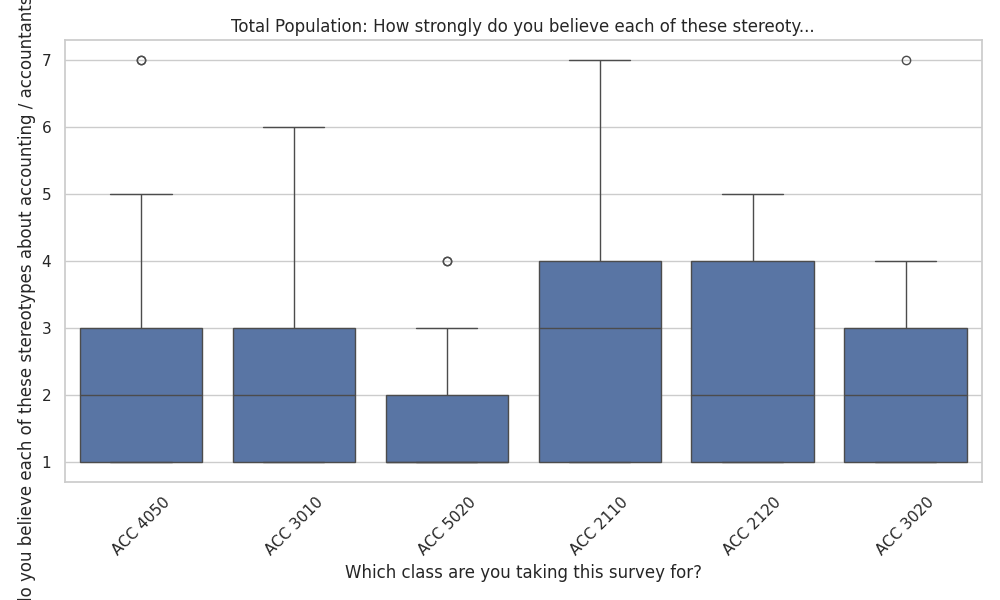

---

### Question: How strongly do you believe each of these stereotypes about accounting / accountants? - Introverts

**Overall Statistics:**
- Count: 390
- Mean: 3.76
- Std Dev: 1.51

**Statistics by Course:**

| Which class are you taking this survey for?   |   count |    mean |     std |
|:----------------------------------------------|--------:|--------:|--------:|
| ACC 2110                                      |     215 | 3.8186  | 1.45642 |
| ACC 2120                                      |      43 | 3.4186  | 1.45131 |
| ACC 3010                                      |      28 | 3.71429 | 1.53616 |
| ACC 3020                                      |      33 | 3.54545 | 1.48094 |
| ACC 4050                                      |      49 | 4.14286 | 1.73205 |
| ACC 5020                                      |      22 | 3.36364 | 1.46533 |

**One-Way ANOVA:**
- F-statistic: 1.5944
- p-value: 0.1606

**Result:** No significant difference found (p >= 0.05).

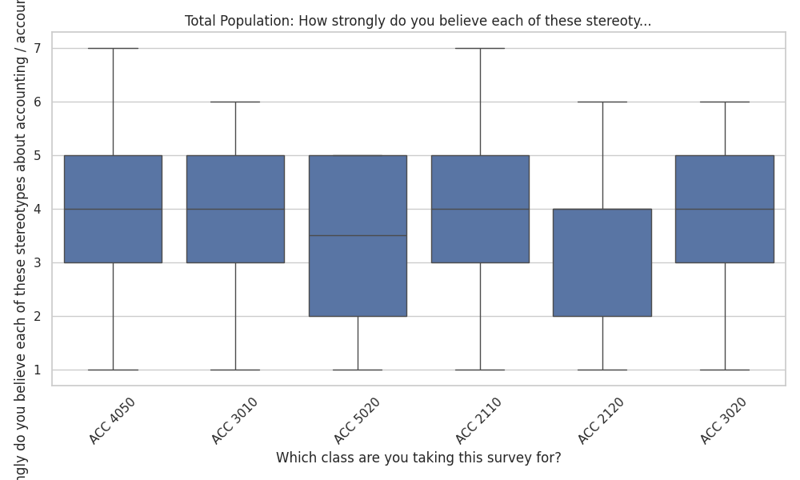

---

### Question: How strongly do you believe each of these stereotypes about accounting / accountants? - Work in a cubicle

**Overall Statistics:**
- Count: 390
- Mean: 4.47
- Std Dev: 1.40

**Statistics by Course:**

| Which class are you taking this survey for?   |   count |    mean |     std |
|:----------------------------------------------|--------:|--------:|--------:|
| ACC 2110                                      |     215 | 4.70698 | 1.34049 |
| ACC 2120                                      |      43 | 4.62791 | 1.25401 |
| ACC 3010                                      |      28 | 4.32143 | 1.33482 |
| ACC 3020                                      |      33 | 4.24242 | 1.39262 |
| ACC 4050                                      |      49 | 3.89796 | 1.54441 |
| ACC 5020                                      |      22 | 3.59091 | 1.40269 |

**One-Way ANOVA:**
- F-statistic: 5.1987
- p-value: 0.0001

**Result:** Significant difference found (p < 0.05). Performing Tukey HSD.

  Multiple Comparison of Means - Tukey HSD, FWER=0.05
========================================================
 group1   group2  meandiff p-adj   lower   upper  reject
--------------------------------------------------------
ACC 2110 ACC 2120  -0.0791 0.9993 -0.7327  0.5745  False
ACC 2110 ACC 3010  -0.3855 0.7242 -1.1716  0.4005  False
ACC 2110 ACC 3020  -0.4646 0.4547  -1.196  0.2669  False
ACC 2110 ACC 4050   -0.809 0.0029 -1.4284 -0.1897   True
ACC 2110 ACC 5020  -1.1161  0.004 -1.9919 -0.2403   True
ACC 2120 ACC 3010  -0.3065 0.9402 -1.2566  0.6436  False
ACC 2120 ACC 3020  -0.3855 0.8273  -1.291    0.52  False
ACC 2120 ACC 4050  -0.7299 0.1106 -1.5475  0.0876  False
ACC 2120 ACC 5020   -1.037 0.0457 -2.0626 -0.0114   True
ACC 3010 ACC 3020   -0.079 0.9999 -1.0843  0.9263  False
ACC 3010 ACC 4050  -0.4235 0.7803 -1.3504  0.5034  False
ACC 3010 ACC 5020  -0.7305 0.4179 -1.8452  0.3842  False
ACC 3020 ACC 4050  -0.3445 0.8731 -1.2255  0.5366  False
ACC 3020 ACC 5020  -0.6515 0.5109 -1.7284  0.4254  False
ACC 4050 ACC 5020  -0.3071 0.9521 -1.3112  0.6971  False
--------------------------------------------------------

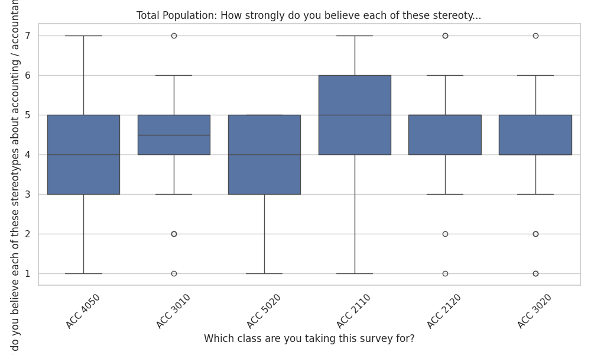

---

### Question: How strongly do you believe each of these stereotypes about accounting / accountants? - Long work hours

**Overall Statistics:**
- Count: 390
- Mean: 5.26
- Std Dev: 1.31

**Statistics by Course:**

| Which class are you taking this survey for?   |   count |    mean |      std |
|:----------------------------------------------|--------:|--------:|---------:|
| ACC 2110                                      |     215 | 5.12093 | 1.33755  |
| ACC 2120                                      |      43 | 4.93023 | 1.29827  |
| ACC 3010                                      |      28 | 5.64286 | 1.28277  |
| ACC 3020                                      |      33 | 5.75758 | 0.902438 |
| ACC 4050                                      |      49 | 5.44898 | 1.30801  |
| ACC 5020                                      |      22 | 5.63636 | 1.29267  |

**One-Way ANOVA:**
- F-statistic: 3.1103
- p-value: 0.0091

**Result:** Significant difference found (p < 0.05). Performing Tukey HSD.

  Multiple Comparison of Means - Tukey HSD, FWER=0.05
=======================================================
 group1   group2  meandiff p-adj   lower  upper  reject
-------------------------------------------------------
ACC 2110 ACC 2120  -0.1907 0.9504 -0.8091 0.4277  False
ACC 2110 ACC 3010   0.5219 0.3384 -0.2218 1.2656  False
ACC 2110 ACC 3020   0.6366 0.0915 -0.0554 1.3287  False
ACC 2110 ACC 4050    0.328 0.5967 -0.2579  0.914  False
ACC 2110 ACC 5020   0.5154 0.4788 -0.3131  1.344  False
ACC 2120 ACC 3010   0.7126 0.2087 -0.1862 1.6115  False
ACC 2120 ACC 3020   0.8273 0.0652 -0.0293  1.684  False
ACC 2120 ACC 4050   0.5187 0.3909 -0.2547 1.2922  False
ACC 2120 ACC 5020   0.7061 0.2976 -0.2641 1.6764  False
ACC 3010 ACC 3020   0.1147 0.9993 -0.8363 1.0658  False
ACC 3010 ACC 4050  -0.1939 0.9885 -1.0708  0.683  False
ACC 3010 ACC 5020  -0.0065    1.0 -1.0611 1.0481  False
ACC 3020 ACC 4050  -0.3086 0.8967 -1.1421  0.525  False
ACC 3020 ACC 5020  -0.1212 0.9994   -1.14 0.8976  False
ACC 4050 ACC 5020   0.1874 0.9932 -0.7626 1.1373  False
-------------------------------------------------------

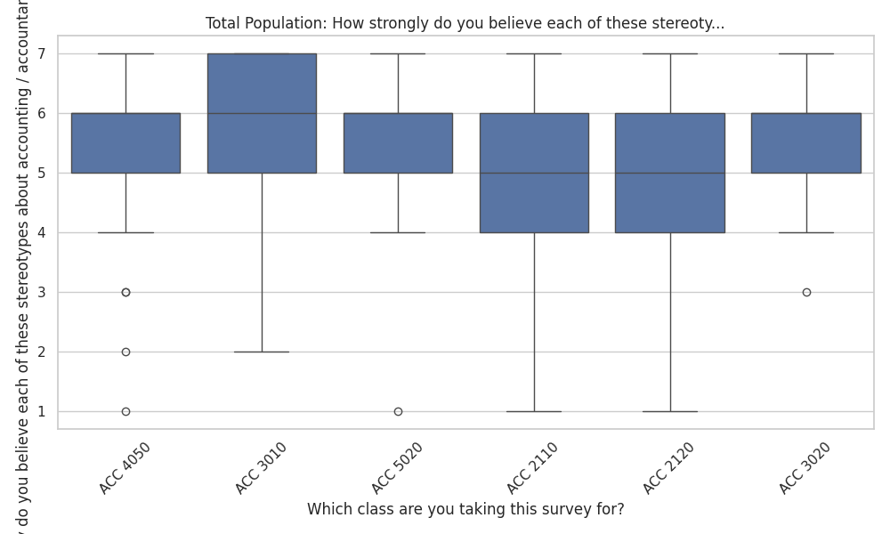

---

### Question: How strongly do you believe each of these stereotypes about accounting / accountants? - Only tax and audit careers

**Overall Statistics:**
- Count: 390
- Mean: 3.26
- Std Dev: 1.64

**Statistics by Course:**

| Which class are you taking this survey for?   |   count |    mean |     std |
|:----------------------------------------------|--------:|--------:|--------:|
| ACC 2110                                      |     215 | 3.6093  | 1.53948 |
| ACC 2120                                      |      43 | 2.7907  | 1.52062 |
| ACC 3010                                      |      28 | 3.03571 | 1.64389 |
| ACC 3020                                      |      33 | 3.0303  | 1.87891 |
| ACC 4050                                      |      49 | 2.69388 | 1.69809 |
| ACC 5020                                      |      22 | 2.59091 | 1.59341 |

**One-Way ANOVA:**
- F-statistic: 5.0369
- p-value: 0.0002

**Result:** Significant difference found (p < 0.05). Performing Tukey HSD.

  Multiple Comparison of Means - Tukey HSD, FWER=0.05
========================================================
 group1   group2  meandiff p-adj   lower   upper  reject
--------------------------------------------------------
ACC 2110 ACC 2120  -0.8186 0.0281 -1.5837 -0.0535   True
ACC 2110 ACC 3010  -0.5736 0.4765 -1.4938  0.3466  False
ACC 2110 ACC 3020   -0.579 0.3814 -1.4353  0.2773  False
ACC 2110 ACC 4050  -0.9154 0.0045 -1.6405 -0.1904   True
ACC 2110 ACC 5020  -1.0184 0.0527 -2.0436  0.0068  False
ACC 2120 ACC 3010    0.245 0.9887 -0.8672  1.3572  False
ACC 2120 ACC 3020   0.2396 0.9872 -0.8204  1.2996  False
ACC 2120 ACC 4050  -0.0968 0.9997 -1.0539  0.8602  False
ACC 2120 ACC 5020  -0.1998 0.9969 -1.4004  1.0008  False
ACC 3010 ACC 3020  -0.0054    1.0 -1.1822  1.1714  False
ACC 3010 ACC 4050  -0.3418 0.9458 -1.4269  0.7432  False
ACC 3010 ACC 5020  -0.4448 0.9253 -1.7497  0.8601  False
ACC 3020 ACC 4050  -0.3364 0.9375 -1.3678   0.695  False
ACC 3020 ACC 5020  -0.4394 0.9183    -1.7  0.8213  False
ACC 4050 ACC 5020   -0.103 0.9999 -1.2784  1.0725  False
--------------------------------------------------------

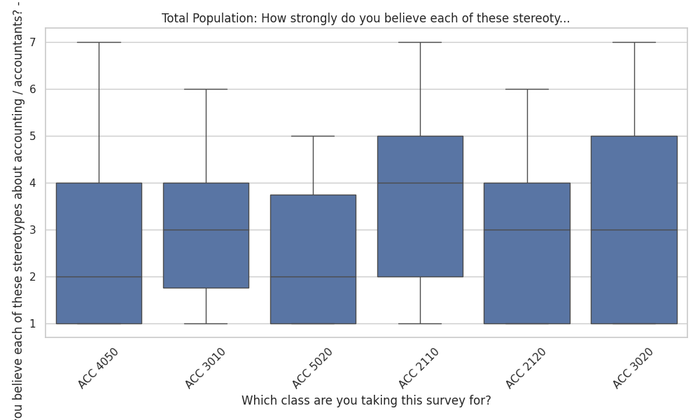

---

### Question: How strongly do you believe each of these stereotypes about accounting / accountants? - Always do taxes

**Overall Statistics:**
- Count: 390
- Mean: 3.06
- Std Dev: 1.66

**Statistics by Course:**

| Which class are you taking this survey for?   |   count |    mean |      std |
|:----------------------------------------------|--------:|--------:|---------:|
| ACC 2110                                      |     215 | 3.70233 | 1.5987   |
| ACC 2120                                      |      43 | 2.65116 | 1.36074  |
| ACC 3010                                      |      28 | 2.64286 | 1.59198  |
| ACC 3020                                      |      33 | 2.24242 | 1.32359  |
| ACC 4050                                      |      49 | 2.08163 | 1.28836  |
| ACC 5020                                      |      22 | 1.45455 | 0.800433 |

**One-Way ANOVA:**
- F-statistic: 20.6444
- p-value: 0.0000

**Result:** Significant difference found (p < 0.05). Performing Tukey HSD.

  Multiple Comparison of Means - Tukey HSD, FWER=0.05
========================================================
 group1   group2  meandiff p-adj   lower   upper  reject
--------------------------------------------------------
ACC 2110 ACC 2120  -1.0512 0.0004 -1.7598 -0.3425   True
ACC 2110 ACC 3010  -1.0595 0.0055 -1.9117 -0.2072   True
ACC 2110 ACC 3020  -1.4599    0.0  -2.253 -0.6668   True
ACC 2110 ACC 4050  -1.6207    0.0 -2.2922 -0.9492   True
ACC 2110 ACC 5020  -2.2478    0.0 -3.1973 -1.2982   True
ACC 2120 ACC 3010  -0.0083    1.0 -1.0384  1.0218  False
ACC 2120 ACC 3020  -0.4087 0.8404 -1.3905   0.573  False
ACC 2120 ACC 4050  -0.5695 0.4411 -1.4559  0.3169  False
ACC 2120 ACC 5020  -1.1966 0.0266 -2.3086 -0.0847   True
ACC 3010 ACC 3020  -0.4004 0.8997 -1.4904  0.6895  False
ACC 3010 ACC 4050  -0.5612 0.5994 -1.5662  0.4437  False
ACC 3010 ACC 5020  -1.1883  0.057 -2.3969  0.0203  False
ACC 3020 ACC 4050  -0.1608 0.9968 -1.1161  0.7945  False
ACC 3020 ACC 5020  -0.7879 0.3837 -1.9555  0.3797  False
ACC 4050 ACC 5020  -0.6271  0.566 -1.7158  0.4616  False
--------------------------------------------------------

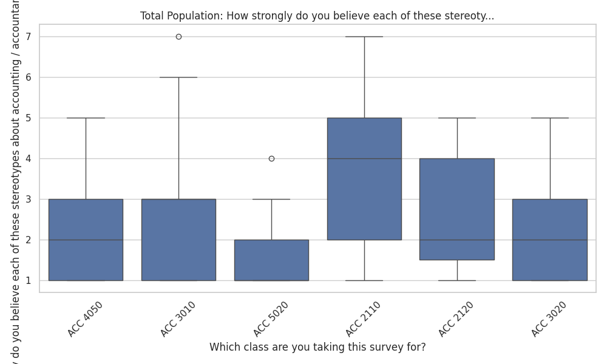

---

### Question: How strongly do you believe each of these stereotypes about accounting / accountants? - Reliable

**Overall Statistics:**
- Count: 390
- Mean: 5.37
- Std Dev: 1.15

**Statistics by Course:**

| Which class are you taking this survey for?   |   count |    mean |      std |
|:----------------------------------------------|--------:|--------:|---------:|
| ACC 2110                                      |     215 | 5.27442 | 1.16573  |
| ACC 2120                                      |      43 | 5.30233 | 1.1027   |
| ACC 3010                                      |      28 | 5.85714 | 0.931518 |
| ACC 3020                                      |      33 | 5.30303 | 1.10354  |
| ACC 4050                                      |      49 | 5.59184 | 1.17115  |
| ACC 5020                                      |      22 | 5.36364 | 1.21677  |

**One-Way ANOVA:**
- F-statistic: 1.7410
- p-value: 0.1243

**Result:** No significant difference found (p >= 0.05).

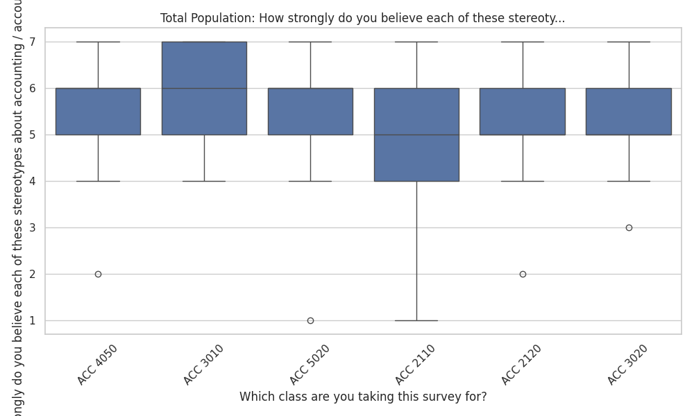

---

### Question: How strongly do you believe each of these stereotypes about accounting / accountants? - Detail oriented

**Overall Statistics:**
- Count: 390
- Mean: 5.70
- Std Dev: 1.09

**Statistics by Course:**

| Which class are you taking this survey for?   |   count |    mean |      std |
|:----------------------------------------------|--------:|--------:|---------:|
| ACC 2110                                      |     215 | 5.65116 | 1.11665  |
| ACC 2120                                      |      43 | 5.69767 | 1.01266  |
| ACC 3010                                      |      28 | 6       | 0.942809 |
| ACC 3020                                      |      33 | 5.57576 | 1.03169  |
| ACC 4050                                      |      49 | 5.83673 | 1.06745  |
| ACC 5020                                      |      22 | 5.68182 | 1.24924  |

**One-Way ANOVA:**
- F-statistic: 0.7531
- p-value: 0.5842

**Result:** No significant difference found (p >= 0.05).

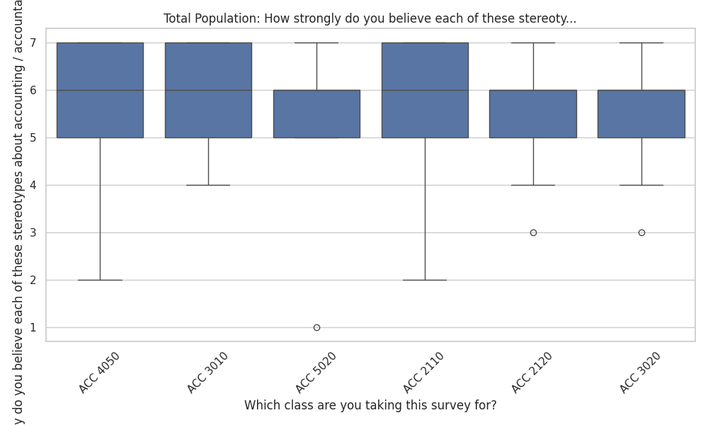

---

### Question: How strongly do you believe each of these stereotypes about accounting / accountants? - Follow rules

**Overall Statistics:**
- Count: 389
- Mean: 5.51
- Std Dev: 1.20

**Statistics by Course:**

| Which class are you taking this survey for?   |   count |    mean |      std |
|:----------------------------------------------|--------:|--------:|---------:|
| ACC 2110                                      |     214 | 5.37383 | 1.27837  |
| ACC 2120                                      |      43 | 5.60465 | 1.07215  |
| ACC 3010                                      |      28 | 5.92857 | 0.899735 |
| ACC 3020                                      |      33 | 5.66667 | 1.10868  |
| ACC 4050                                      |      49 | 5.71429 | 1.06066  |
| ACC 5020                                      |      22 | 5.5     | 1.26303  |

**One-Way ANOVA:**
- F-statistic: 1.7018
- p-value: 0.1332

**Result:** No significant difference found (p >= 0.05).

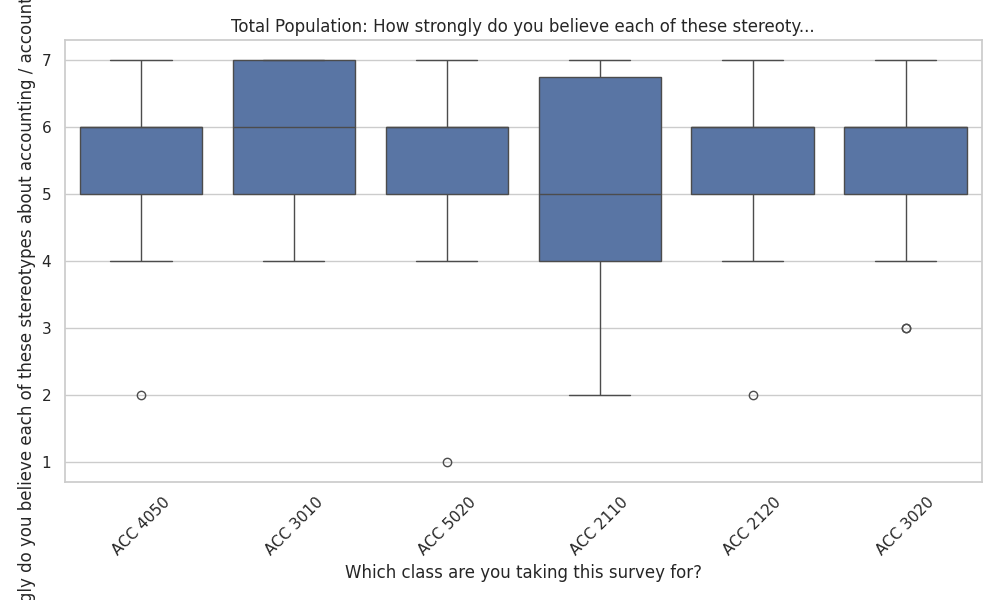

---

### Question: How strongly do you believe each of these stereotypes about accounting / accountants? - Willing to break the law

**Overall Statistics:**
- Count: 389
- Mean: 2.40
- Std Dev: 1.37

**Statistics by Course:**

| Which class are you taking this survey for?   |   count |    mean |     std |
|:----------------------------------------------|--------:|--------:|--------:|
| ACC 2110                                      |     214 | 2.53271 | 1.41963 |
| ACC 2120                                      |      43 | 2.25581 | 1.38173 |
| ACC 3010                                      |      28 | 2.21429 | 1.19744 |
| ACC 3020                                      |      33 | 2.39394 | 1.49874 |
| ACC 4050                                      |      49 | 2.12245 | 1.09226 |
| ACC 5020                                      |      22 | 2.18182 | 1.36753 |

**One-Way ANOVA:**
- F-statistic: 1.1165
- p-value: 0.3510

**Result:** No significant difference found (p >= 0.05).

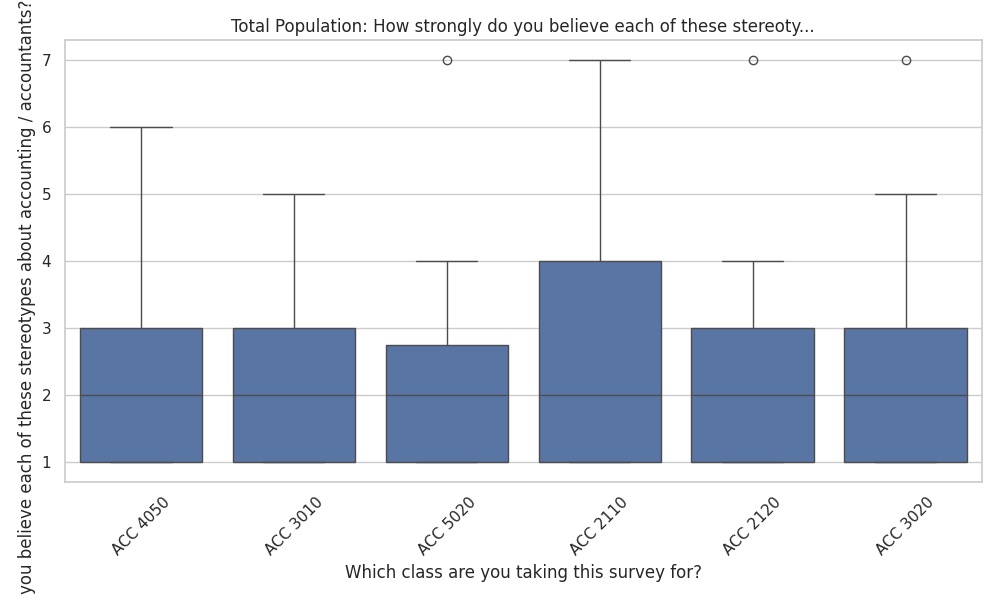

---

### Question: How strongly do you believe each of these stereotypes about accounting / accountants? - Boring

**Overall Statistics:**
- Count: 389
- Mean: 3.76
- Std Dev: 1.51

**Statistics by Course:**

| Which class are you taking this survey for?   |   count |    mean |     std |
|:----------------------------------------------|--------:|--------:|--------:|
| ACC 2110                                      |     214 | 4.02336 | 1.50879 |
| ACC 2120                                      |      43 | 3.44186 | 1.38534 |
| ACC 3010                                      |      28 | 3.21429 | 1.44932 |
| ACC 3020                                      |      33 | 3.78788 | 1.34065 |
| ACC 4050                                      |      49 | 3.5102  | 1.54276 |
| ACC 5020                                      |      22 | 3.04545 | 1.58797 |

**One-Way ANOVA:**
- F-statistic: 3.7851
- p-value: 0.0023

**Result:** Significant difference found (p < 0.05). Performing Tukey HSD.

  Multiple Comparison of Means - Tukey HSD, FWER=0.05
========================================================
 group1   group2  meandiff p-adj   lower   upper  reject
--------------------------------------------------------
ACC 2110 ACC 2120  -0.5815 0.1808 -1.2933  0.1303  False
ACC 2110 ACC 3010  -0.8091 0.0761  -1.665  0.0469  False
ACC 2110 ACC 3020  -0.2355 0.9584  -1.032  0.5611  False
ACC 2110 ACC 4050  -0.5132   0.25 -1.1877  0.1614  False
ACC 2110 ACC 5020  -0.9779 0.0407 -1.9315 -0.0243   True
ACC 2120 ACC 3010  -0.2276 0.9887 -1.2619  0.8067  False
ACC 2120 ACC 3020    0.346  0.916 -0.6397  1.3317  False
ACC 2120 ACC 4050   0.0683 0.9999 -0.8217  0.9583  False
ACC 2120 ACC 5020  -0.3964 0.9122 -1.5128    0.72  False
ACC 3010 ACC 3020   0.5736 0.6637 -0.5208  1.6679  False
ACC 3010 ACC 4050   0.2959 0.9598 -0.7131  1.3049  False
ACC 3010 ACC 5020  -0.1688 0.9987 -1.3823  1.0446  False
ACC 3020 ACC 4050  -0.2777  0.962 -1.2368  0.6815  False
ACC 3020 ACC 5020  -0.7424  0.458 -1.9147  0.4299  False
ACC 4050 ACC 5020  -0.4647  0.828 -1.5578  0.6283  False
--------------------------------------------------------

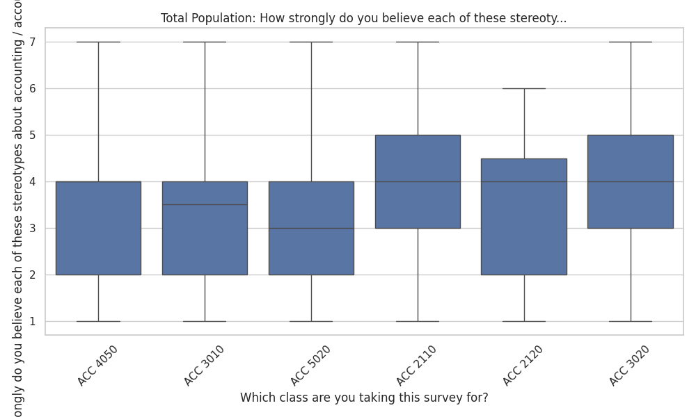

---

### Question: How strongly do you believe each of these stereotypes about accounting / accountants? - Work alone

**Overall Statistics:**
- Count: 388
- Mean: 3.71
- Std Dev: 1.52

**Statistics by Course:**

| Which class are you taking this survey for?   |   count |    mean |     std |
|:----------------------------------------------|--------:|--------:|--------:|
| ACC 2110                                      |     213 | 4.04695 | 1.42341 |
| ACC 2120                                      |      43 | 3.72093 | 1.35094 |
| ACC 3010                                      |      28 | 3.21429 | 1.5953  |
| ACC 3020                                      |      33 | 3.39394 | 1.34488 |
| ACC 4050                                      |      49 | 3.34694 | 1.58838 |
| ACC 5020                                      |      22 | 2.40909 | 1.6521  |

**One-Way ANOVA:**
- F-statistic: 7.3509
- p-value: 0.0000

**Result:** Significant difference found (p < 0.05). Performing Tukey HSD.

  Multiple Comparison of Means - Tukey HSD, FWER=0.05
========================================================
 group1   group2  meandiff p-adj   lower   upper  reject
--------------------------------------------------------
ACC 2110 ACC 2120   -0.326 0.7635 -1.0238  0.3718  False
ACC 2110 ACC 3010  -0.8327 0.0531 -1.6717  0.0064  False
ACC 2110 ACC 3020   -0.653 0.1604 -1.4338  0.1278  False
ACC 2110 ACC 4050     -0.7 0.0309 -1.3613 -0.0387   True
ACC 2110 ACC 5020  -1.6379    0.0 -2.5726 -0.7032   True
ACC 2120 ACC 3010  -0.5066 0.7076 -1.5202  0.5069  False
ACC 2120 ACC 3020   -0.327 0.9273 -1.2929   0.639  False
ACC 2120 ACC 4050   -0.374 0.8229 -1.2462  0.4982  False
ACC 2120 ACC 5020  -1.3118 0.0086 -2.4059 -0.2178   True
ACC 3010 ACC 3020   0.1797 0.9968 -0.8928  1.2521  False
ACC 3010 ACC 4050   0.1327 0.9989 -0.8561  1.1215  False
ACC 3010 ACC 5020  -0.8052 0.3797 -1.9943   0.384  False
ACC 3020 ACC 4050   -0.047    1.0 -0.9869  0.8929  False
ACC 3020 ACC 5020  -0.9848 0.1403 -2.1337   0.164  False
ACC 4050 ACC 5020  -0.9378 0.1244  -2.009  0.1333  False
--------------------------------------------------------

---

### Question: How strongly do each of these stereotypes lead you towards or away from a major / career in accounting? - Never talk to people

**Overall Statistics:**
- Count: 390
- Mean: 3.52
- Std Dev: 1.41

**Statistics by Course:**

| Which class are you taking this survey for?   |   count |    mean |     std |
|:----------------------------------------------|--------:|--------:|--------:|
| ACC 2110                                      |     215 | 3.45581 | 1.42299 |
| ACC 2120                                      |      42 | 3.90476 | 1.00752 |
| ACC 3010                                      |      28 | 3.21429 | 1.49956 |
| ACC 3020                                      |      33 | 3.33333 | 1.63299 |
| ACC 4050                                      |      50 | 3.74    | 1.3524  |
| ACC 5020                                      |      22 | 3.63636 | 1.55978 |

**One-Way ANOVA:**
- F-statistic: 1.3697
- p-value: 0.2348

**Result:** No significant difference found (p >= 0.05).

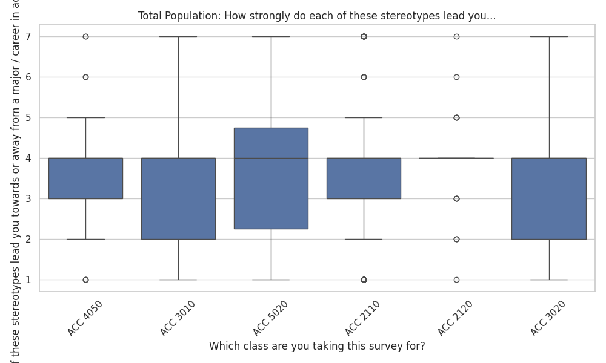

---

### Question: How strongly do each of these stereotypes lead you towards or away from a major / career in accounting? - Introverts

**Overall Statistics:**
- Count: 390
- Mean: 3.67
- Std Dev: 1.41

**Statistics by Course:**

| Which class are you taking this survey for?   |   count |    mean |     std |
|:----------------------------------------------|--------:|--------:|--------:|
| ACC 2110                                      |     215 | 3.52558 | 1.38011 |
| ACC 2120                                      |      42 | 4.14286 | 1.04931 |
| ACC 3010                                      |      28 | 3.42857 | 1.52579 |
| ACC 3020                                      |      33 | 3.51515 | 1.48158 |
| ACC 4050                                      |      50 | 4.2     | 1.45686 |
| ACC 5020                                      |      22 | 3.54545 | 1.53459 |

**One-Way ANOVA:**
- F-statistic: 3.1874
- p-value: 0.0078

**Result:** Significant difference found (p < 0.05). Performing Tukey HSD.

  Multiple Comparison of Means - Tukey HSD, FWER=0.05
=======================================================
 group1   group2  meandiff p-adj   lower  upper  reject
-------------------------------------------------------
ACC 2110 ACC 2120   0.6173  0.091 -0.0532 1.2877  False
ACC 2110 ACC 3010   -0.097 0.9993 -0.8955 0.7014  False
ACC 2110 ACC 3020  -0.0104    1.0 -0.7534 0.7326  False
ACC 2110 ACC 4050   0.6744 0.0255  0.0504 1.2984   True
ACC 2110 ACC 5020   0.0199    1.0 -0.8697 0.9095  False
ACC 2120 ACC 3010  -0.7143 0.2842 -1.6839 0.2553  False
ACC 2120 ACC 3020  -0.6277 0.3765 -1.5522 0.2968  False
ACC 2120 ACC 4050   0.0571    1.0 -0.7747  0.889  False
ACC 2120 ACC 5020  -0.5974 0.5752 -1.6433 0.4485  False
ACC 3010 ACC 3020   0.0866 0.9999 -0.9345 1.1077  False
ACC 3010 ACC 4050   0.7714 0.1749 -0.1666 1.7095  False
ACC 3010 ACC 5020   0.1169 0.9997 -1.0154 1.2491  False
ACC 3020 ACC 4050   0.6848 0.2398 -0.2065 1.5762  False
ACC 3020 ACC 5020   0.0303    1.0 -1.0635 1.1242  False
ACC 4050 ACC 5020  -0.6545 0.4388 -1.6713 0.3622  False
-------------------------------------------------------

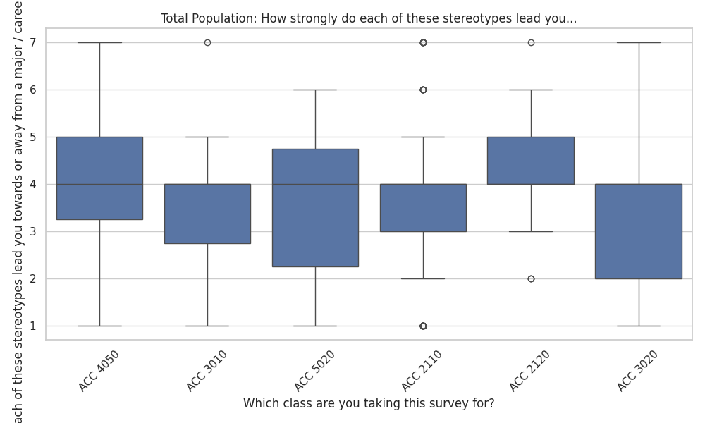

---

### Question: How strongly do each of these stereotypes lead you towards or away from a major / career in accounting? - Work in a cubicle

**Overall Statistics:**
- Count: 390
- Mean: 3.11
- Std Dev: 1.42

**Statistics by Course:**

| Which class are you taking this survey for?   |   count |    mean |     std |
|:----------------------------------------------|--------:|--------:|--------:|
| ACC 2110                                      |     215 | 2.94419 | 1.46825 |
| ACC 2120                                      |      42 | 3.71429 | 1.21546 |
| ACC 3010                                      |      28 | 3       | 1.1547  |
| ACC 3020                                      |      33 | 3.0303  | 1.48923 |
| ACC 4050                                      |      50 | 3.46    | 1.38814 |
| ACC 5020                                      |      22 | 2.95455 | 1.21409 |

**One-Way ANOVA:**
- F-statistic: 2.8963
- p-value: 0.0140

**Result:** Significant difference found (p < 0.05). Performing Tukey HSD.

  Multiple Comparison of Means - Tukey HSD, FWER=0.05
=======================================================
 group1   group2  meandiff p-adj   lower  upper  reject
-------------------------------------------------------
ACC 2110 ACC 2120   0.7701 0.0154  0.0929 1.4473   True
ACC 2110 ACC 3010   0.0558    1.0 -0.7507 0.8623  False
ACC 2110 ACC 3020   0.0861 0.9995 -0.6644 0.8366  False
ACC 2110 ACC 4050   0.5158 0.1792 -0.1144 1.1461  False
ACC 2110 ACC 5020   0.0104    1.0 -0.8882 0.9089  False
ACC 2120 ACC 3010  -0.7143 0.2952 -1.6936 0.2651  False
ACC 2120 ACC 3020   -0.684 0.2905 -1.6177 0.2498  False
ACC 2120 ACC 4050  -0.2543 0.9541 -1.0945 0.5859  False
ACC 2120 ACC 5020  -0.7597 0.3108 -1.8162 0.2967  False
ACC 3010 ACC 3020   0.0303    1.0 -1.0011 1.0617  False
ACC 3010 ACC 4050     0.46 0.7328 -0.4875 1.4075  False
ACC 3010 ACC 5020  -0.0455    1.0 -1.1891 1.0982  False
ACC 3020 ACC 4050   0.4297 0.7468 -0.4706   1.33  False
ACC 3020 ACC 5020  -0.0758    1.0 -1.1806 1.0291  False
ACC 4050 ACC 5020  -0.5055 0.7212 -1.5324 0.5215  False
-------------------------------------------------------

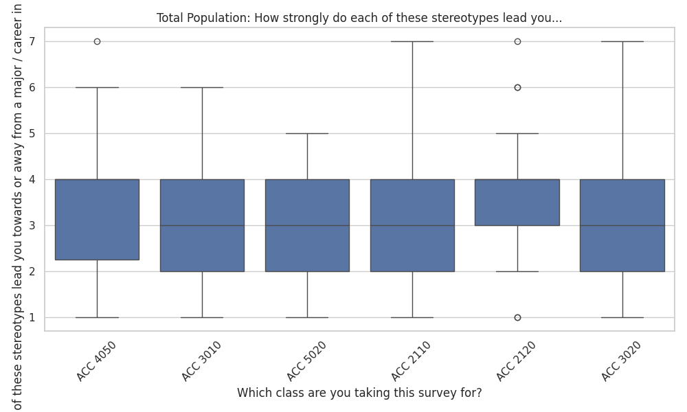

---

### Question: How strongly do each of these stereotypes lead you towards or away from a major / career in accounting? - Long work hours

**Overall Statistics:**
- Count: 390
- Mean: 3.07
- Std Dev: 1.32

**Statistics by Course:**

| Which class are you taking this survey for?   |   count |    mean |     std |
|:----------------------------------------------|--------:|--------:|--------:|
| ACC 2110                                      |     215 | 3.12558 | 1.35276 |
| ACC 2120                                      |      42 | 3.14286 | 1.09481 |
| ACC 3010                                      |      28 | 2.85714 | 1.26825 |
| ACC 3020                                      |      33 | 2.60606 | 1.24848 |
| ACC 4050                                      |      50 | 3.02    | 1.28556 |
| ACC 5020                                      |      22 | 3.45455 | 1.50324 |

**One-Way ANOVA:**
- F-statistic: 1.4649
- p-value: 0.2004

**Result:** No significant difference found (p >= 0.05).

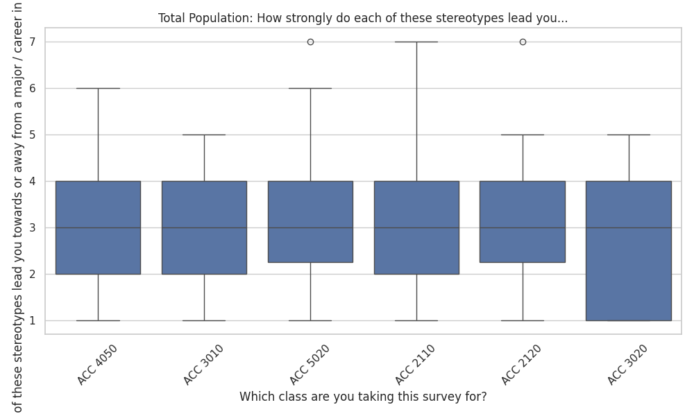

---

### Question: How strongly do each of these stereotypes lead you towards or away from a major / career in accounting? - Only tax and audit careers

**Overall Statistics:**
- Count: 391
- Mean: 3.31
- Std Dev: 1.25

**Statistics by Course:**

| Which class are you taking this survey for?   |   count |    mean |      std |
|:----------------------------------------------|--------:|--------:|---------:|
| ACC 2110                                      |     215 | 3.15814 | 1.28366  |
| ACC 2120                                      |      43 | 3.7907  | 1.22587  |
| ACC 3010                                      |      28 | 3.42857 | 1.25988  |
| ACC 3020                                      |      33 | 3.39394 | 0.863836 |
| ACC 4050                                      |      50 | 3.34    | 1.30321  |
| ACC 5020                                      |      22 | 3.54545 | 1.18431  |

**One-Way ANOVA:**
- F-statistic: 2.1714
- p-value: 0.0566

**Result:** No significant difference found (p >= 0.05).

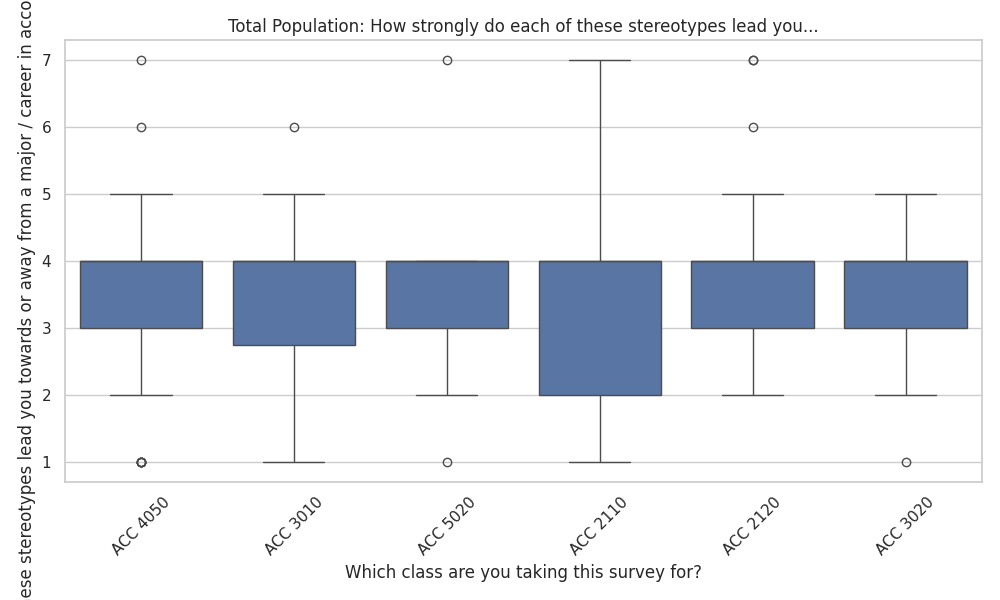

---

### Question: How strongly do each of these stereotypes lead you towards or away from a major / career in accounting? - Always do taxes

**Overall Statistics:**
- Count: 390
- Mean: 3.26
- Std Dev: 1.30

**Statistics by Course:**

| Which class are you taking this survey for?   |   count |    mean |     std |
|:----------------------------------------------|--------:|--------:|--------:|
| ACC 2110                                      |     215 | 3.12093 | 1.33405 |
| ACC 2120                                      |      42 | 3.71429 | 1.08843 |
| ACC 3010                                      |      28 | 3.28571 | 1.32936 |
| ACC 3020                                      |      33 | 3.33333 | 1.05079 |
| ACC 4050                                      |      50 | 3.38    | 1.3686  |
| ACC 5020                                      |      22 | 3.27273 | 1.42032 |

**One-Way ANOVA:**
- F-statistic: 1.6320
- p-value: 0.1505

**Result:** No significant difference found (p >= 0.05).

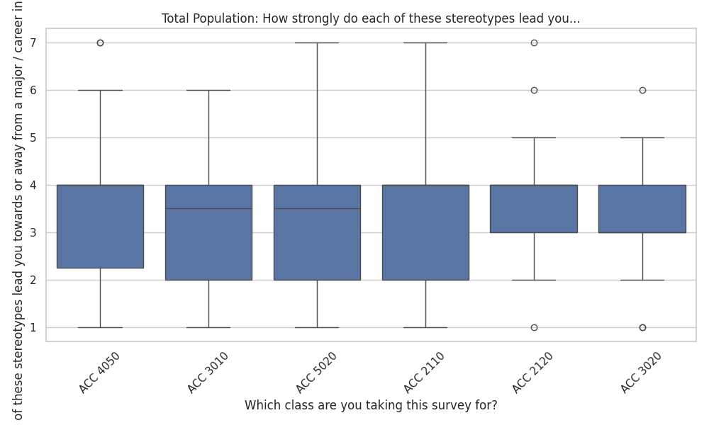

---

### Question: How strongly do each of these stereotypes lead you towards or away from a major / career in accounting? - Reliable

**Overall Statistics:**
- Count: 390
- Mean: 5.27
- Std Dev: 1.23

**Statistics by Course:**

| Which class are you taking this survey for?   |   count |    mean |      std |
|:----------------------------------------------|--------:|--------:|---------:|
| ACC 2110                                      |     215 | 4.98605 | 1.21701  |
| ACC 2120                                      |      42 | 5.52381 | 0.993592 |
| ACC 3010                                      |      28 | 5.82143 | 1.09048  |
| ACC 3020                                      |      33 | 5.51515 | 1.12142  |
| ACC 4050                                      |      50 | 5.74    | 1.02639  |
| ACC 5020                                      |      22 | 5.36364 | 1.70561  |

**One-Way ANOVA:**
- F-statistic: 5.9136
- p-value: 0.0000

**Result:** Significant difference found (p < 0.05). Performing Tukey HSD.

  Multiple Comparison of Means - Tukey HSD, FWER=0.05
=======================================================
 group1   group2  meandiff p-adj   lower  upper  reject
-------------------------------------------------------
ACC 2110 ACC 2120   0.5378 0.0812 -0.0366 1.1121  False
ACC 2110 ACC 3010   0.8354 0.0069  0.1514 1.5194   True
ACC 2110 ACC 3020   0.5291 0.1655 -0.1074 1.1656  False
ACC 2110 ACC 4050    0.754 0.0009  0.2195 1.2885   True
ACC 2110 ACC 5020   0.3776 0.7154 -0.3844 1.1396  False
ACC 2120 ACC 3010   0.2976 0.9089  -0.533 1.1282  False
ACC 2120 ACC 3020  -0.0087    1.0 -0.8006 0.7833  False
ACC 2120 ACC 4050   0.2162 0.9536 -0.4964 0.9287  False
ACC 2120 ACC 5020  -0.1602 0.9957 -1.0561 0.7358  False
ACC 3010 ACC 3020  -0.3063 0.9168  -1.181 0.5684  False
ACC 3010 ACC 4050  -0.0814 0.9997  -0.885 0.7221  False
ACC 3010 ACC 5020  -0.4578 0.7556 -1.4277 0.5121  False
ACC 3020 ACC 4050   0.2248 0.9591 -0.5387 0.9884  False
ACC 3020 ACC 5020  -0.1515 0.9973 -1.0885 0.7855  False
ACC 4050 ACC 5020  -0.3764 0.8181 -1.2473 0.4946  False
-------------------------------------------------------

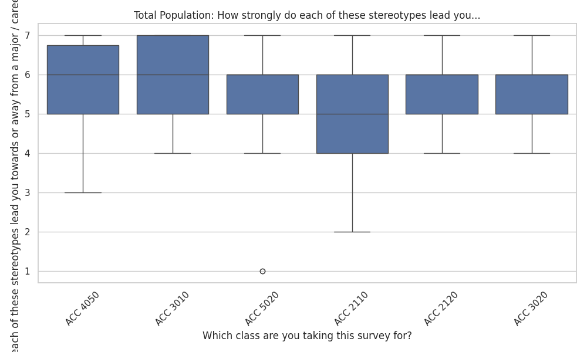

---

### Question: How strongly do each of these stereotypes lead you towards or away from a major / career in accounting? - Detail oriented

**Overall Statistics:**
- Count: 391
- Mean: 5.30
- Std Dev: 1.22

**Statistics by Course:**

| Which class are you taking this survey for?   |   count |    mean |      std |
|:----------------------------------------------|--------:|--------:|---------:|
| ACC 2110                                      |     215 | 5.04186 | 1.17335  |
| ACC 2120                                      |      43 | 5.46512 | 1.14119  |
| ACC 3010                                      |      28 | 5.96429 | 0.999338 |
| ACC 3020                                      |      33 | 5.54545 | 1.17502  |
| ACC 4050                                      |      50 | 5.68    | 1.07741  |
| ACC 5020                                      |      22 | 5.5     | 1.73891  |

**One-Way ANOVA:**
- F-statistic: 5.4009
- p-value: 0.0001

**Result:** Significant difference found (p < 0.05). Performing Tukey HSD.

  Multiple Comparison of Means - Tukey HSD, FWER=0.05
=======================================================
 group1   group2  meandiff p-adj   lower  upper  reject
-------------------------------------------------------
ACC 2110 ACC 2120   0.4233 0.2702 -0.1438 0.9904  False
ACC 2110 ACC 3010   0.9224 0.0017  0.2404 1.6045   True
ACC 2110 ACC 3020   0.5036 0.2079 -0.1311 1.1383  False
ACC 2110 ACC 4050   0.6381 0.0087  0.1052 1.1711   True
ACC 2110 ACC 5020   0.4581 0.5148 -0.3017  1.218  False
ACC 2120 ACC 3010   0.4992 0.5099 -0.3252 1.3235  False
ACC 2120 ACC 3020   0.0803 0.9997 -0.7053  0.866  False
ACC 2120 ACC 4050   0.2149  0.953 -0.4911 0.9209  False
ACC 2120 ACC 5020   0.0349    1.0  -0.855 0.9247  False
ACC 3010 ACC 3020  -0.4188 0.7419 -1.2911 0.4534  False
ACC 3010 ACC 4050  -0.2843 0.9124 -1.0856  0.517  False
ACC 3010 ACC 5020  -0.4643 0.7421 -1.4314 0.5029  False
ACC 3020 ACC 4050   0.1345 0.9959 -0.6268 0.8959  False
ACC 3020 ACC 5020  -0.0455    1.0 -0.9798 0.8889  False
ACC 4050 ACC 5020    -0.18 0.9914 -1.0485 0.6885  False
-------------------------------------------------------

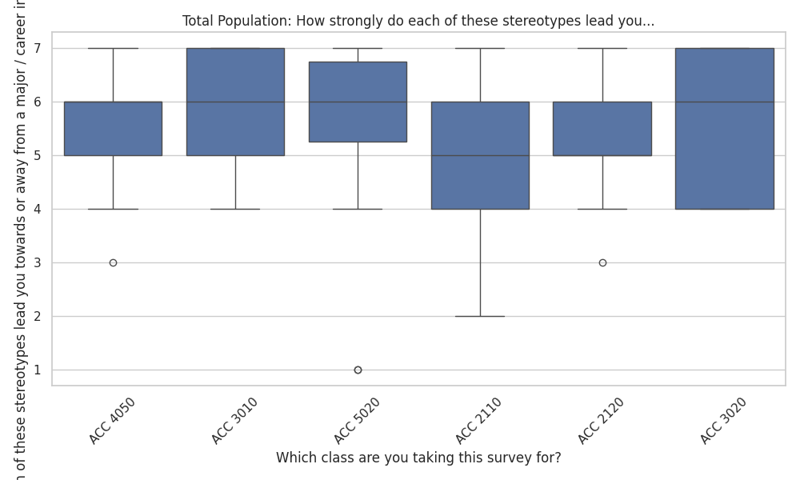

---

### Question: How strongly do each of these stereotypes lead you towards or away from a major / career in accounting? - Follow rules

**Overall Statistics:**
- Count: 391
- Mean: 5.10
- Std Dev: 1.23

**Statistics by Course:**

| Which class are you taking this survey for?   |   count |    mean |     std |
|:----------------------------------------------|--------:|--------:|--------:|
| ACC 2110                                      |     215 | 4.87442 | 1.19111 |
| ACC 2120                                      |      43 | 5.39535 | 1.15757 |
| ACC 3010                                      |      28 | 5.46429 | 1.17006 |
| ACC 3020                                      |      33 | 5.33333 | 1.08012 |
| ACC 4050                                      |      50 | 5.5     | 1.18235 |
| ACC 5020                                      |      22 | 5.04545 | 1.61768 |

**One-Way ANOVA:**
- F-statistic: 3.9032
- p-value: 0.0018

**Result:** Significant difference found (p < 0.05). Performing Tukey HSD.

  Multiple Comparison of Means - Tukey HSD, FWER=0.05
=======================================================
 group1   group2  meandiff p-adj   lower  upper  reject
-------------------------------------------------------
ACC 2110 ACC 2120   0.5209 0.1019 -0.0549 1.0968  False
ACC 2110 ACC 3010   0.5899 0.1454 -0.1027 1.2824  False
ACC 2110 ACC 3020   0.4589 0.3219 -0.1855 1.1034  False
ACC 2110 ACC 4050   0.6256  0.013  0.0844 1.1668   True
ACC 2110 ACC 5020    0.171 0.9883 -0.6005 0.9426  False
ACC 2120 ACC 3010   0.0689 0.9999 -0.7681  0.906  False
ACC 2120 ACC 3020   -0.062 0.9999 -0.8597 0.7357  False
ACC 2120 ACC 4050   0.1047 0.9984 -0.6123 0.8216  False
ACC 2120 ACC 5020  -0.3499 0.8775 -1.2534 0.5537  False
ACC 3010 ACC 3020   -0.131 0.9983 -1.0166 0.7547  False
ACC 3010 ACC 4050   0.0357    1.0 -0.7779 0.8493  False
ACC 3010 ACC 5020  -0.4188 0.8262 -1.4009 0.5632  False
ACC 3020 ACC 4050   0.1667 0.9897 -0.6064 0.9398  False
ACC 3020 ACC 5020  -0.2879 0.9536 -1.2366 0.6609  False
ACC 4050 ACC 5020  -0.4545 0.6797 -1.3364 0.4273  False
-------------------------------------------------------

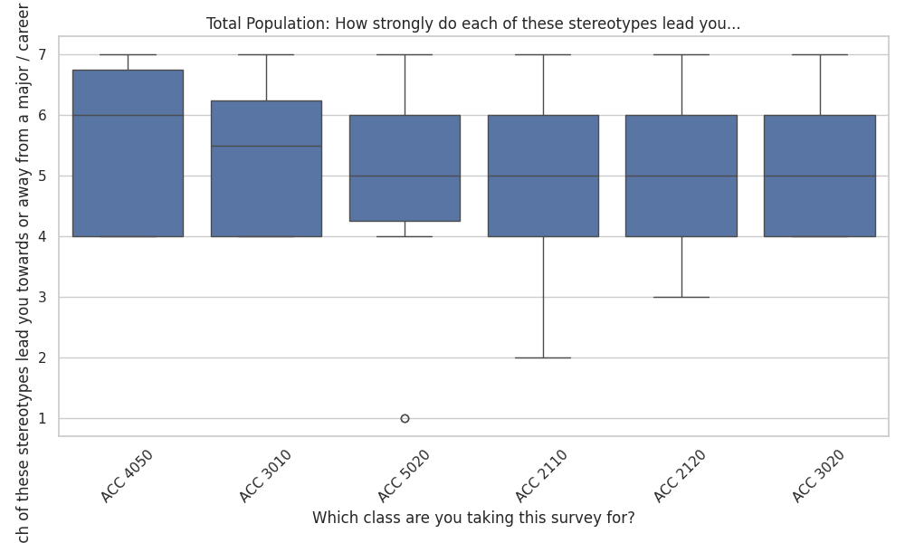

---

### Question: How strongly do each of these stereotypes lead you towards or away from a major / career in accounting? - Willing to break the law

**Overall Statistics:**
- Count: 390
- Mean: 2.68
- Std Dev: 1.44

**Statistics by Course:**

| Which class are you taking this survey for?   |   count |    mean |     std |
|:----------------------------------------------|--------:|--------:|--------:|
| ACC 2110                                      |     215 | 2.79535 | 1.40259 |
| ACC 2120                                      |      42 | 2.47619 | 1.50184 |
| ACC 3010                                      |      28 | 2.28571 | 1.24297 |
| ACC 3020                                      |      33 | 2.63636 | 1.43218 |
| ACC 4050                                      |      50 | 2.62    | 1.52382 |
| ACC 5020                                      |      22 | 2.68182 | 1.78316 |

**One-Way ANOVA:**
- F-statistic: 0.8816
- p-value: 0.4934

**Result:** No significant difference found (p >= 0.05).

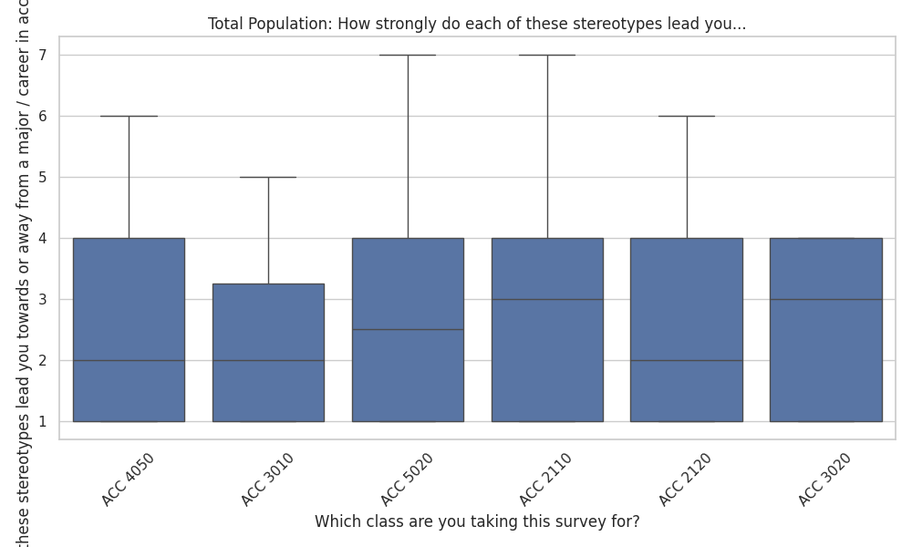

---

### Question: How strongly do each of these stereotypes lead you towards or away from a major / career in accounting? - Boring

**Overall Statistics:**
- Count: 389
- Mean: 2.95
- Std Dev: 1.30

**Statistics by Course:**

| Which class are you taking this survey for?   |   count |    mean |     std |
|:----------------------------------------------|--------:|--------:|--------:|
| ACC 2110                                      |     214 | 2.92991 | 1.36342 |
| ACC 2120                                      |      42 | 3.16667 | 1.08012 |
| ACC 3010                                      |      28 | 2.53571 | 1.26146 |
| ACC 3020                                      |      33 | 2.69697 | 1.18545 |
| ACC 4050                                      |      50 | 3.18    | 1.15511 |
| ACC 5020                                      |      22 | 3.18182 | 1.43548 |

**One-Way ANOVA:**
- F-statistic: 1.5309
- p-value: 0.1792

**Result:** No significant difference found (p >= 0.05).

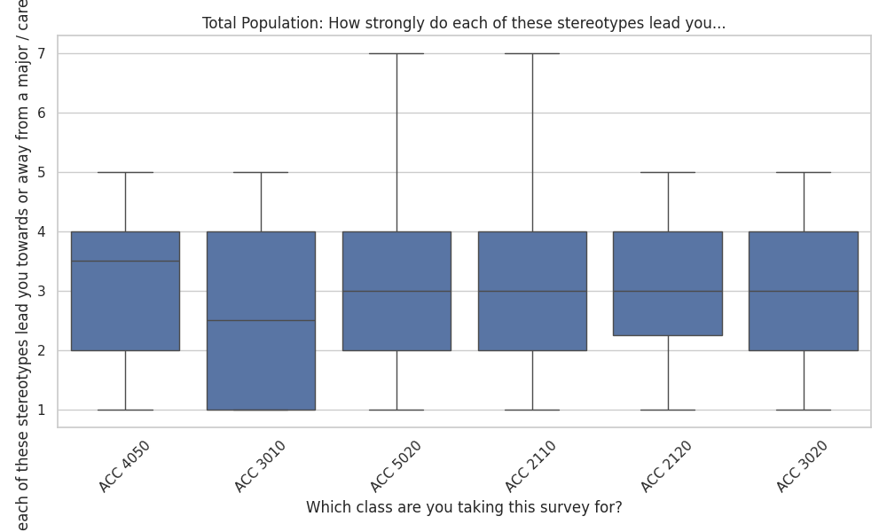

---

### Question: How strongly do each of these stereotypes lead you towards or away from a major / career in accounting? - Work alone

**Overall Statistics:**
- Count: 390
- Mean: 3.46
- Std Dev: 1.47

**Statistics by Course:**

| Which class are you taking this survey for?   |   count |    mean |     std |
|:----------------------------------------------|--------:|--------:|--------:|
| ACC 2110                                      |     215 | 3.40465 | 1.53433 |
| ACC 2120                                      |      42 | 4.09524 | 1.14358 |
| ACC 3010                                      |      28 | 3.39286 | 1.52362 |
| ACC 3020                                      |      33 | 3.18182 | 1.3568  |
| ACC 4050                                      |      50 | 3.42    | 1.41551 |
| ACC 5020                                      |      22 | 3.31818 | 1.3934  |

**One-Way ANOVA:**
- F-statistic: 1.9534
- p-value: 0.0848

**Result:** No significant difference found (p >= 0.05).

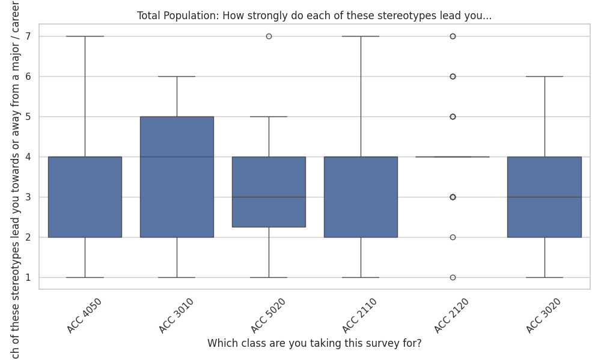

---

### Question: How useful do you think the following skills / traits are in accounting? - Written communication

**Overall Statistics:**
- Count: 390
- Mean: 6.02
- Std Dev: 1.16

**Statistics by Course:**

| Which class are you taking this survey for?   |   count |    mean |      std |
|:----------------------------------------------|--------:|--------:|---------:|
| ACC 2110                                      |     214 | 5.96729 | 1.19618  |
| ACC 2120                                      |      43 | 6.04651 | 0.898504 |
| ACC 3010                                      |      28 | 6.03571 | 0.922241 |
| ACC 3020                                      |      33 | 6.09091 | 0.879049 |
| ACC 4050                                      |      50 | 6.12    | 1.40901  |
| ACC 5020                                      |      22 | 6.13636 | 1.3556   |

**One-Way ANOVA:**
- F-statistic: 0.2346
- p-value: 0.9472

**Result:** No significant difference found (p >= 0.05).

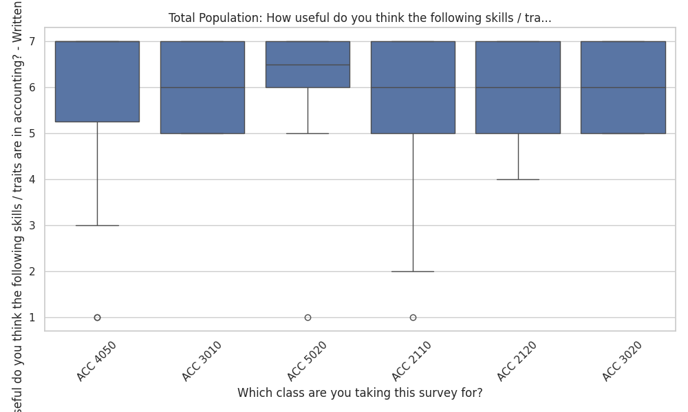

---

### Question: How useful do you think the following skills / traits are in accounting? - Verbal communication

**Overall Statistics:**
- Count: 389
- Mean: 5.97
- Std Dev: 1.25

**Statistics by Course:**

| Which class are you taking this survey for?   |   count |    mean |      std |
|:----------------------------------------------|--------:|--------:|---------:|
| ACC 2110                                      |     214 | 5.77103 | 1.34928  |
| ACC 2120                                      |      42 | 6       | 0.826394 |
| ACC 3010                                      |      28 | 6.35714 | 0.780042 |
| ACC 3020                                      |      33 | 6.24242 | 0.902438 |
| ACC 4050                                      |      50 | 6.26    | 1.3524   |
| ACC 5020                                      |      22 | 6.31818 | 1.35879  |

**One-Way ANOVA:**
- F-statistic: 2.8760
- p-value: 0.0146

**Result:** Significant difference found (p < 0.05). Performing Tukey HSD.

  Multiple Comparison of Means - Tukey HSD, FWER=0.05
=======================================================
 group1   group2  meandiff p-adj   lower  upper  reject
-------------------------------------------------------
ACC 2110 ACC 2120    0.229 0.8828 -0.3693 0.8272  False
ACC 2110 ACC 3010   0.5861 0.1745 -0.1263 1.2985  False
ACC 2110 ACC 3020   0.4714 0.3235 -0.1916 1.1344  False
ACC 2110 ACC 4050    0.489 0.1222 -0.0678 1.0458  False
ACC 2110 ACC 5020   0.5472 0.3589 -0.2465 1.3408  False
ACC 2120 ACC 3010   0.3571  0.845 -0.5077  1.222  False
ACC 2120 ACC 3020   0.2424 0.9594 -0.5822  1.067  False
ACC 2120 ACC 4050     0.26 0.9166  -0.482  1.002  False
ACC 2120 ACC 5020   0.3182 0.9251 -0.6148 1.2511  False
ACC 3010 ACC 3020  -0.1147 0.9992 -1.0255 0.7961  False
ACC 3010 ACC 4050  -0.0971 0.9995 -0.9339 0.7396  False
ACC 3010 ACC 5020   -0.039    1.0 -1.0489  0.971  False
ACC 3020 ACC 4050   0.0176    1.0 -0.7775 0.8126  False
ACC 3020 ACC 5020   0.0758 0.9999 -0.8999 1.0514  False
ACC 4050 ACC 5020   0.0582    1.0 -0.8487 0.9651  False
-------------------------------------------------------

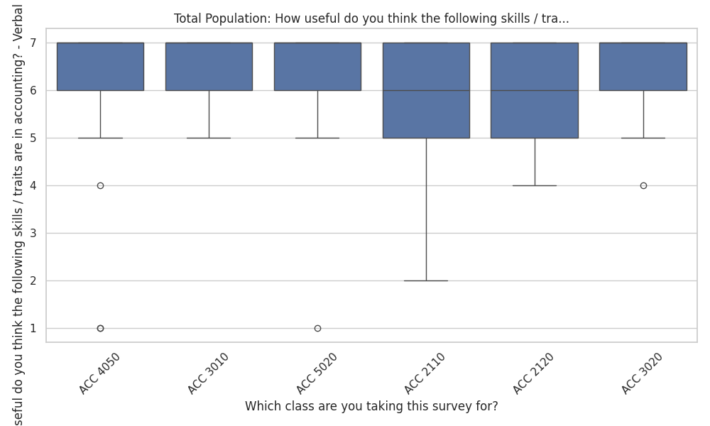

---

### Question: How useful do you think the following skills / traits are in accounting? - Critical thinking

**Overall Statistics:**
- Count: 390
- Mean: 6.37
- Std Dev: 1.06

**Statistics by Course:**

| Which class are you taking this survey for?   |   count |    mean |      std |
|:----------------------------------------------|--------:|--------:|---------:|
| ACC 2110                                      |     214 | 6.22897 | 1.15425  |
| ACC 2120                                      |      43 | 6.27907 | 0.881708 |
| ACC 3010                                      |      28 | 6.67857 | 0.611832 |
| ACC 3020                                      |      33 | 6.57576 | 0.662868 |
| ACC 4050                                      |      50 | 6.48    | 1.28158  |
| ACC 5020                                      |      22 | 6.90909 | 0.294245 |

**One-Way ANOVA:**
- F-statistic: 2.8456
- p-value: 0.0155

**Result:** Significant difference found (p < 0.05). Performing Tukey HSD.

  Multiple Comparison of Means - Tukey HSD, FWER=0.05
=======================================================
 group1   group2  meandiff p-adj   lower  upper  reject
-------------------------------------------------------
ACC 2110 ACC 2120   0.0501 0.9997 -0.4522 0.5524  False
ACC 2110 ACC 3010   0.4496 0.2731 -0.1544 1.0536  False
ACC 2110 ACC 3020   0.3468 0.4885 -0.2153 0.9089  False
ACC 2110 ACC 4050    0.251 0.6497 -0.2211 0.7232  False
ACC 2110 ACC 5020   0.6801 0.0459  0.0072 1.3531   True
ACC 2120 ACC 3010   0.3995 0.6204 -0.3304 1.1294  False
ACC 2120 ACC 3020   0.2967 0.8262 -0.3989 0.9923  False
ACC 2120 ACC 4050   0.2009 0.9411 -0.4242 0.8261  False
ACC 2120 ACC 5020     0.63 0.2005 -0.1579 1.4179  False
ACC 3010 ACC 3020  -0.1028 0.9989 -0.8751 0.6695  False
ACC 3010 ACC 4050  -0.1986 0.9671  -0.908 0.5109  False
ACC 3010 ACC 5020   0.2305 0.9722 -0.6258 1.0869  False
ACC 3020 ACC 4050  -0.0958 0.9986 -0.7699 0.5784  False
ACC 3020 ACC 5020   0.3333 0.8582  -0.494 1.1606  False
ACC 4050 ACC 5020   0.4291 0.6003 -0.3399 1.1981  False
-------------------------------------------------------

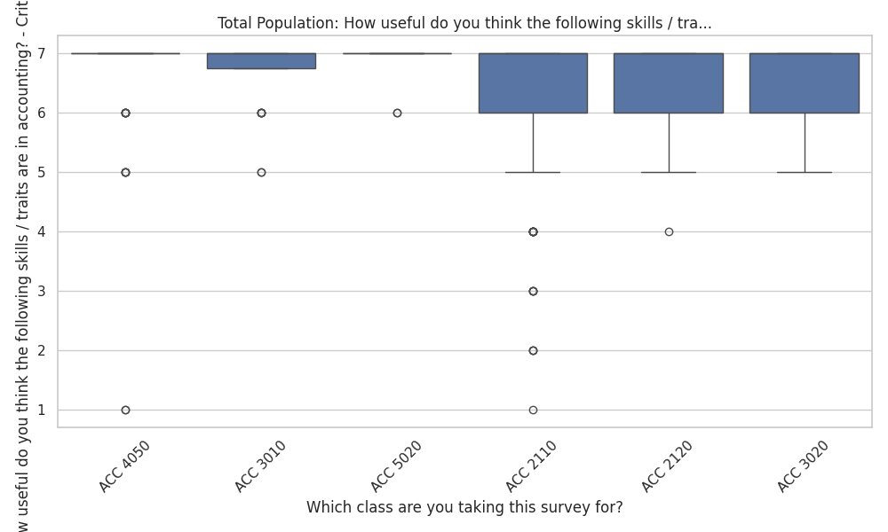

---

### Question: How useful do you think the following skills / traits are in accounting? - Organization

**Overall Statistics:**
- Count: 390
- Mean: 6.48
- Std Dev: 0.97

**Statistics by Course:**

| Which class are you taking this survey for?   |   count |    mean |      std |
|:----------------------------------------------|--------:|--------:|---------:|
| ACC 2110                                      |     214 | 6.45327 | 0.961788 |
| ACC 2120                                      |      43 | 6.62791 | 0.655499 |
| ACC 3010                                      |      28 | 6.57143 | 0.741798 |
| ACC 3020                                      |      33 | 6.48485 | 0.712444 |
| ACC 4050                                      |      50 | 6.42    | 1.26314  |
| ACC 5020                                      |      22 | 6.5     | 1.33631  |

**One-Way ANOVA:**
- F-statistic: 0.3217
- p-value: 0.8999

**Result:** No significant difference found (p >= 0.05).

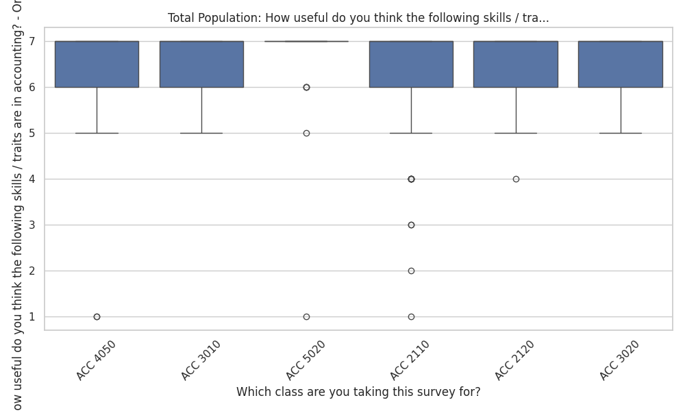

---

### Question: How useful do you think the following skills / traits are in accounting? - Attention to detail

**Overall Statistics:**
- Count: 390
- Mean: 6.56
- Std Dev: 0.90

**Statistics by Course:**

| Which class are you taking this survey for?   |   count |    mean |      std |
|:----------------------------------------------|--------:|--------:|---------:|
| ACC 2110                                      |     214 | 6.49065 | 0.933169 |
| ACC 2120                                      |      43 | 6.72093 | 0.629648 |
| ACC 3010                                      |      28 | 6.75    | 0.585314 |
| ACC 3020                                      |      33 | 6.48485 | 0.833712 |
| ACC 4050                                      |      50 | 6.54    | 1.23239  |
| ACC 5020                                      |      22 | 6.90909 | 0.294245 |

**One-Way ANOVA:**
- F-statistic: 1.4956
- p-value: 0.1902

**Result:** No significant difference found (p >= 0.05).

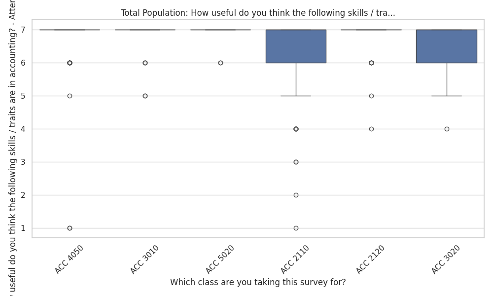

---

### Question: How useful do you think the following skills / traits are in accounting? - Being good with numbers

**Overall Statistics:**
- Count: 390
- Mean: 6.02
- Std Dev: 1.14

**Statistics by Course:**

| Which class are you taking this survey for?   |   count |    mean |      std |
|:----------------------------------------------|--------:|--------:|---------:|
| ACC 2110                                      |     214 | 6.2757  | 1.01337  |
| ACC 2120                                      |      43 | 5.83721 | 1.15326  |
| ACC 3010                                      |      28 | 5.92857 | 0.978607 |
| ACC 3020                                      |      33 | 5.51515 | 1.17583  |
| ACC 4050                                      |      50 | 5.62    | 1.4831   |
| ACC 5020                                      |      22 | 5.68182 | 1.04135  |

**One-Way ANOVA:**
- F-statistic: 5.5897
- p-value: 0.0001

**Result:** Significant difference found (p < 0.05). Performing Tukey HSD.

  Multiple Comparison of Means - Tukey HSD, FWER=0.05
========================================================
 group1   group2  meandiff p-adj   lower   upper  reject
--------------------------------------------------------
ACC 2110 ACC 2120  -0.4385 0.1737  -0.971   0.094  False
ACC 2110 ACC 3010  -0.3471 0.6303 -0.9875  0.2932  False
ACC 2110 ACC 3020  -0.7605 0.0039 -1.3565 -0.1646   True
ACC 2110 ACC 4050  -0.6557 0.0028 -1.1562 -0.1552   True
ACC 2110 ACC 5020  -0.5939 0.1643 -1.3073  0.1195  False
ACC 2120 ACC 3010   0.0914 0.9994 -0.6824  0.8651  False
ACC 2120 ACC 3020  -0.3221 0.8113 -1.0595  0.4154  False
ACC 2120 ACC 4050  -0.2172 0.9362 -0.8799  0.4455  False
ACC 2120 ACC 5020  -0.1554 0.9948 -0.9906  0.6798  False
ACC 3010 ACC 3020  -0.4134 0.6985 -1.2321  0.4053  False
ACC 3010 ACC 4050  -0.3086 0.8485 -1.0607  0.4435  False
ACC 3010 ACC 5020  -0.2468  0.971 -1.1545   0.661  False
ACC 3020 ACC 4050   0.1048 0.9983 -0.6098  0.8195  False
ACC 3020 ACC 5020   0.1667 0.9943 -0.7103  1.0437  False
ACC 4050 ACC 5020   0.0618 0.9999 -0.7534   0.877  False
--------------------------------------------------------

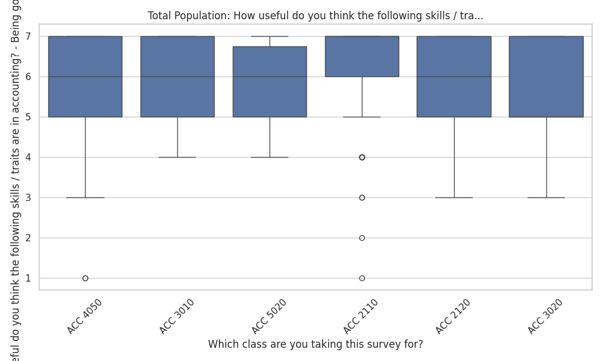

---

### Question: How useful do you think the following skills / traits are in accounting? - Being a perfectionist

**Overall Statistics:**
- Count: 390
- Mean: 4.77
- Std Dev: 1.38

**Statistics by Course:**

| Which class are you taking this survey for?   |   count |    mean |      std |
|:----------------------------------------------|--------:|--------:|---------:|
| ACC 2110                                      |     214 | 5.11215 | 1.33798  |
| ACC 2120                                      |      43 | 4.74419 | 1.36439  |
| ACC 3010                                      |      28 | 4.60714 | 1.47421  |
| ACC 3020                                      |      33 | 4.18182 | 1.26131  |
| ACC 4050                                      |      50 | 4.26    | 1.22574  |
| ACC 5020                                      |      22 | 3.68182 | 0.945484 |

**One-Way ANOVA:**
- F-statistic: 8.8578
- p-value: 0.0000

**Result:** Significant difference found (p < 0.05). Performing Tukey HSD.

  Multiple Comparison of Means - Tukey HSD, FWER=0.05
========================================================
 group1   group2  meandiff p-adj   lower   upper  reject
--------------------------------------------------------
ACC 2110 ACC 2120   -0.368 0.5475 -0.9962  0.2603  False
ACC 2110 ACC 3010   -0.505 0.3947 -1.2605  0.2505  False
ACC 2110 ACC 3020  -0.9303 0.0024 -1.6334 -0.2273   True
ACC 2110 ACC 4050  -0.8521 0.0006 -1.4426 -0.2617   True
ACC 2110 ACC 5020  -1.4303    0.0  -2.272 -0.5887   True
ACC 2120 ACC 3010   -0.137 0.9981 -1.0499  0.7758  False
ACC 2120 ACC 3020  -0.5624  0.434 -1.4323  0.3076  False
ACC 2120 ACC 4050  -0.4842  0.484  -1.266  0.2976  False
ACC 2120 ACC 5020  -1.0624 0.0261 -2.0477  -0.077   True
ACC 3010 ACC 3020  -0.4253 0.8059 -1.3912  0.5405  False
ACC 3010 ACC 4050  -0.3471 0.8727 -1.2344  0.5402  False
ACC 3010 ACC 5020  -0.9253 0.1343 -1.9963  0.1457  False
ACC 3020 ACC 4050   0.0782 0.9998 -0.7649  0.9213  False
ACC 3020 ACC 5020     -0.5 0.7366 -1.5347  0.5347  False
ACC 4050 ACC 5020  -0.5782 0.5181 -1.5399  0.3836  False
--------------------------------------------------------

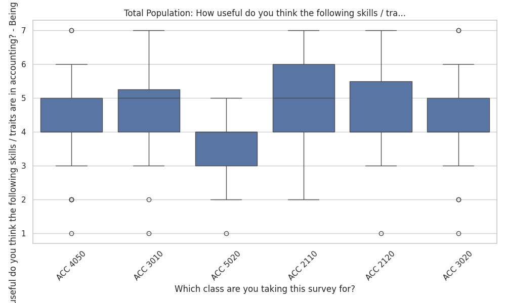

---

### Question: How useful do you think the following skills / traits are in accounting? - Willing to learn new things

**Overall Statistics:**
- Count: 390
- Mean: 6.04
- Std Dev: 1.16

**Statistics by Course:**

| Which class are you taking this survey for?   |   count |    mean |     std |
|:----------------------------------------------|--------:|--------:|--------:|
| ACC 2110                                      |     214 | 5.96262 | 1.15002 |
| ACC 2120                                      |      43 | 5.97674 | 1.03483 |
| ACC 3010                                      |      28 | 6.39286 | 0.99403 |
| ACC 3020                                      |      33 | 6.15152 | 1.12142 |
| ACC 4050                                      |      50 | 6.02    | 1.34756 |
| ACC 5020                                      |      22 | 6.36364 | 1.329   |

**One-Way ANOVA:**
- F-statistic: 1.1341
- p-value: 0.3417

**Result:** No significant difference found (p >= 0.05).

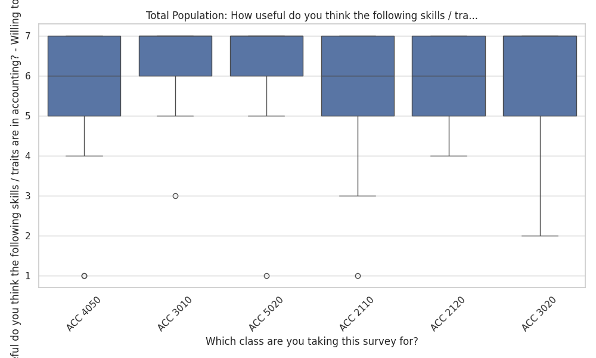

---

### Question: How useful do you think the following skills / traits are in accounting? - Honest / ethical conduct

**Overall Statistics:**
- Count: 390
- Mean: 6.40
- Std Dev: 1.05

**Statistics by Course:**

| Which class are you taking this survey for?   |   count |    mean |      std |
|:----------------------------------------------|--------:|--------:|---------:|
| ACC 2110                                      |     214 | 6.2757  | 1.11063  |
| ACC 2120                                      |      43 | 6.46512 | 0.854925 |
| ACC 3010                                      |      28 | 6.85714 | 0.448395 |
| ACC 3020                                      |      33 | 6.36364 | 1.02525  |
| ACC 4050                                      |      50 | 6.46    | 1.24884  |
| ACC 5020                                      |      22 | 6.81818 | 0.664499 |

**One-Way ANOVA:**
- F-statistic: 2.4629
- p-value: 0.0326

**Result:** Significant difference found (p < 0.05). Performing Tukey HSD.

  Multiple Comparison of Means - Tukey HSD, FWER=0.05
=======================================================
 group1   group2  meandiff p-adj   lower  upper  reject
-------------------------------------------------------
ACC 2110 ACC 2120   0.1894 0.8868 -0.3101 0.6889  False
ACC 2110 ACC 3010   0.5814 0.0641 -0.0192 1.1821  False
ACC 2110 ACC 3020   0.0879 0.9977 -0.4711 0.6469  False
ACC 2110 ACC 4050   0.1843 0.8711 -0.2852 0.6538  False
ACC 2110 ACC 5020   0.5425 0.1878 -0.1267 1.2117  False
ACC 2120 ACC 3010    0.392  0.634 -0.3338 1.1179  False
ACC 2120 ACC 3020  -0.1015 0.9983 -0.7932 0.5902  False
ACC 2120 ACC 4050  -0.0051    1.0 -0.6268 0.6165  False
ACC 2120 ACC 5020   0.3531 0.7901 -0.4304 1.1366  False
ACC 3010 ACC 3020  -0.4935 0.4409 -1.2615 0.2745  False
ACC 3010 ACC 4050  -0.3971 0.5909 -1.1027 0.3084  False
ACC 3010 ACC 5020   -0.039    1.0 -0.8905 0.8126  False
ACC 3020 ACC 4050   0.0964 0.9985  -0.574 0.7667  False
ACC 3020 ACC 5020   0.4545 0.6106 -0.3681 1.2772  False
ACC 4050 ACC 5020   0.3582 0.7616 -0.4065 1.1229  False
-------------------------------------------------------

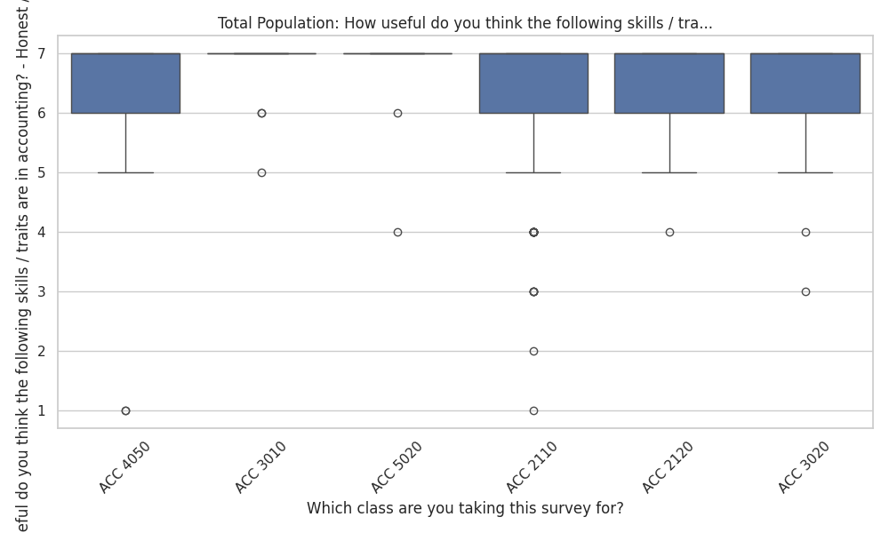

---

### Question: To what degree do you like accounting principles and rules?

**Overall Statistics:**
- Count: 389
- Mean: 5.20
- Std Dev: 1.21

**Statistics by Course:**

| Which class are you taking this survey for?   |   count |    mean |      std |
|:----------------------------------------------|--------:|--------:|---------:|
| ACC 2110                                      |     214 | 4.84579 | 1.21399  |
| ACC 2120                                      |      43 | 5.62791 | 1.23488  |
| ACC 3010                                      |      28 | 5.67857 | 1.05597  |
| ACC 3020                                      |      33 | 5.42424 | 1.11888  |
| ACC 4050                                      |      49 | 5.63265 | 1.01435  |
| ACC 5020                                      |      22 | 5.86364 | 0.774317 |

**One-Way ANOVA:**
- F-statistic: 9.2583
- p-value: 0.0000

**Result:** Significant difference found (p < 0.05). Performing Tukey HSD.

  Multiple Comparison of Means - Tukey HSD, FWER=0.05
=======================================================
 group1   group2  meandiff p-adj   lower  upper  reject
-------------------------------------------------------
ACC 2110 ACC 2120   0.7821 0.0009  0.2297 1.3345   True
ACC 2110 ACC 3010   0.8328  0.005  0.1685 1.4971   True
ACC 2110 ACC 3020   0.5784 0.0816 -0.0397 1.1966  False
ACC 2110 ACC 4050   0.7869 0.0003  0.2634 1.3103   True
ACC 2110 ACC 5020   1.0178 0.0014  0.2778 1.7579   True
ACC 2120 ACC 3010   0.0507    1.0  -0.752 0.8534  False
ACC 2120 ACC 3020  -0.2037 0.9735 -0.9686 0.5613  False
ACC 2120 ACC 4050   0.0047    1.0  -0.686 0.6955  False
ACC 2120 ACC 5020   0.2357 0.9709 -0.6307 1.1022  False
ACC 3010 ACC 3020  -0.2543 0.9561 -1.1036  0.595  False
ACC 3010 ACC 4050  -0.0459    1.0  -0.829 0.7372  False
ACC 3010 ACC 5020   0.1851 0.9933 -0.7567 1.1268  False
ACC 3020 ACC 4050   0.2084 0.9671  -0.536 0.9528  False
ACC 3020 ACC 5020   0.4394 0.7371 -0.4704 1.3492  False
ACC 4050 ACC 5020    0.231 0.9708 -0.6173 1.0793  False
-------------------------------------------------------

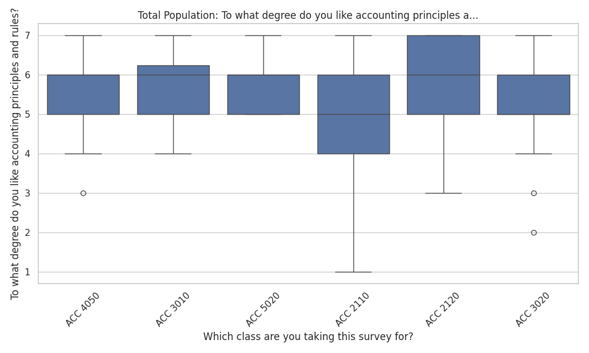

---

### Question: How significantly do you think Artificial Intelligence (AI) will change the type of work performed by accountants in the future?

**Overall Statistics:**
- Count: 390
- Mean: 5.42
- Std Dev: 1.30

**Statistics by Course:**

| Which class are you taking this survey for?   |   count |    mean |     std |
|:----------------------------------------------|--------:|--------:|--------:|
| ACC 2110                                      |     214 | 5.51402 | 1.3522  |
| ACC 2120                                      |      43 | 5.2093  | 1.2063  |
| ACC 3010                                      |      28 | 5.57143 | 1.16837 |
| ACC 3020                                      |      33 | 5.60606 | 1.29758 |
| ACC 4050                                      |      50 | 5.28    | 1.17872 |
| ACC 5020                                      |      22 | 4.81818 | 1.29601 |

**One-Way ANOVA:**
- F-statistic: 1.7309
- p-value: 0.1265

**Result:** No significant difference found (p >= 0.05).

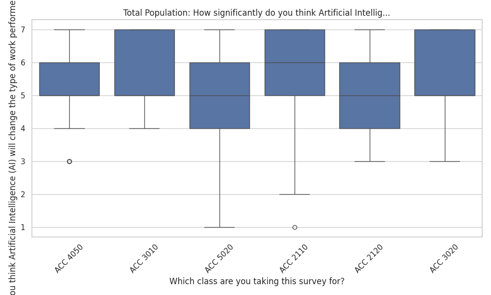

---

### Question: To what degree do you feel that your job in accounting has influenced how you view the accounting profession?

**Overall Statistics:**
- Count: 96
- Mean: 5.69
- Std Dev: 1.21

**Statistics by Course:**

| Which class are you taking this survey for?   |   count |    mean |      std |
|:----------------------------------------------|--------:|--------:|---------:|
| ACC 2110                                      |      15 | 5.66667 | 1.39728  |
| ACC 2120                                      |       9 | 6.33333 | 0.866025 |
| ACC 3010                                      |      11 | 5       | 1.09545  |
| ACC 3020                                      |      19 | 5.52632 | 1.21876  |
| ACC 4050                                      |      24 | 6       | 1.10335  |
| ACC 5020                                      |      18 | 5.55556 | 1.24722  |

**One-Way ANOVA:**
- F-statistic: 1.7230
- p-value: 0.1374

**Result:** No significant difference found (p >= 0.05).

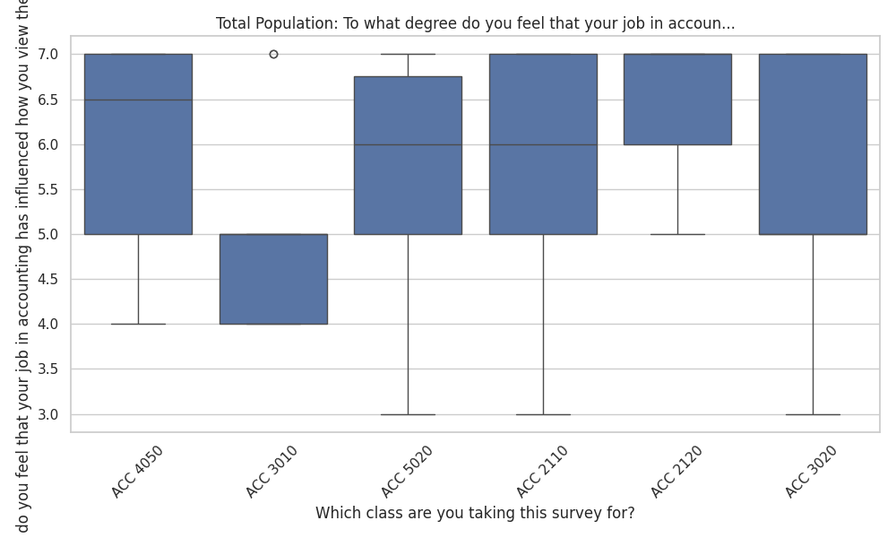

---

### Question: How beneficial do you think having a Master of Accountancy degree would be on a person's ability to get a job in accounting?

**Overall Statistics:**
- Count: 389
- Mean: 5.46
- Std Dev: 1.46

**Statistics by Course:**

| Which class are you taking this survey for?   |   count |    mean |     std |
|:----------------------------------------------|--------:|--------:|--------:|
| ACC 2110                                      |     214 | 5.8271  | 1.31906 |
| ACC 2120                                      |      43 | 5.62791 | 1.39767 |
| ACC 3010                                      |      28 | 5.60714 | 1.16553 |
| ACC 3020                                      |      33 | 4.78788 | 1.24392 |
| ACC 4050                                      |      49 | 4.32653 | 1.61229 |
| ACC 5020                                      |      22 | 4.90909 | 1.57084 |

**One-Way ANOVA:**
- F-statistic: 12.3337
- p-value: 0.0000

**Result:** Significant difference found (p < 0.05). Performing Tukey HSD.

  Multiple Comparison of Means - Tukey HSD, FWER=0.05
========================================================
 group1   group2  meandiff p-adj   lower   upper  reject
--------------------------------------------------------
ACC 2110 ACC 2120  -0.1992  0.953 -0.8534   0.455  False
ACC 2110 ACC 3010    -0.22 0.9673 -1.0067  0.5667  False
ACC 2110 ACC 3020  -1.0392 0.0008 -1.7713 -0.3071   True
ACC 2110 ACC 4050  -1.5006    0.0 -2.1205 -0.8806   True
ACC 2110 ACC 5020   -0.918  0.034 -1.7945 -0.0416   True
ACC 2120 ACC 3010  -0.0208    1.0 -0.9714  0.9299  False
ACC 2120 ACC 3020    -0.84 0.0868  -1.746  0.0659  False
ACC 2120 ACC 4050  -1.3014 0.0001 -2.1194 -0.4834   True
ACC 2120 ACC 5020  -0.7188 0.3405 -1.7449  0.3073  False
ACC 3010 ACC 3020  -0.8193 0.1835 -1.8251  0.1866  False
ACC 3010 ACC 4050  -1.2806 0.0013  -2.208 -0.3532   True
ACC 3010 ACC 5020  -0.6981 0.4717 -1.8133  0.4172  False
ACC 3020 ACC 4050  -0.4613 0.6652 -1.3429  0.4202  False
ACC 3020 ACC 5020   0.1212 0.9995 -0.9563  1.1987  False
ACC 4050 ACC 5020   0.5826 0.5586 -0.4221  1.5872  False
--------------------------------------------------------

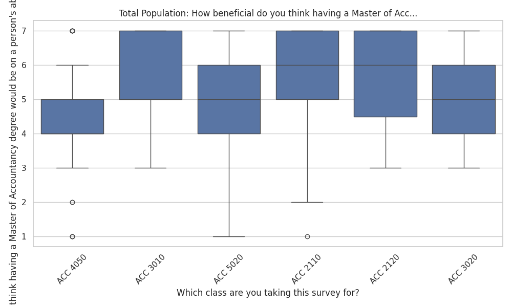

---

### Question: How beneficial do you think having an accounting certification or license (Certified Public Accountant, Enrolled Agent, etc.) would be on a person's ability to get a job in accounting?

**Overall Statistics:**
- Count: 389
- Mean: 6.05
- Std Dev: 1.21

**Statistics by Course:**

| Which class are you taking this survey for?   |   count |    mean |      std |
|:----------------------------------------------|--------:|--------:|---------:|
| ACC 2110                                      |     214 | 5.93458 | 1.30201  |
| ACC 2120                                      |      43 | 5.95349 | 1.13292  |
| ACC 3010                                      |      28 | 6.46429 | 0.838082 |
| ACC 3020                                      |      33 | 6.06061 | 1.08799  |
| ACC 4050                                      |      49 | 6.44898 | 0.818057 |
| ACC 5020                                      |      22 | 5.95455 | 1.46311  |

**One-Way ANOVA:**
- F-statistic: 2.2412
- p-value: 0.0497

**Result:** Significant difference found (p < 0.05). Performing Tukey HSD.

  Multiple Comparison of Means - Tukey HSD, FWER=0.05
=======================================================
 group1   group2  meandiff p-adj   lower  upper  reject
-------------------------------------------------------
ACC 2110 ACC 2120   0.0189    1.0 -0.5541 0.5919  False
ACC 2110 ACC 3010   0.5297 0.2393 -0.1594 1.2188  False
ACC 2110 ACC 3020    0.126 0.9933 -0.5152 0.7673  False
ACC 2110 ACC 4050   0.5144  0.075 -0.0286 1.0574  False
ACC 2110 ACC 5020     0.02    1.0 -0.7477 0.7877  False
ACC 2120 ACC 3010   0.5108 0.4949 -0.3219 1.3435  False
ACC 2120 ACC 3020   0.1071 0.9989 -0.6864 0.9007  False
ACC 2120 ACC 4050   0.4955 0.3553  -0.221  1.212  False
ACC 2120 ACC 5020   0.0011    1.0 -0.8978 0.8999  False
ACC 3010 ACC 3020  -0.4037 0.7781 -1.2847 0.4773  False
ACC 3010 ACC 4050  -0.0153    1.0 -0.8276  0.797  False
ACC 3010 ACC 5020  -0.5097  0.668 -1.4866 0.4672  False
ACC 3020 ACC 4050   0.3884 0.7021 -0.3838 1.1605  False
ACC 3020 ACC 5020  -0.1061 0.9995 -1.0498 0.8377  False
ACC 4050 ACC 5020  -0.4944 0.5929 -1.3744 0.3856  False
-------------------------------------------------------

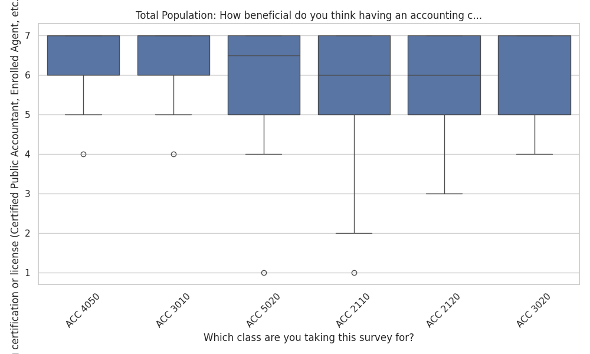

---

### Question: How strongly do you believe that you want to pursue that area of accounting?

**Overall Statistics:**
- Count: 120
- Mean: 5.60
- Std Dev: 1.09

**Statistics by Course:**

| Which class are you taking this survey for?   |   count |    mean |      std |
|:----------------------------------------------|--------:|--------:|---------:|
| ACC 2110                                      |       8 | 4.75    | 0.707107 |
| ACC 2120                                      |      15 | 5.26667 | 0.798809 |
| ACC 3010                                      |      19 | 5.15789 | 1.46299  |
| ACC 3020                                      |      21 | 6       | 0.774597 |
| ACC 4050                                      |      38 | 5.78947 | 1.06943  |
| ACC 5020                                      |      19 | 5.84211 | 1.01451  |

**One-Way ANOVA:**
- F-statistic: 3.1305
- p-value: 0.0110

**Result:** Significant difference found (p < 0.05). Performing Tukey HSD.

  Multiple Comparison of Means - Tukey HSD, FWER=0.05
=======================================================
 group1   group2  meandiff p-adj   lower  upper  reject
-------------------------------------------------------
ACC 2110 ACC 2120   0.5167 0.8669 -0.8058 1.8392  False
ACC 2110 ACC 3010   0.4079 0.9383 -0.8653 1.6811  False
ACC 2110 ACC 3020     1.25 0.0516 -0.0051 2.5051  False
ACC 2110 ACC 4050   1.0395 0.1148 -0.1356 2.2146  False
ACC 2110 ACC 5020   1.0921 0.1368 -0.1811 2.3653  False
ACC 2120 ACC 3010  -0.1088 0.9997 -1.1522 0.9346  False
ACC 2120 ACC 3020   0.7333 0.3043 -0.2879 1.7546  False
ACC 2120 ACC 4050   0.5228 0.5706 -0.3983 1.4439  False
ACC 2120 ACC 5020   0.5754 0.6011 -0.4679 1.6188  False
ACC 3010 ACC 3020   0.8421  0.118 -0.1144 1.7986  False
ACC 3010 ACC 4050   0.6316 0.2662 -0.2172 1.4804  False
ACC 3010 ACC 5020   0.6842 0.3356 -0.2959 1.6643  False
ACC 3020 ACC 4050  -0.2105  0.976 -1.0319 0.6109  False
ACC 3020 ACC 5020  -0.1579 0.9968 -1.1144 0.7986  False
ACC 4050 ACC 5020   0.0526    1.0 -0.7961 0.9014  False
-------------------------------------------------------

---

## Accounting Majors

### Question: How strongly do you believe each of these stereotypes about accounting / accountants? - Never talk to people

**Overall Statistics:**
- Count: 180
- Mean: 2.34
- Std Dev: 1.41

**Statistics by Course:**

| Which class are you taking this survey for?   |   count |    mean |     std |
|:----------------------------------------------|--------:|--------:|--------:|
| ACC 2110                                      |      22 | 2.40909 | 1.70878 |
| ACC 2120                                      |      32 | 2.53125 | 1.21773 |
| ACC 3010                                      |      25 | 2.2     | 1.38444 |
| ACC 3020                                      |      33 | 2.30303 | 1.38033 |
| ACC 4050                                      |      49 | 2.4898  | 1.54276 |
| ACC 5020                                      |      19 | 1.84211 | 1.06787 |

**One-Way ANOVA:**
- F-statistic: 0.7594
- p-value: 0.5803

**Result:** No significant difference found (p >= 0.05).

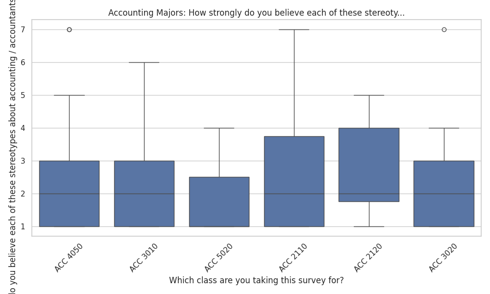

---

### Question: How strongly do you believe each of these stereotypes about accounting / accountants? - Introverts

**Overall Statistics:**
- Count: 180
- Mean: 3.64
- Std Dev: 1.54

**Statistics by Course:**

| Which class are you taking this survey for?   |   count |    mean |     std |
|:----------------------------------------------|--------:|--------:|--------:|
| ACC 2110                                      |      22 | 3.36364 | 1.43246 |
| ACC 2120                                      |      32 | 3.3125  | 1.3545  |
| ACC 3010                                      |      25 | 3.52    | 1.50333 |
| ACC 3020                                      |      33 | 3.54545 | 1.48094 |
| ACC 4050                                      |      49 | 4.14286 | 1.73205 |
| ACC 5020                                      |      19 | 3.52632 | 1.42861 |

**One-Way ANOVA:**
- F-statistic: 1.5808
- p-value: 0.1678

**Result:** No significant difference found (p >= 0.05).

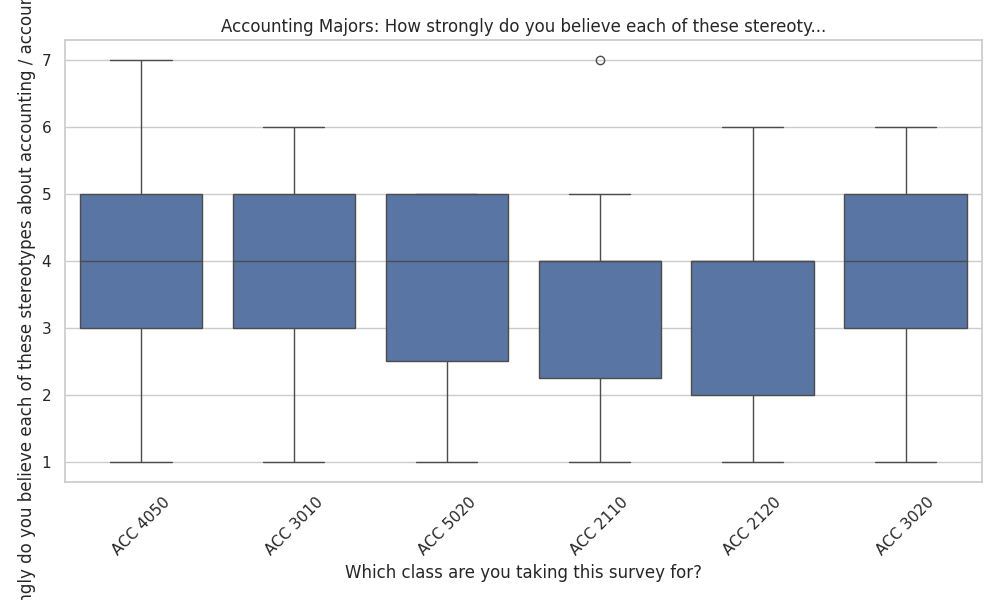

---

### Question: How strongly do you believe each of these stereotypes about accounting / accountants? - Work in a cubicle

**Overall Statistics:**
- Count: 180
- Mean: 4.21
- Std Dev: 1.37

**Statistics by Course:**

| Which class are you taking this survey for?   |   count |    mean |     std |
|:----------------------------------------------|--------:|--------:|--------:|
| ACC 2110                                      |      22 | 4.63636 | 1.00216 |
| ACC 2120                                      |      32 | 4.59375 | 1.16007 |
| ACC 3010                                      |      25 | 4.24    | 1.39284 |
| ACC 3020                                      |      33 | 4.24242 | 1.39262 |
| ACC 4050                                      |      49 | 3.89796 | 1.54441 |
| ACC 5020                                      |      19 | 3.78947 | 1.31567 |

**One-Way ANOVA:**
- F-statistic: 1.8548
- p-value: 0.1047

**Result:** No significant difference found (p >= 0.05).

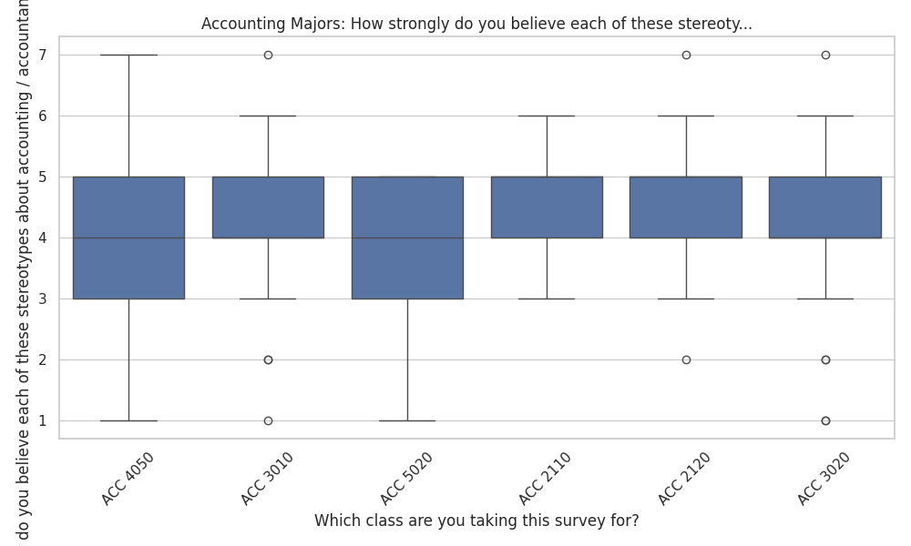

---

### Question: How strongly do you believe each of these stereotypes about accounting / accountants? - Long work hours

**Overall Statistics:**
- Count: 180
- Mean: 5.41
- Std Dev: 1.25

**Statistics by Course:**

| Which class are you taking this survey for?   |   count |    mean |      std |
|:----------------------------------------------|--------:|--------:|---------:|
| ACC 2110                                      |      22 | 5       | 0.9759   |
| ACC 2120                                      |      32 | 4.84375 | 1.39375  |
| ACC 3010                                      |      25 | 5.76    | 1.26754  |
| ACC 3020                                      |      33 | 5.75758 | 0.902438 |
| ACC 4050                                      |      49 | 5.44898 | 1.30801  |
| ACC 5020                                      |      19 | 5.68421 | 1.33552  |

**One-Way ANOVA:**
- F-statistic: 3.0238
- p-value: 0.0121

**Result:** Significant difference found (p < 0.05). Performing Tukey HSD.

  Multiple Comparison of Means - Tukey HSD, FWER=0.05
=======================================================
 group1   group2  meandiff p-adj   lower  upper  reject
-------------------------------------------------------
ACC 2110 ACC 2120  -0.1562 0.9973 -1.1301 0.8176  False
ACC 2110 ACC 3010     0.76 0.2765 -0.2679 1.7879  False
ACC 2110 ACC 3020   0.7576 0.2182 -0.2103 1.7254  False
ACC 2110 ACC 4050    0.449 0.7064 -0.4534 1.3514  False
ACC 2110 ACC 5020   0.6842 0.4746 -0.4171 1.7855  False
ACC 2120 ACC 3010   0.9162 0.0601 -0.0223 1.8548  False
ACC 2120 ACC 3020   0.9138 0.0341  0.0414 1.7862   True
ACC 2120 ACC 4050   0.6052 0.2513  -0.194 1.4044  False
ACC 2120 ACC 5020   0.8405 0.1697 -0.1779 1.8589  False
ACC 3010 ACC 3020  -0.0024    1.0 -0.9348 0.9299  False
ACC 3010 ACC 4050   -0.311 0.9048 -1.1753 0.5532  False
ACC 3010 ACC 5020  -0.0758    1.0  -1.146 0.9944  False
ACC 3020 ACC 4050  -0.3086 0.8713 -1.1004 0.4832  False
ACC 3020 ACC 5020  -0.0734 0.9999  -1.086 0.9393  False
ACC 4050 ACC 5020   0.2352 0.9801 -0.7151 1.1855  False
-------------------------------------------------------

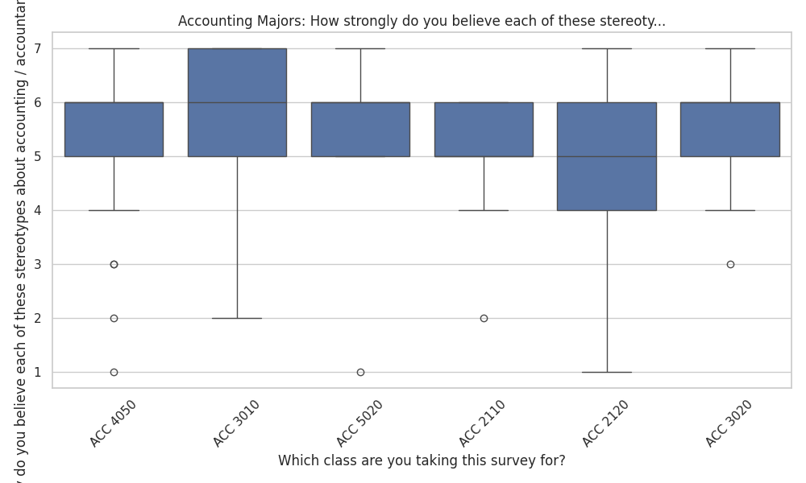

---

### Question: How strongly do you believe each of these stereotypes about accounting / accountants? - Only tax and audit careers

**Overall Statistics:**
- Count: 180
- Mean: 2.83
- Std Dev: 1.60

**Statistics by Course:**

| Which class are you taking this survey for?   |   count |    mean |     std |
|:----------------------------------------------|--------:|--------:|--------:|
| ACC 2110                                      |      22 | 2.86364 | 1.08213 |
| ACC 2120                                      |      32 | 2.8125  | 1.55413 |
| ACC 3010                                      |      25 | 2.92    | 1.52534 |
| ACC 3020                                      |      33 | 3.0303  | 1.87891 |
| ACC 4050                                      |      49 | 2.69388 | 1.69809 |
| ACC 5020                                      |      19 | 2.68421 | 1.66842 |

**One-Way ANOVA:**
- F-statistic: 0.2188
- p-value: 0.9541

**Result:** No significant difference found (p >= 0.05).

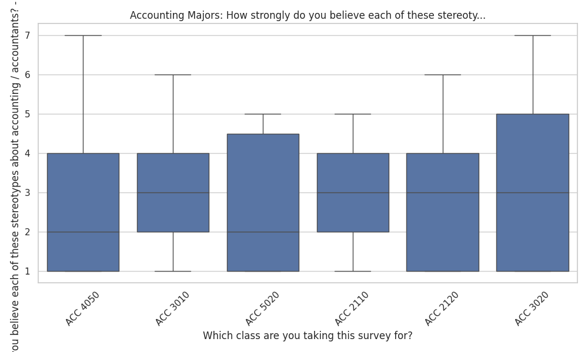

---

### Question: How strongly do you believe each of these stereotypes about accounting / accountants? - Always do taxes

**Overall Statistics:**
- Count: 180
- Mean: 2.27
- Std Dev: 1.35

**Statistics by Course:**

| Which class are you taking this survey for?   |   count |    mean |      std |
|:----------------------------------------------|--------:|--------:|---------:|
| ACC 2110                                      |      22 | 2.59091 | 1.36832  |
| ACC 2120                                      |      32 | 2.5625  | 1.38977  |
| ACC 3010                                      |      25 | 2.6     | 1.58114  |
| ACC 3020                                      |      33 | 2.24242 | 1.32359  |
| ACC 4050                                      |      49 | 2.08163 | 1.28836  |
| ACC 5020                                      |      19 | 1.52632 | 0.841191 |

**One-Way ANOVA:**
- F-statistic: 2.2619
- p-value: 0.0504

**Result:** No significant difference found (p >= 0.05).

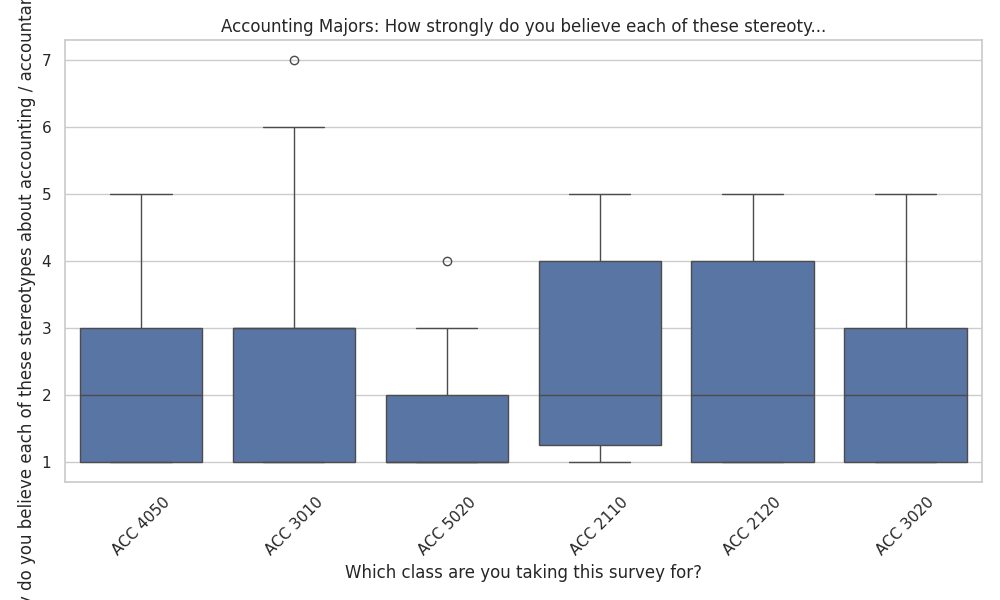

---

### Question: How strongly do you believe each of these stereotypes about accounting / accountants? - Reliable

**Overall Statistics:**
- Count: 180
- Mean: 5.48
- Std Dev: 1.13

**Statistics by Course:**

| Which class are you taking this survey for?   |   count |    mean |      std |
|:----------------------------------------------|--------:|--------:|---------:|
| ACC 2110                                      |      22 | 5.36364 | 1.1358   |
| ACC 2120                                      |      32 | 5.34375 | 1.12478  |
| ACC 3010                                      |      25 | 5.88    | 0.927362 |
| ACC 3020                                      |      33 | 5.30303 | 1.10354  |
| ACC 4050                                      |      49 | 5.59184 | 1.17115  |
| ACC 5020                                      |      19 | 5.31579 | 1.29326  |

**One-Way ANOVA:**
- F-statistic: 1.1058
- p-value: 0.3591

**Result:** No significant difference found (p >= 0.05).

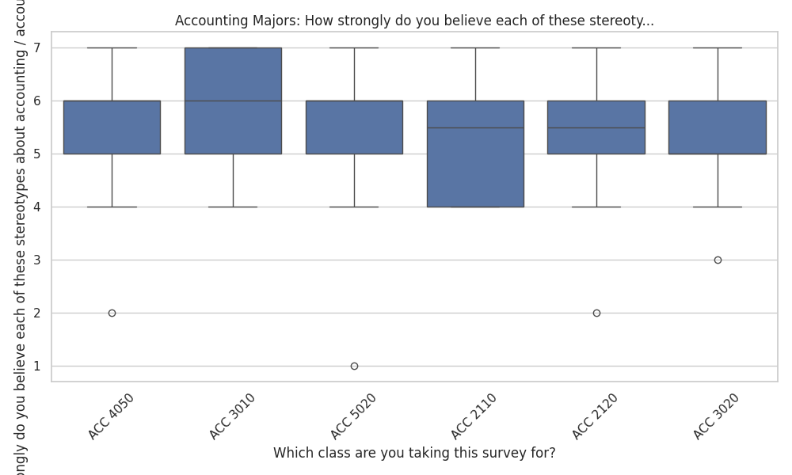

---

### Question: How strongly do you believe each of these stereotypes about accounting / accountants? - Detail oriented

**Overall Statistics:**
- Count: 180
- Mean: 5.77
- Std Dev: 1.05

**Statistics by Course:**

| Which class are you taking this survey for?   |   count |    mean |      std |
|:----------------------------------------------|--------:|--------:|---------:|
| ACC 2110                                      |      22 | 5.72727 | 0.984732 |
| ACC 2120                                      |      32 | 5.8125  | 0.965117 |
| ACC 3010                                      |      25 | 5.96    | 0.978093 |
| ACC 3020                                      |      33 | 5.57576 | 1.03169  |
| ACC 4050                                      |      49 | 5.83673 | 1.06745  |
| ACC 5020                                      |      19 | 5.68421 | 1.33552  |

**One-Way ANOVA:**
- F-statistic: 0.4692
- p-value: 0.7989

**Result:** No significant difference found (p >= 0.05).

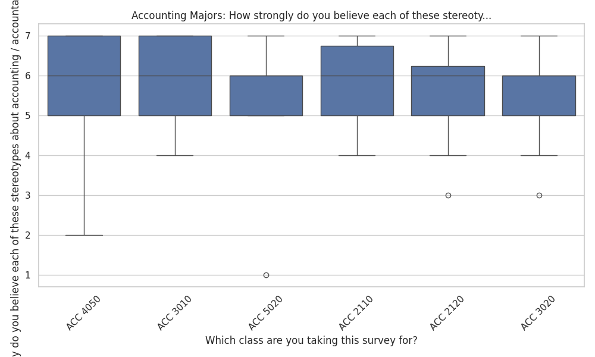

---

### Question: How strongly do you believe each of these stereotypes about accounting / accountants? - Follow rules

**Overall Statistics:**
- Count: 180
- Mean: 5.69
- Std Dev: 1.11

**Statistics by Course:**

| Which class are you taking this survey for?   |   count |    mean |      std |
|:----------------------------------------------|--------:|--------:|---------:|
| ACC 2110                                      |      22 | 5.5     | 1.18523  |
| ACC 2120                                      |      32 | 5.6875  | 1.14828  |
| ACC 3010                                      |      25 | 5.96    | 0.888819 |
| ACC 3020                                      |      33 | 5.66667 | 1.10868  |
| ACC 4050                                      |      49 | 5.71429 | 1.06066  |
| ACC 5020                                      |      19 | 5.52632 | 1.3486   |

**One-Way ANOVA:**
- F-statistic: 0.5126
- p-value: 0.7665

**Result:** No significant difference found (p >= 0.05).

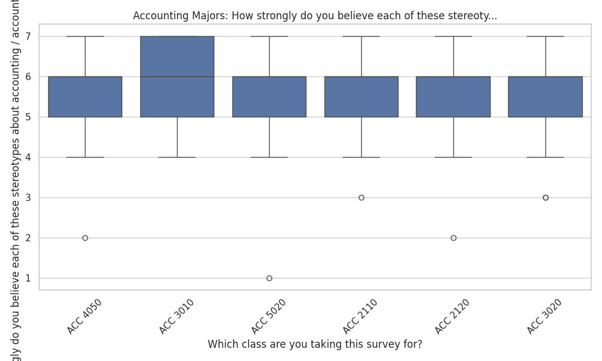

---

### Question: How strongly do you believe each of these stereotypes about accounting / accountants? - Willing to break the law

**Overall Statistics:**
- Count: 180
- Mean: 2.22
- Std Dev: 1.28

**Statistics by Course:**

| Which class are you taking this survey for?   |   count |    mean |     std |
|:----------------------------------------------|--------:|--------:|--------:|
| ACC 2110                                      |      22 | 2.31818 | 1.24924 |
| ACC 2120                                      |      32 | 2.125   | 1.4085  |
| ACC 3010                                      |      25 | 2.16    | 1.10604 |
| ACC 3020                                      |      33 | 2.39394 | 1.49874 |
| ACC 4050                                      |      49 | 2.12245 | 1.09226 |
| ACC 5020                                      |      19 | 2.26316 | 1.44692 |

**One-Way ANOVA:**
- F-statistic: 0.2503
- p-value: 0.9392

**Result:** No significant difference found (p >= 0.05).

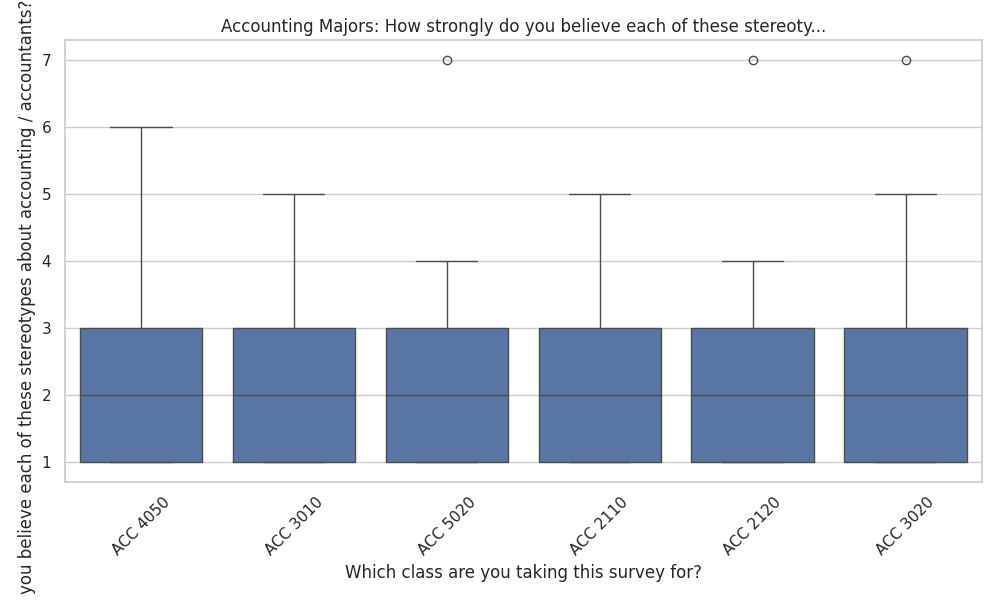

---

### Question: How strongly do you believe each of these stereotypes about accounting / accountants? - Boring

**Overall Statistics:**
- Count: 180
- Mean: 3.44
- Std Dev: 1.45

**Statistics by Course:**

| Which class are you taking this survey for?   |   count |    mean |     std |
|:----------------------------------------------|--------:|--------:|--------:|
| ACC 2110                                      |      22 | 3.40909 | 1.36832 |
| ACC 2120                                      |      32 | 3.34375 | 1.33463 |
| ACC 3010                                      |      25 | 3.24    | 1.50776 |
| ACC 3020                                      |      33 | 3.78788 | 1.34065 |
| ACC 4050                                      |      49 | 3.5102  | 1.54276 |
| ACC 5020                                      |      19 | 3.15789 | 1.60773 |

**One-Way ANOVA:**
- F-statistic: 0.6689
- p-value: 0.6476

**Result:** No significant difference found (p >= 0.05).

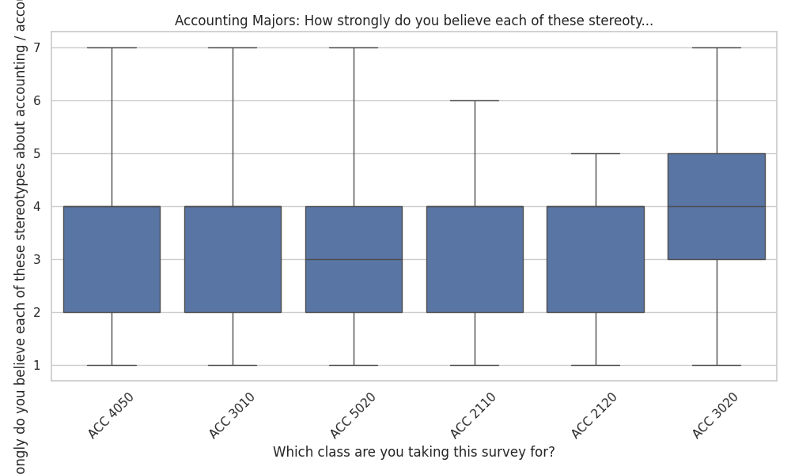

---

### Question: How strongly do you believe each of these stereotypes about accounting / accountants? - Work alone

**Overall Statistics:**
- Count: 180
- Mean: 3.38
- Std Dev: 1.51

**Statistics by Course:**

| Which class are you taking this survey for?   |   count |    mean |     std |
|:----------------------------------------------|--------:|--------:|--------:|
| ACC 2110                                      |      22 | 3.77273 | 1.37778 |
| ACC 2120                                      |      32 | 3.8125  | 1.25563 |
| ACC 3010                                      |      25 | 3.2     | 1.63299 |
| ACC 3020                                      |      33 | 3.39394 | 1.34488 |
| ACC 4050                                      |      49 | 3.34694 | 1.58838 |
| ACC 5020                                      |      19 | 2.52632 | 1.71167 |

**One-Way ANOVA:**
- F-statistic: 2.1809
- p-value: 0.0584

**Result:** No significant difference found (p >= 0.05).

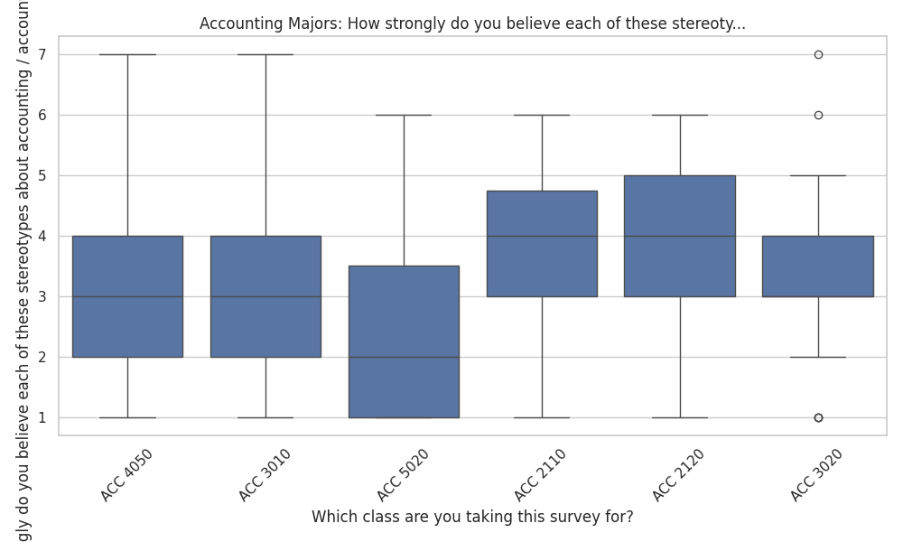

---

### Question: How strongly do each of these stereotypes lead you towards or away from a major / career in accounting? - Never talk to people

**Overall Statistics:**
- Count: 181
- Mean: 3.69
- Std Dev: 1.44

**Statistics by Course:**

| Which class are you taking this survey for?   |   count |    mean |      std |
|:----------------------------------------------|--------:|--------:|---------:|
| ACC 2110                                      |      22 | 3.90909 | 1.50899  |
| ACC 2120                                      |      32 | 4.15625 | 0.846601 |
| ACC 3010                                      |      25 | 3.24    | 1.5885   |
| ACC 3020                                      |      33 | 3.33333 | 1.63299  |
| ACC 4050                                      |      50 | 3.74    | 1.3524   |
| ACC 5020                                      |      19 | 3.68421 | 1.63478  |

**One-Way ANOVA:**
- F-statistic: 1.7214
- p-value: 0.1320

**Result:** No significant difference found (p >= 0.05).

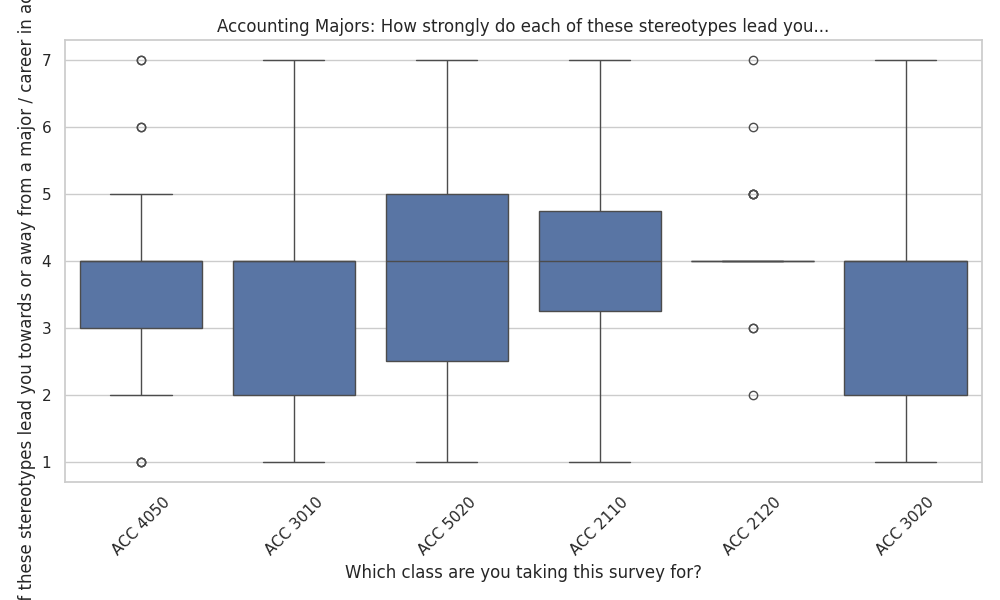

---

### Question: How strongly do each of these stereotypes lead you towards or away from a major / career in accounting? - Introverts

**Overall Statistics:**
- Count: 181
- Mean: 3.90
- Std Dev: 1.44

**Statistics by Course:**

| Which class are you taking this survey for?   |   count |    mean |     std |
|:----------------------------------------------|--------:|--------:|--------:|
| ACC 2110                                      |      22 | 3.86364 | 1.28343 |
| ACC 2120                                      |      32 | 4.34375 | 1.03517 |
| ACC 3010                                      |      25 | 3.48    | 1.61038 |
| ACC 3020                                      |      33 | 3.51515 | 1.48158 |
| ACC 4050                                      |      50 | 4.2     | 1.45686 |
| ACC 5020                                      |      19 | 3.57895 | 1.60955 |

**One-Way ANOVA:**
- F-statistic: 2.2024
- p-value: 0.0561

**Result:** No significant difference found (p >= 0.05).

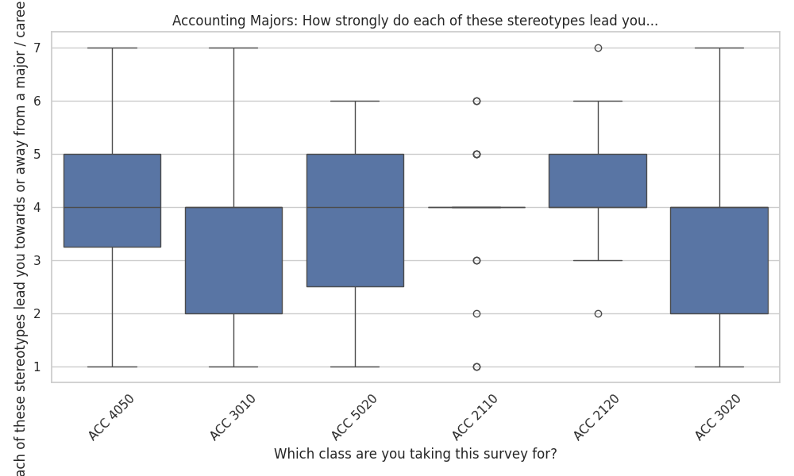

---

### Question: How strongly do each of these stereotypes lead you towards or away from a major / career in accounting? - Work in a cubicle

**Overall Statistics:**
- Count: 181
- Mean: 3.35
- Std Dev: 1.37

**Statistics by Course:**

| Which class are you taking this survey for?   |   count |    mean |     std |
|:----------------------------------------------|--------:|--------:|--------:|
| ACC 2110                                      |      22 | 3.59091 | 1.46902 |
| ACC 2120                                      |      32 | 3.875   | 1.18458 |
| ACC 3010                                      |      25 | 3.08    | 1.18743 |
| ACC 3020                                      |      33 | 3.0303  | 1.48923 |
| ACC 4050                                      |      50 | 3.46    | 1.38814 |
| ACC 5020                                      |      19 | 2.84211 | 1.25889 |

**One-Way ANOVA:**
- F-statistic: 2.2992
- p-value: 0.0470

**Result:** Significant difference found (p < 0.05). Performing Tukey HSD.

  Multiple Comparison of Means - Tukey HSD, FWER=0.05
=======================================================
 group1   group2  meandiff p-adj   lower  upper  reject
-------------------------------------------------------
ACC 2110 ACC 2120   0.2841 0.9733 -0.7893 1.3575  False
ACC 2110 ACC 3010  -0.5109  0.785 -1.6439  0.622  False
ACC 2110 ACC 3020  -0.5606 0.6555 -1.6273 0.5061  False
ACC 2110 ACC 4050  -0.1309  0.999 -1.1225 0.8606  False
ACC 2110 ACC 5020  -0.7488 0.4829 -1.9626  0.465  False
ACC 2120 ACC 3010   -0.795 0.2364 -1.8295 0.2395  False
ACC 2120 ACC 3020  -0.8447 0.1207 -1.8062 0.1169  False
ACC 2120 ACC 4050   -0.415  0.749 -1.2924 0.4624  False
ACC 2120 ACC 5020  -1.0329 0.0906 -2.1554 0.0896  False
ACC 3010 ACC 3020  -0.0497    1.0 -1.0773 0.9779  False
ACC 3010 ACC 4050     0.38  0.858 -0.5693 1.3293  False
ACC 3010 ACC 5020  -0.2379 0.9922 -1.4175 0.9417  False
ACC 3020 ACC 4050   0.4297 0.7121 -0.4396 1.2989  False
ACC 3020 ACC 5020  -0.1882 0.9966 -1.3043 0.9279  False
ACC 4050 ACC 5020  -0.6179 0.5306 -1.6624 0.4266  False
-------------------------------------------------------

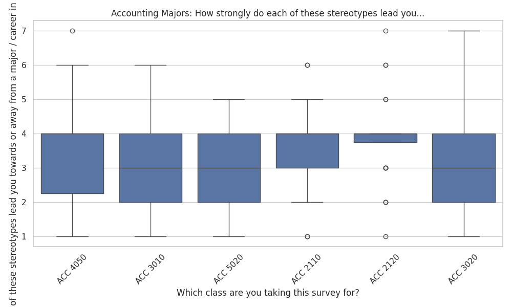

---

### Question: How strongly do each of these stereotypes lead you towards or away from a major / career in accounting? - Long work hours

**Overall Statistics:**
- Count: 181
- Mean: 3.02
- Std Dev: 1.26

**Statistics by Course:**

| Which class are you taking this survey for?   |   count |    mean |      std |
|:----------------------------------------------|--------:|--------:|---------:|
| ACC 2110                                      |      22 | 3.27273 | 0.827032 |
| ACC 2120                                      |      32 | 3.09375 | 1.17389  |
| ACC 3010                                      |      25 | 2.88    | 1.30128  |
| ACC 3020                                      |      33 | 2.60606 | 1.24848  |
| ACC 4050                                      |      50 | 3.02    | 1.28556  |
| ACC 5020                                      |      19 | 3.52632 | 1.57651  |

**One-Way ANOVA:**
- F-statistic: 1.6127
- p-value: 0.1590

**Result:** No significant difference found (p >= 0.05).

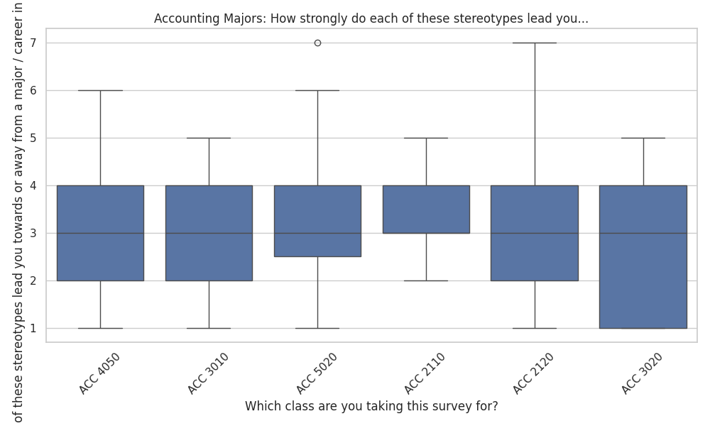

---

### Question: How strongly do each of these stereotypes lead you towards or away from a major / career in accounting? - Only tax and audit careers

**Overall Statistics:**
- Count: 181
- Mean: 3.45
- Std Dev: 1.16

**Statistics by Course:**

| Which class are you taking this survey for?   |   count |    mean |      std |
|:----------------------------------------------|--------:|--------:|---------:|
| ACC 2110                                      |      22 | 3.54545 | 0.911685 |
| ACC 2120                                      |      32 | 3.6875  | 1.20315  |
| ACC 3010                                      |      25 | 3.32    | 1.28193  |
| ACC 3020                                      |      33 | 3.39394 | 0.863836 |
| ACC 4050                                      |      50 | 3.34    | 1.30321  |
| ACC 5020                                      |      19 | 3.52632 | 1.26352  |

**One-Way ANOVA:**
- F-statistic: 0.4781
- p-value: 0.7923

**Result:** No significant difference found (p >= 0.05).

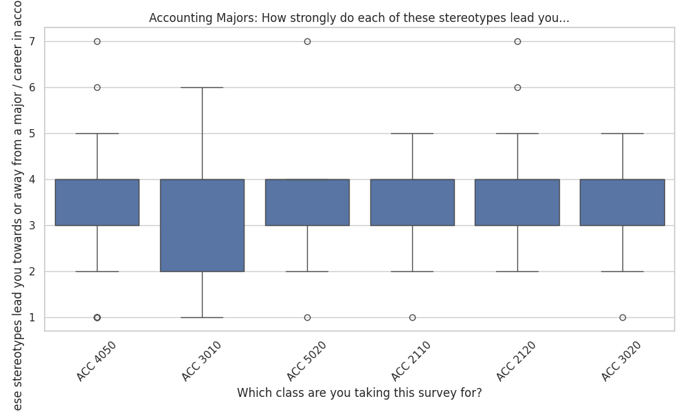

---

### Question: How strongly do each of these stereotypes lead you towards or away from a major / career in accounting? - Always do taxes

**Overall Statistics:**
- Count: 181
- Mean: 3.38
- Std Dev: 1.27

**Statistics by Course:**

| Which class are you taking this survey for?   |   count |    mean |     std |
|:----------------------------------------------|--------:|--------:|--------:|
| ACC 2110                                      |      22 | 3.27273 | 1.20245 |
| ACC 2120                                      |      32 | 3.6875  | 1.17604 |
| ACC 3010                                      |      25 | 3.2     | 1.35401 |
| ACC 3020                                      |      33 | 3.33333 | 1.05079 |
| ACC 4050                                      |      50 | 3.38    | 1.3686  |
| ACC 5020                                      |      19 | 3.26316 | 1.48482 |

**One-Way ANOVA:**
- F-statistic: 0.5443
- p-value: 0.7425

**Result:** No significant difference found (p >= 0.05).

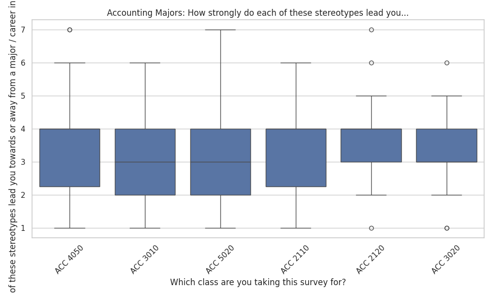

---

### Question: How strongly do each of these stereotypes lead you towards or away from a major / career in accounting? - Reliable

**Overall Statistics:**
- Count: 181
- Mean: 5.68
- Std Dev: 1.12

**Statistics by Course:**

| Which class are you taking this survey for?   |   count |    mean |      std |
|:----------------------------------------------|--------:|--------:|---------:|
| ACC 2110                                      |      22 | 5.77273 | 0.922307 |
| ACC 2120                                      |      32 | 5.625   | 0.941858 |
| ACC 3010                                      |      25 | 5.92    | 1.07703  |
| ACC 3020                                      |      33 | 5.51515 | 1.12142  |
| ACC 4050                                      |      50 | 5.74    | 1.02639  |
| ACC 5020                                      |      19 | 5.47368 | 1.7754   |

**One-Way ANOVA:**
- F-statistic: 0.5699
- p-value: 0.7230

**Result:** No significant difference found (p >= 0.05).

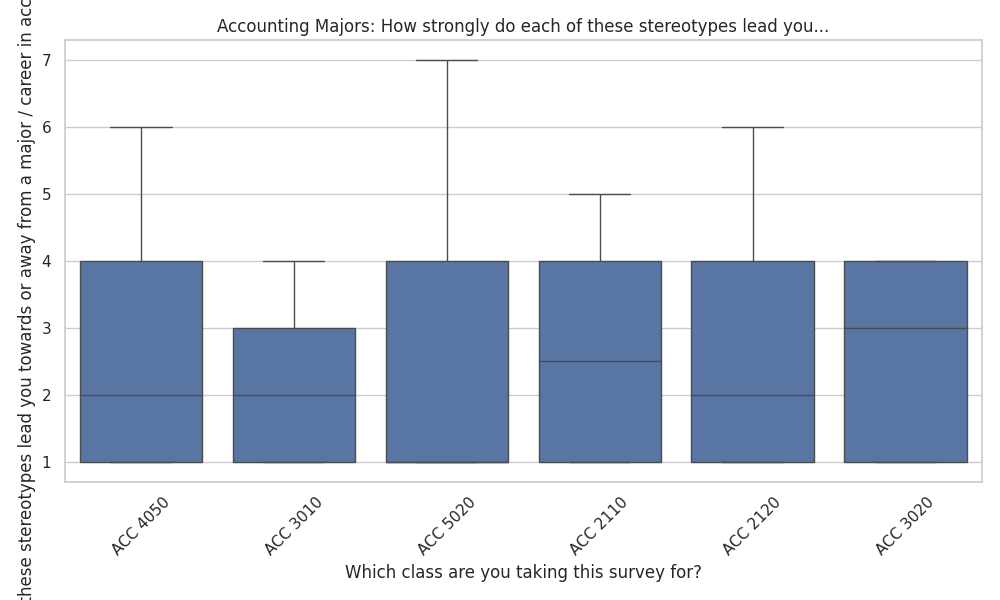

---

### Question: How strongly do each of these stereotypes lead you towards or away from a major / career in accounting? - Detail oriented

**Overall Statistics:**
- Count: 181
- Mean: 5.73
- Std Dev: 1.16

**Statistics by Course:**

| Which class are you taking this survey for?   |   count |    mean |      std |
|:----------------------------------------------|--------:|--------:|---------:|
| ACC 2110                                      |      22 | 6       | 0.872872 |
| ACC 2120                                      |      32 | 5.59375 | 1.10306  |
| ACC 3010                                      |      25 | 6.08    | 0.953939 |
| ACC 3020                                      |      33 | 5.54545 | 1.17502  |
| ACC 4050                                      |      50 | 5.68    | 1.07741  |
| ACC 5020                                      |      19 | 5.63158 | 1.80156  |

**One-Way ANOVA:**
- F-statistic: 0.9967
- p-value: 0.4213

**Result:** No significant difference found (p >= 0.05).

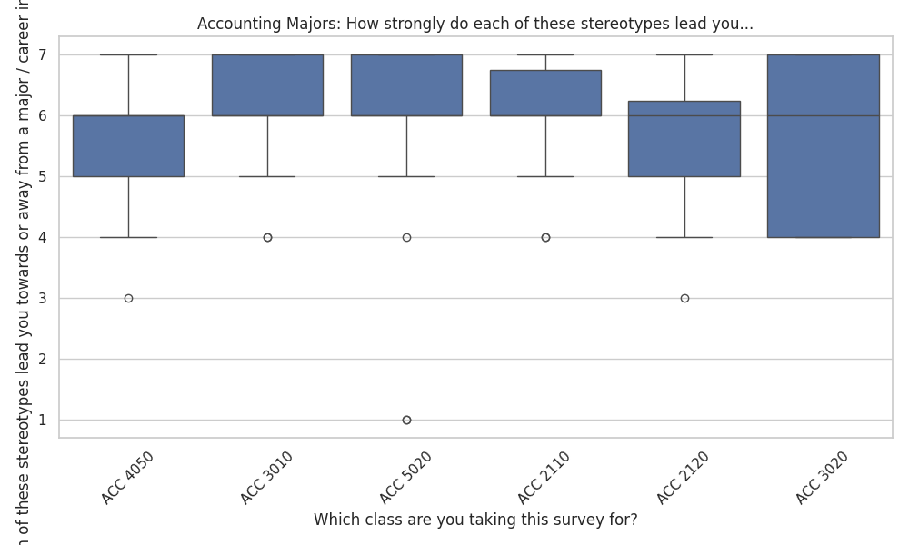

---

### Question: How strongly do each of these stereotypes lead you towards or away from a major / career in accounting? - Follow rules

**Overall Statistics:**
- Count: 181
- Mean: 5.49
- Std Dev: 1.20

**Statistics by Course:**

| Which class are you taking this survey for?   |   count |    mean |     std |
|:----------------------------------------------|--------:|--------:|--------:|
| ACC 2110                                      |      22 | 5.81818 | 1.05272 |
| ACC 2120                                      |      32 | 5.53125 | 1.13548 |
| ACC 3010                                      |      25 | 5.52    | 1.19443 |
| ACC 3020                                      |      33 | 5.33333 | 1.08012 |
| ACC 4050                                      |      50 | 5.5     | 1.18235 |
| ACC 5020                                      |      19 | 5.21053 | 1.68585 |

**One-Way ANOVA:**
- F-statistic: 0.6523
- p-value: 0.6601

**Result:** No significant difference found (p >= 0.05).

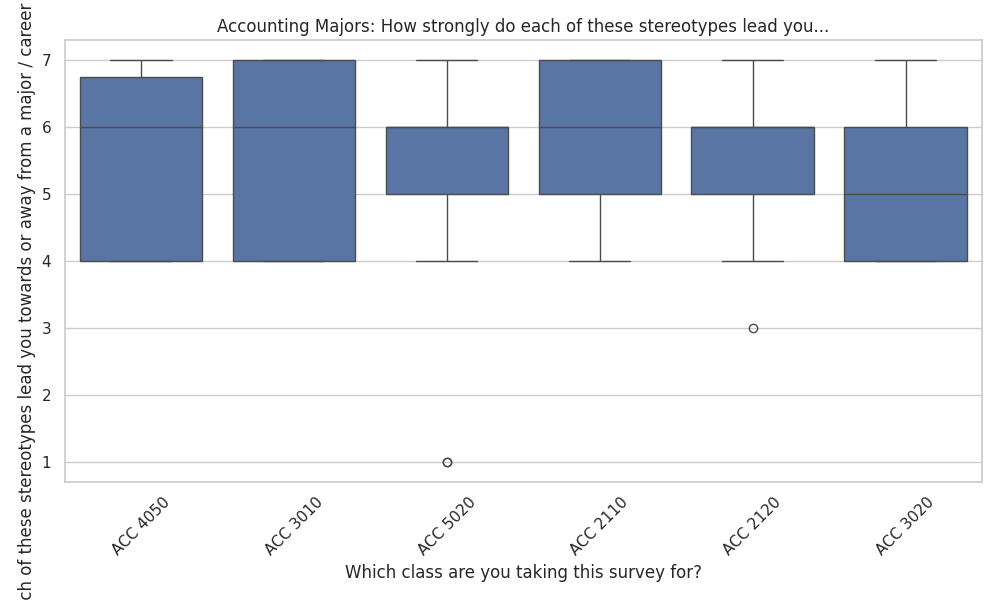

---

### Question: How strongly do each of these stereotypes lead you towards or away from a major / career in accounting? - Willing to break the law

**Overall Statistics:**
- Count: 181
- Mean: 2.50
- Std Dev: 1.47

**Statistics by Course:**

| Which class are you taking this survey for?   |   count |    mean |     std |
|:----------------------------------------------|--------:|--------:|--------:|
| ACC 2110                                      |      22 | 2.63636 | 1.39882 |
| ACC 2120                                      |      32 | 2.34375 | 1.49428 |
| ACC 3010                                      |      25 | 2.16    | 1.17898 |
| ACC 3020                                      |      33 | 2.63636 | 1.43218 |
| ACC 4050                                      |      50 | 2.62    | 1.52382 |
| ACC 5020                                      |      19 | 2.47368 | 1.83692 |

**One-Way ANOVA:**
- F-statistic: 0.4948
- p-value: 0.7799

**Result:** No significant difference found (p >= 0.05).

---

### Question: How strongly do each of these stereotypes lead you towards or away from a major / career in accounting? - Boring

**Overall Statistics:**
- Count: 181
- Mean: 2.96
- Std Dev: 1.21

**Statistics by Course:**

| Which class are you taking this survey for?   |   count |    mean |     std |
|:----------------------------------------------|--------:|--------:|--------:|
| ACC 2110                                      |      22 | 3.22727 | 1.02036 |
| ACC 2120                                      |      32 | 3.0625  | 1.10534 |
| ACC 3010                                      |      25 | 2.4     | 1.22474 |
| ACC 3020                                      |      33 | 2.69697 | 1.18545 |
| ACC 4050                                      |      50 | 3.18    | 1.15511 |
| ACC 5020                                      |      19 | 3.05263 | 1.50826 |

**One-Way ANOVA:**
- F-statistic: 2.0700
- p-value: 0.0713

**Result:** No significant difference found (p >= 0.05).

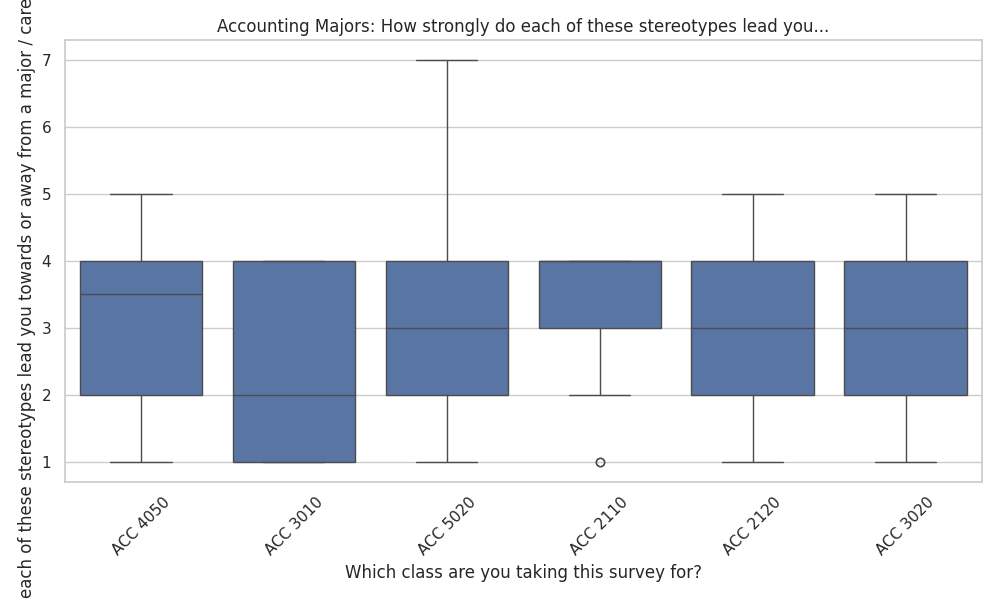

---

### Question: How strongly do each of these stereotypes lead you towards or away from a major / career in accounting? - Work alone

**Overall Statistics:**
- Count: 181
- Mean: 3.55
- Std Dev: 1.42

**Statistics by Course:**

| Which class are you taking this survey for?   |   count |    mean |     std |
|:----------------------------------------------|--------:|--------:|--------:|
| ACC 2110                                      |      22 | 3.95455 | 1.4953  |
| ACC 2120                                      |      32 | 4.125   | 1.18458 |
| ACC 3010                                      |      25 | 3.44    | 1.50222 |
| ACC 3020                                      |      33 | 3.18182 | 1.3568  |
| ACC 4050                                      |      50 | 3.42    | 1.41551 |
| ACC 5020                                      |      19 | 3.21053 | 1.47494 |

**One-Way ANOVA:**
- F-statistic: 2.2579
- p-value: 0.0507

**Result:** No significant difference found (p >= 0.05).

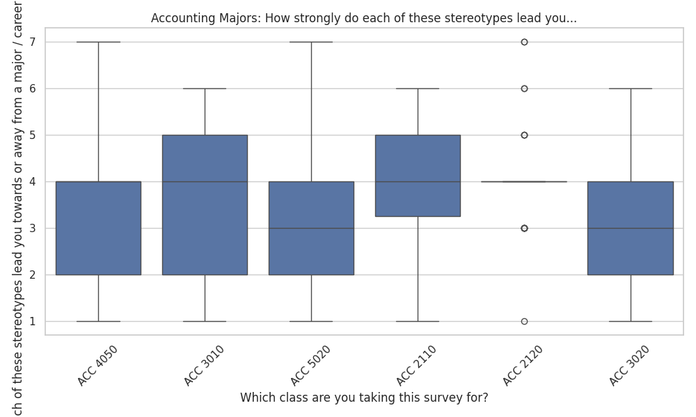

---

### Question: How useful do you think the following skills / traits are in accounting? - Written communication

**Overall Statistics:**
- Count: 181
- Mean: 6.13
- Std Dev: 1.11

**Statistics by Course:**

| Which class are you taking this survey for?   |   count |    mean |      std |
|:----------------------------------------------|--------:|--------:|---------:|
| ACC 2110                                      |      22 | 6.18182 | 0.906924 |
| ACC 2120                                      |      32 | 6.15625 | 0.883883 |
| ACC 3010                                      |      25 | 6.12    | 0.927362 |
| ACC 3020                                      |      33 | 6.09091 | 0.879049 |
| ACC 4050                                      |      50 | 6.12    | 1.40901  |
| ACC 5020                                      |      19 | 6.10526 | 1.44894  |

**One-Way ANOVA:**
- F-statistic: 0.0235
- p-value: 0.9998

**Result:** No significant difference found (p >= 0.05).

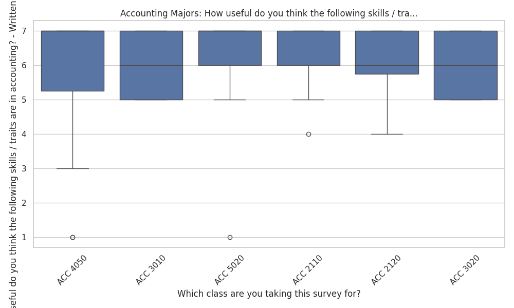

---

### Question: How useful do you think the following skills / traits are in accounting? - Verbal communication

**Overall Statistics:**
- Count: 181
- Mean: 6.22
- Std Dev: 1.07

**Statistics by Course:**

| Which class are you taking this survey for?   |   count |    mean |      std |
|:----------------------------------------------|--------:|--------:|---------:|
| ACC 2110                                      |      22 | 6.04545 | 0.898532 |
| ACC 2120                                      |      32 | 6.09375 | 0.777065 |
| ACC 3010                                      |      25 | 6.4     | 0.763763 |
| ACC 3020                                      |      33 | 6.24242 | 0.902438 |
| ACC 4050                                      |      50 | 6.26    | 1.3524   |
| ACC 5020                                      |      19 | 6.26316 | 1.44692  |

**One-Way ANOVA:**
- F-statistic: 0.3658
- p-value: 0.8715

**Result:** No significant difference found (p >= 0.05).

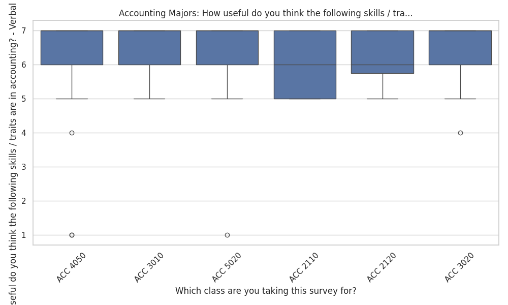

---

### Question: How useful do you think the following skills / traits are in accounting? - Critical thinking

**Overall Statistics:**
- Count: 181
- Mean: 6.56
- Std Dev: 0.88

**Statistics by Course:**

| Which class are you taking this survey for?   |   count |    mean |      std |
|:----------------------------------------------|--------:|--------:|---------:|
| ACC 2110                                      |      22 | 6.59091 | 0.666125 |
| ACC 2120                                      |      32 | 6.375   | 0.832796 |
| ACC 3010                                      |      25 | 6.64    | 0.637704 |
| ACC 3020                                      |      33 | 6.57576 | 0.662868 |
| ACC 4050                                      |      50 | 6.48    | 1.28158  |
| ACC 5020                                      |      19 | 6.89474 | 0.315302 |

**One-Way ANOVA:**
- F-statistic: 0.9542
- p-value: 0.4475

**Result:** No significant difference found (p >= 0.05).

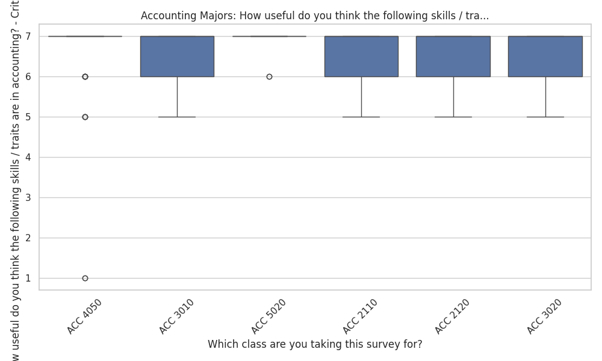

---

### Question: How useful do you think the following skills / traits are in accounting? - Organization

**Overall Statistics:**
- Count: 181
- Mean: 6.54
- Std Dev: 0.95

**Statistics by Course:**

| Which class are you taking this survey for?   |   count |    mean |      std |
|:----------------------------------------------|--------:|--------:|---------:|
| ACC 2110                                      |      22 | 6.72727 | 0.550482 |
| ACC 2120                                      |      32 | 6.6875  | 0.535061 |
| ACC 3010                                      |      25 | 6.56    | 0.768115 |
| ACC 3020                                      |      33 | 6.48485 | 0.712444 |
| ACC 4050                                      |      50 | 6.42    | 1.26314  |
| ACC 5020                                      |      19 | 6.42105 | 1.42657  |

**One-Way ANOVA:**
- F-statistic: 0.5593
- p-value: 0.7311

**Result:** No significant difference found (p >= 0.05).

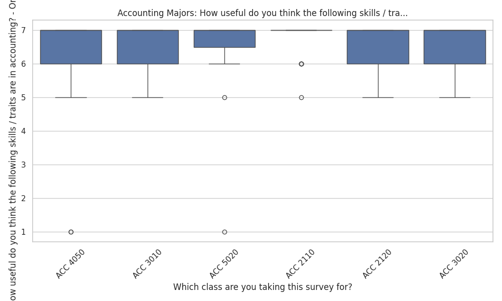

---

### Question: How useful do you think the following skills / traits are in accounting? - Attention to detail

**Overall Statistics:**
- Count: 181
- Mean: 6.66
- Std Dev: 0.82

**Statistics by Course:**

| Which class are you taking this survey for?   |   count |    mean |      std |
|:----------------------------------------------|--------:|--------:|---------:|
| ACC 2110                                      |      22 | 6.81818 | 0.394771 |
| ACC 2120                                      |      32 | 6.75    | 0.508001 |
| ACC 3010                                      |      25 | 6.72    | 0.613732 |
| ACC 3020                                      |      33 | 6.48485 | 0.833712 |
| ACC 4050                                      |      50 | 6.54    | 1.23239  |
| ACC 5020                                      |      19 | 6.89474 | 0.315302 |

**One-Way ANOVA:**
- F-statistic: 1.0837
- p-value: 0.3711

**Result:** No significant difference found (p >= 0.05).

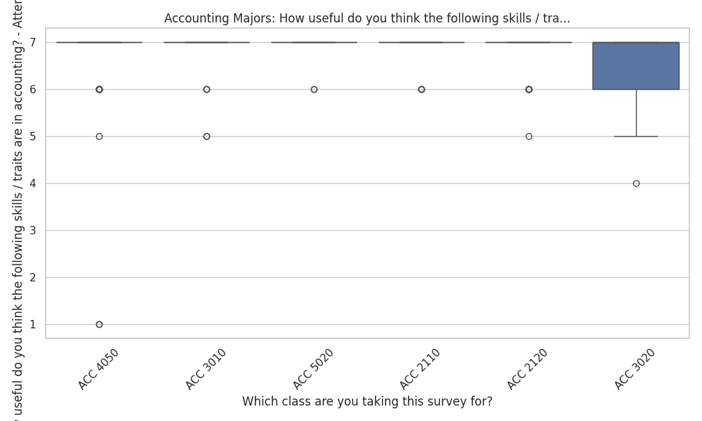

---

### Question: How useful do you think the following skills / traits are in accounting? - Being good with numbers

**Overall Statistics:**
- Count: 181
- Mean: 5.77
- Std Dev: 1.21

**Statistics by Course:**

| Which class are you taking this survey for?   |   count |    mean |      std |
|:----------------------------------------------|--------:|--------:|---------:|
| ACC 2110                                      |      22 | 6.18182 | 0.795006 |
| ACC 2120                                      |      32 | 5.875   | 1.18458  |
| ACC 3010                                      |      25 | 6       | 1        |
| ACC 3020                                      |      33 | 5.51515 | 1.17583  |
| ACC 4050                                      |      50 | 5.62    | 1.4831   |
| ACC 5020                                      |      19 | 5.63158 | 1.06513  |

**One-Way ANOVA:**
- F-statistic: 1.2492
- p-value: 0.2882

**Result:** No significant difference found (p >= 0.05).

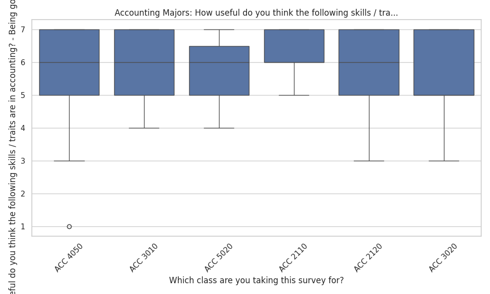

---

### Question: How useful do you think the following skills / traits are in accounting? - Being a perfectionist

**Overall Statistics:**
- Count: 181
- Mean: 4.44
- Std Dev: 1.34

**Statistics by Course:**

| Which class are you taking this survey for?   |   count |    mean |      std |
|:----------------------------------------------|--------:|--------:|---------:|
| ACC 2110                                      |      22 | 5.31818 | 1.04135  |
| ACC 2120                                      |      32 | 4.8125  | 1.44663  |
| ACC 3010                                      |      25 | 4.56    | 1.52971  |
| ACC 3020                                      |      33 | 4.18182 | 1.26131  |
| ACC 4050                                      |      50 | 4.26    | 1.22574  |
| ACC 5020                                      |      19 | 3.57895 | 0.961237 |

**One-Way ANOVA:**
- F-statistic: 4.8726
- p-value: 0.0003

**Result:** Significant difference found (p < 0.05). Performing Tukey HSD.

  Multiple Comparison of Means - Tukey HSD, FWER=0.05
========================================================
 group1   group2  meandiff p-adj   lower   upper  reject
--------------------------------------------------------
ACC 2110 ACC 2120  -0.5057 0.7082 -1.5241  0.5127  False
ACC 2110 ACC 3010  -0.7582 0.3283 -1.8331  0.3167  False
ACC 2110 ACC 3020  -1.1364 0.0179 -2.1485 -0.1243   True
ACC 2110 ACC 4050  -1.0582 0.0176 -1.9989 -0.1174   True
ACC 2110 ACC 5020  -1.7392 0.0003 -2.8909 -0.5876   True
ACC 2120 ACC 3010  -0.2525 0.9765  -1.234   0.729  False
ACC 2120 ACC 3020  -0.6307 0.3511  -1.543  0.2816  False
ACC 2120 ACC 4050  -0.5525  0.398 -1.3849  0.2799  False
ACC 2120 ACC 5020  -1.2336  0.013 -2.2985 -0.1686   True
ACC 3010 ACC 3020  -0.3782 0.8735 -1.3532  0.5968  False
ACC 3010 ACC 4050     -0.3 0.9299 -1.2007  0.6007  False
ACC 3010 ACC 5020  -0.9811 0.1222 -2.1002  0.1381  False
ACC 3020 ACC 4050   0.0782 0.9998 -0.7465  0.9029  False
ACC 3020 ACC 5020  -0.6029 0.5729 -1.6618  0.4561  False
ACC 4050 ACC 5020  -0.6811 0.3578  -1.672  0.3099  False
--------------------------------------------------------

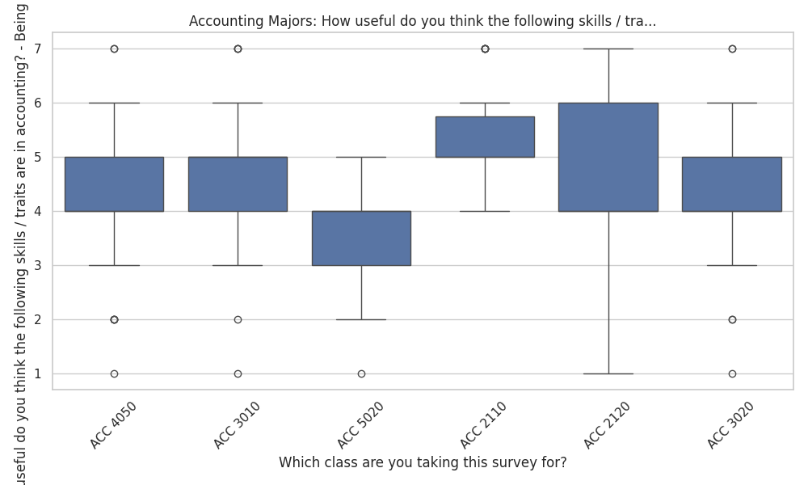

---

### Question: How useful do you think the following skills / traits are in accounting? - Willing to learn new things

**Overall Statistics:**
- Count: 181
- Mean: 6.17
- Std Dev: 1.14

**Statistics by Course:**

| Which class are you taking this survey for?   |   count |    mean |      std |
|:----------------------------------------------|--------:|--------:|---------:|
| ACC 2110                                      |      22 | 6.45455 | 0.738549 |
| ACC 2120                                      |      32 | 6.03125 | 0.932716 |
| ACC 3010                                      |      25 | 6.32    | 1.02956  |
| ACC 3020                                      |      33 | 6.15152 | 1.12142  |
| ACC 4050                                      |      50 | 6.02    | 1.34756  |
| ACC 5020                                      |      19 | 6.31579 | 1.41628  |

**One-Way ANOVA:**
- F-statistic: 0.6871
- p-value: 0.6338

**Result:** No significant difference found (p >= 0.05).

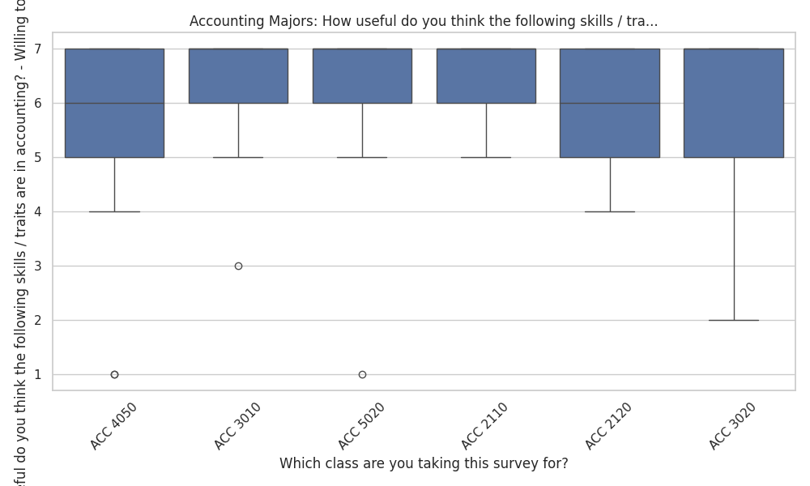

---

### Question: How useful do you think the following skills / traits are in accounting? - Honest / ethical conduct

**Overall Statistics:**
- Count: 181
- Mean: 6.58
- Std Dev: 0.93

**Statistics by Course:**

| Which class are you taking this survey for?   |   count |    mean |      std |
|:----------------------------------------------|--------:|--------:|---------:|
| ACC 2110                                      |      22 | 6.72727 | 0.550482 |
| ACC 2120                                      |      32 | 6.53125 | 0.761339 |
| ACC 3010                                      |      25 | 6.88    | 0.439697 |
| ACC 3020                                      |      33 | 6.36364 | 1.02525  |
| ACC 4050                                      |      50 | 6.46    | 1.24884  |
| ACC 5020                                      |      19 | 6.78947 | 0.713283 |

**One-Way ANOVA:**
- F-statistic: 1.3939
- p-value: 0.2287

**Result:** No significant difference found (p >= 0.05).

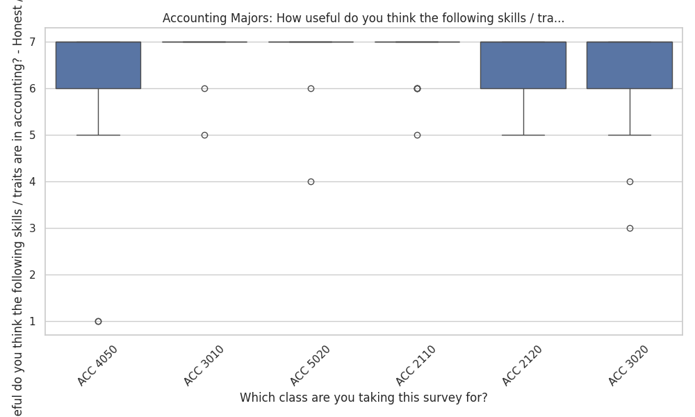

---

### Question: To what degree do you like accounting principles and rules?

**Overall Statistics:**
- Count: 180
- Mean: 5.61
- Std Dev: 1.06

**Statistics by Course:**

| Which class are you taking this survey for?   |   count |    mean |      std |
|:----------------------------------------------|--------:|--------:|---------:|
| ACC 2110                                      |      22 | 5.36364 | 1.25529  |
| ACC 2120                                      |      32 | 5.84375 | 1.0809   |
| ACC 3010                                      |      25 | 5.6     | 1.08012  |
| ACC 3020                                      |      33 | 5.42424 | 1.11888  |
| ACC 4050                                      |      49 | 5.63265 | 1.01435  |
| ACC 5020                                      |      19 | 5.78947 | 0.787327 |

**One-Way ANOVA:**
- F-statistic: 0.8549
- p-value: 0.5128

**Result:** No significant difference found (p >= 0.05).

---

### Question: How significantly do you think Artificial Intelligence (AI) will change the type of work performed by accountants in the future?

**Overall Statistics:**
- Count: 181
- Mean: 5.29
- Std Dev: 1.26

**Statistics by Course:**

| Which class are you taking this survey for?   |   count |    mean |     std |
|:----------------------------------------------|--------:|--------:|--------:|
| ACC 2110                                      |      22 | 5.18182 | 1.46828 |
| ACC 2120                                      |      32 | 5.1875  | 1.22967 |
| ACC 3010                                      |      25 | 5.52    | 1.1225  |
| ACC 3020                                      |      33 | 5.60606 | 1.29758 |
| ACC 4050                                      |      50 | 5.28    | 1.17872 |
| ACC 5020                                      |      19 | 4.73684 | 1.32674 |

**One-Way ANOVA:**
- F-statistic: 1.3986
- p-value: 0.2270

**Result:** No significant difference found (p >= 0.05).

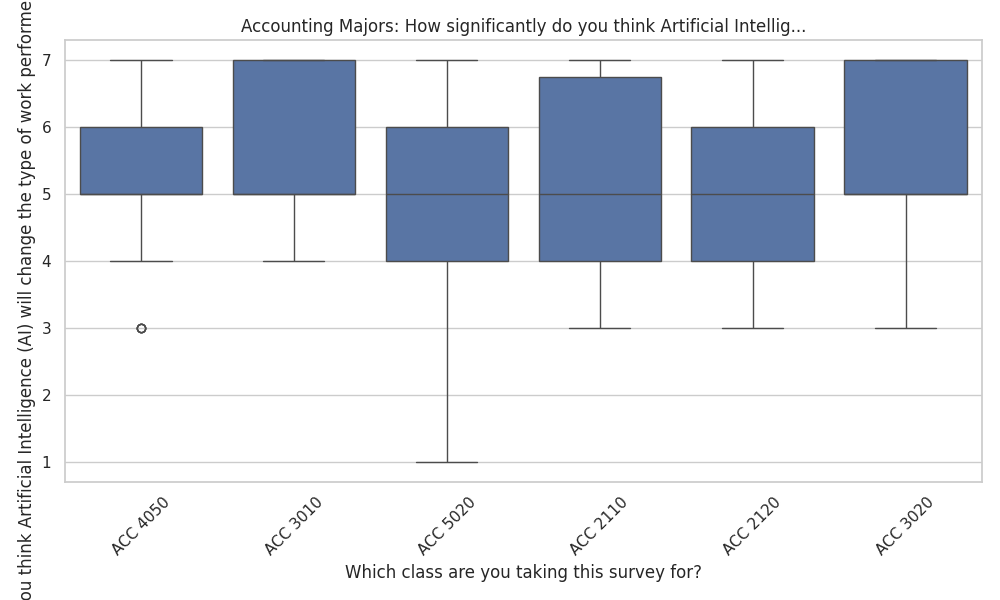

---

### Question: To what degree do you feel that your job in accounting has influenced how you view the accounting profession?

**Overall Statistics:**
- Count: 79
- Mean: 5.65
- Std Dev: 1.21

**Statistics by Course:**

| Which class are you taking this survey for?   |   count |    mean |      std |
|:----------------------------------------------|--------:|--------:|---------:|
| ACC 2110                                      |       4 | 5.5     | 1.73205  |
| ACC 2120                                      |       7 | 6.14286 | 0.899735 |
| ACC 3010                                      |      10 | 5       | 1.1547   |
| ACC 3020                                      |      19 | 5.52632 | 1.21876  |
| ACC 4050                                      |      24 | 6       | 1.10335  |
| ACC 5020                                      |      15 | 5.46667 | 1.30201  |

**One-Way ANOVA:**
- F-statistic: 1.3643
- p-value: 0.2477

**Result:** No significant difference found (p >= 0.05).

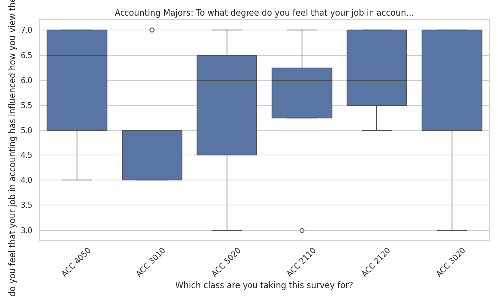

---

### Question: How beneficial do you think having a Master of Accountancy degree would be on a person's ability to get a job in accounting?

**Overall Statistics:**
- Count: 180
- Mean: 5.00
- Std Dev: 1.51

**Statistics by Course:**

| Which class are you taking this survey for?   |   count |    mean |     std |
|:----------------------------------------------|--------:|--------:|--------:|
| ACC 2110                                      |      22 | 5.5     | 1.33631 |
| ACC 2120                                      |      32 | 5.625   | 1.43122 |
| ACC 3010                                      |      25 | 5.64    | 1.22066 |
| ACC 3020                                      |      33 | 4.78788 | 1.24392 |
| ACC 4050                                      |      49 | 4.32653 | 1.61229 |
| ACC 5020                                      |      19 | 4.63158 | 1.49854 |

**One-Way ANOVA:**
- F-statistic: 5.3990
- p-value: 0.0001

**Result:** Significant difference found (p < 0.05). Performing Tukey HSD.

  Multiple Comparison of Means - Tukey HSD, FWER=0.05
========================================================
 group1   group2  meandiff p-adj   lower   upper  reject
--------------------------------------------------------
ACC 2110 ACC 2120    0.125 0.9996 -1.0093  1.2593  False
ACC 2110 ACC 3010     0.14 0.9994 -1.0573  1.3373  False
ACC 2110 ACC 3020  -0.7121 0.4554 -1.8394  0.4152  False
ACC 2110 ACC 4050  -1.1735  0.019 -2.2246 -0.1224   True
ACC 2110 ACC 5020  -0.8684  0.375 -2.1511  0.4143  False
ACC 2120 ACC 3010    0.015    1.0 -1.0782  1.1082  False
ACC 2120 ACC 3020  -0.8371 0.1712 -1.8533   0.179  False
ACC 2120 ACC 4050  -1.2985 0.0012 -2.2294 -0.3676   True
ACC 2120 ACC 5020  -0.9934 0.1573 -2.1796  0.1928  False
ACC 3010 ACC 3020  -0.8521 0.2158 -1.9381  0.2338  False
ACC 3010 ACC 4050  -1.3135 0.0031 -2.3201 -0.3068   True
ACC 3010 ACC 5020  -1.0084 0.1873  -2.255  0.2381  False
ACC 3020 ACC 4050  -0.4613 0.7016 -1.3837   0.461  False
ACC 3020 ACC 5020  -0.1563 0.9989 -1.3358  1.0232  False
ACC 4050 ACC 5020    0.305 0.9682 -0.8018  1.4119  False
--------------------------------------------------------

---

### Question: How beneficial do you think having an accounting certification or license (Certified Public Accountant, Enrolled Agent, etc.) would be on a person's ability to get a job in accounting?

**Overall Statistics:**
- Count: 180
- Mean: 6.18
- Std Dev: 1.07

**Statistics by Course:**

| Which class are you taking this survey for?   |   count |    mean |      std |
|:----------------------------------------------|--------:|--------:|---------:|
| ACC 2110                                      |      22 | 6.04545 | 0.950051 |
| ACC 2120                                      |      32 | 5.9375  | 1.21649  |
| ACC 3010                                      |      25 | 6.48    | 0.87178  |
| ACC 3020                                      |      33 | 6.06061 | 1.08799  |
| ACC 4050                                      |      49 | 6.44898 | 0.818057 |
| ACC 5020                                      |      19 | 5.84211 | 1.53707  |

**One-Way ANOVA:**
- F-statistic: 1.9062
- p-value: 0.0956

**Result:** No significant difference found (p >= 0.05).

---

### Question: How strongly do you believe that you want to pursue that area of accounting?

**Overall Statistics:**
- Count: 120
- Mean: 5.60
- Std Dev: 1.09

**Statistics by Course:**

| Which class are you taking this survey for?   |   count |    mean |      std |
|:----------------------------------------------|--------:|--------:|---------:|
| ACC 2110                                      |       8 | 4.75    | 0.707107 |
| ACC 2120                                      |      15 | 5.26667 | 0.798809 |
| ACC 3010                                      |      19 | 5.15789 | 1.46299  |
| ACC 3020                                      |      21 | 6       | 0.774597 |
| ACC 4050                                      |      38 | 5.78947 | 1.06943  |
| ACC 5020                                      |      19 | 5.84211 | 1.01451  |

**One-Way ANOVA:**
- F-statistic: 3.1305
- p-value: 0.0110

**Result:** Significant difference found (p < 0.05). Performing Tukey HSD.

  Multiple Comparison of Means - Tukey HSD, FWER=0.05
=======================================================
 group1   group2  meandiff p-adj   lower  upper  reject
-------------------------------------------------------
ACC 2110 ACC 2120   0.5167 0.8669 -0.8058 1.8392  False
ACC 2110 ACC 3010   0.4079 0.9383 -0.8653 1.6811  False
ACC 2110 ACC 3020     1.25 0.0516 -0.0051 2.5051  False
ACC 2110 ACC 4050   1.0395 0.1148 -0.1356 2.2146  False
ACC 2110 ACC 5020   1.0921 0.1368 -0.1811 2.3653  False
ACC 2120 ACC 3010  -0.1088 0.9997 -1.1522 0.9346  False
ACC 2120 ACC 3020   0.7333 0.3043 -0.2879 1.7546  False
ACC 2120 ACC 4050   0.5228 0.5706 -0.3983 1.4439  False
ACC 2120 ACC 5020   0.5754 0.6011 -0.4679 1.6188  False
ACC 3010 ACC 3020   0.8421  0.118 -0.1144 1.7986  False
ACC 3010 ACC 4050   0.6316 0.2662 -0.2172 1.4804  False
ACC 3010 ACC 5020   0.6842 0.3356 -0.2959 1.6643  False
ACC 3020 ACC 4050  -0.2105  0.976 -1.0319 0.6109  False
ACC 3020 ACC 5020  -0.1579 0.9968 -1.1144 0.7986  False
ACC 4050 ACC 5020   0.0526    1.0 -0.7961 0.9014  False
-------------------------------------------------------

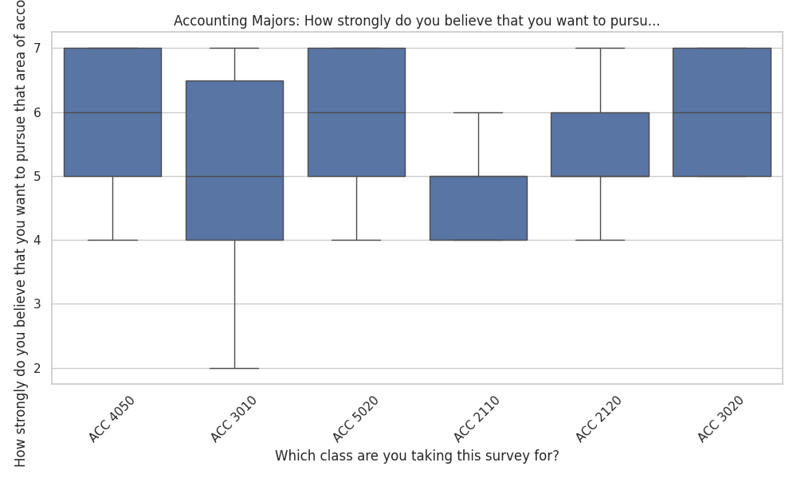

---
