# Survey Analysis Report
Analysis of UVU accounting student survey data.
## Analysis Segment: All Students
**Number of observations:** 393
**Courses included:** ACC 4050, ACC 3010, ACC 5020, ACC 2110, ACC 2120, ACC 3020
### Q12_1: Never talk to people
- **Question Text:** How strongly do you believe each of these stereotypes about accounting / accountants? - Never talk to people
- **ANOVA:** F=4.8028, p=0.0003

**Descriptive Statistics:**
| Q2       |   mean |   std |   count |
|:---------|-------:|------:|--------:|
| ACC 2110 |   3.03 |  1.59 |     215 |
| ACC 2120 |   2.58 |  1.33 |      43 |
| ACC 3010 |   2.32 |  1.42 |      28 |
| ACC 3020 |   2.3  |  1.38 |      33 |
| ACC 4050 |   2.49 |  1.54 |      49 |
| ACC 5020 |   1.77 |  1.02 |      22 |

**Significant Difference Detected (p < 0.05).**

**Tukey HSD Post-hoc Results:**
| group1   | group2   |   meandiff |   p-adj |   lower |   upper | reject   |
|:---------|:---------|-----------:|--------:|--------:|--------:|:---------|
| ACC 2110 | ACC 5020 |    -1.2598 |  0.0029 |  -2.224 | -0.2957 | True     |

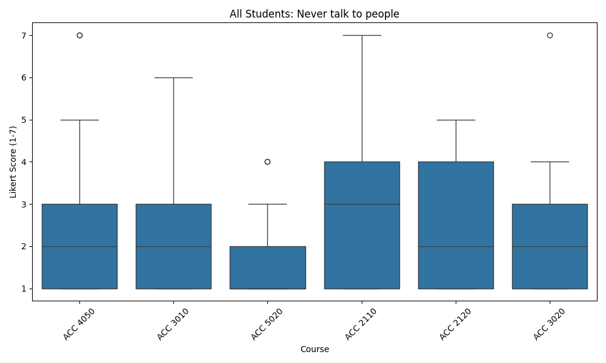
---
### Q12_2: Introverts
- **Question Text:** How strongly do you believe each of these stereotypes about accounting / accountants? - Introverts
- **ANOVA:** F=1.5944, p=0.1606

**Descriptive Statistics:**
| Q2       |   mean |   std |   count |
|:---------|-------:|------:|--------:|
| ACC 2110 |   3.82 |  1.46 |     215 |
| ACC 2120 |   3.42 |  1.45 |      43 |
| ACC 3010 |   3.71 |  1.54 |      28 |
| ACC 3020 |   3.55 |  1.48 |      33 |
| ACC 4050 |   4.14 |  1.73 |      49 |
| ACC 5020 |   3.36 |  1.47 |      22 |

No significant difference across courses.

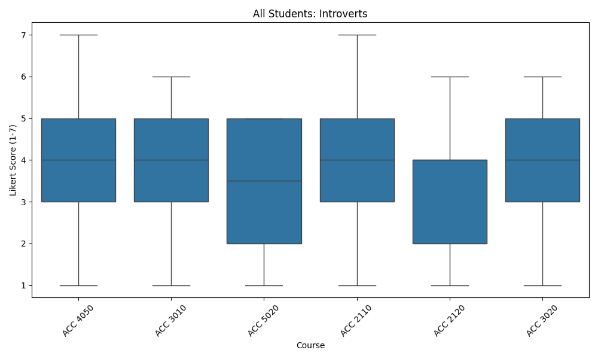
---
### Q12_3: Work in a cubicle
- **Question Text:** How strongly do you believe each of these stereotypes about accounting / accountants? - Work in a cubicle
- **ANOVA:** F=5.1987, p=0.0001

**Descriptive Statistics:**
| Q2       |   mean |   std |   count |
|:---------|-------:|------:|--------:|
| ACC 2110 |   4.71 |  1.34 |     215 |
| ACC 2120 |   4.63 |  1.25 |      43 |
| ACC 3010 |   4.32 |  1.33 |      28 |
| ACC 3020 |   4.24 |  1.39 |      33 |
| ACC 4050 |   3.9  |  1.54 |      49 |
| ACC 5020 |   3.59 |  1.4  |      22 |

**Significant Difference Detected (p < 0.05).**

**Tukey HSD Post-hoc Results:**
| group1   | group2   |   meandiff |   p-adj |   lower |   upper | reject   |
|:---------|:---------|-----------:|--------:|--------:|--------:|:---------|
| ACC 2110 | ACC 4050 |    -0.809  |  0.0029 | -1.4284 | -0.1897 | True     |
| ACC 2110 | ACC 5020 |    -1.1161 |  0.004  | -1.9919 | -0.2403 | True     |
| ACC 2120 | ACC 5020 |    -1.037  |  0.0457 | -2.0626 | -0.0114 | True     |

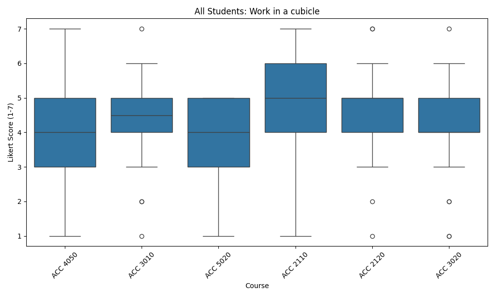
---
### Q12_4: Long work hours
- **Question Text:** How strongly do you believe each of these stereotypes about accounting / accountants? - Long work hours
- **ANOVA:** F=3.1103, p=0.0091

**Descriptive Statistics:**
| Q2       |   mean |   std |   count |
|:---------|-------:|------:|--------:|
| ACC 2110 |   5.12 |  1.34 |     215 |
| ACC 2120 |   4.93 |  1.3  |      43 |
| ACC 3010 |   5.64 |  1.28 |      28 |
| ACC 3020 |   5.76 |  0.9  |      33 |
| ACC 4050 |   5.45 |  1.31 |      49 |
| ACC 5020 |   5.64 |  1.29 |      22 |

**Significant Difference Detected (p < 0.05).**

**Tukey HSD Post-hoc Results:**
No pairwise differences were significant according to Tukey HSD.

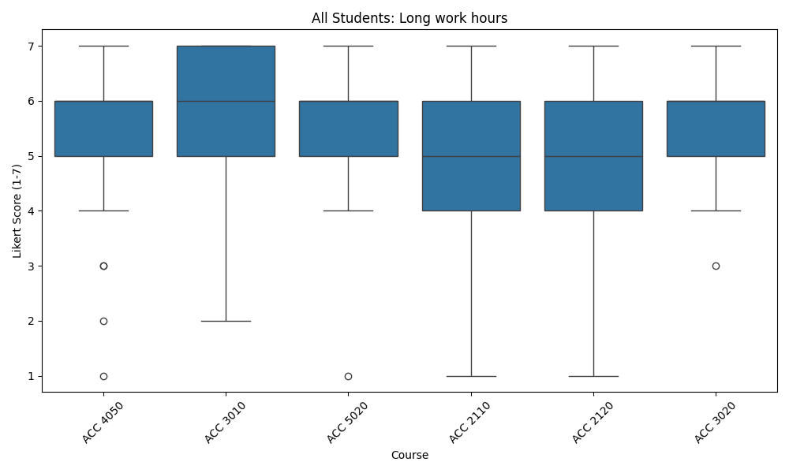
---
### Q12_5: Only tax and audit careers
- **Question Text:** How strongly do you believe each of these stereotypes about accounting / accountants? - Only tax and audit careers
- **ANOVA:** F=5.0369, p=0.0002

**Descriptive Statistics:**
| Q2       |   mean |   std |   count |
|:---------|-------:|------:|--------:|
| ACC 2110 |   3.61 |  1.54 |     215 |
| ACC 2120 |   2.79 |  1.52 |      43 |
| ACC 3010 |   3.04 |  1.64 |      28 |
| ACC 3020 |   3.03 |  1.88 |      33 |
| ACC 4050 |   2.69 |  1.7  |      49 |
| ACC 5020 |   2.59 |  1.59 |      22 |

**Significant Difference Detected (p < 0.05).**

**Tukey HSD Post-hoc Results:**
| group1   | group2   |   meandiff |   p-adj |   lower |   upper | reject   |
|:---------|:---------|-----------:|--------:|--------:|--------:|:---------|
| ACC 2110 | ACC 2120 |    -0.8186 |  0.0281 | -1.5837 | -0.0535 | True     |
| ACC 2110 | ACC 4050 |    -0.9154 |  0.0045 | -1.6405 | -0.1904 | True     |

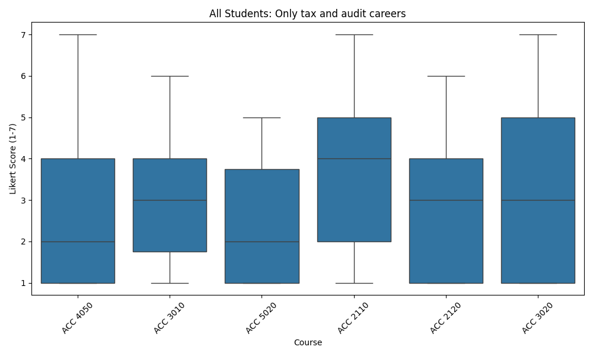
---
### Q12_6: Always do taxes
- **Question Text:** How strongly do you believe each of these stereotypes about accounting / accountants? - Always do taxes
- **ANOVA:** F=20.6444, p=0.0000

**Descriptive Statistics:**
| Q2       |   mean |   std |   count |
|:---------|-------:|------:|--------:|
| ACC 2110 |   3.7  |  1.6  |     215 |
| ACC 2120 |   2.65 |  1.36 |      43 |
| ACC 3010 |   2.64 |  1.59 |      28 |
| ACC 3020 |   2.24 |  1.32 |      33 |
| ACC 4050 |   2.08 |  1.29 |      49 |
| ACC 5020 |   1.45 |  0.8  |      22 |

**Significant Difference Detected (p < 0.05).**

**Tukey HSD Post-hoc Results:**
| group1   | group2   |   meandiff |   p-adj |   lower |   upper | reject   |
|:---------|:---------|-----------:|--------:|--------:|--------:|:---------|
| ACC 2110 | ACC 2120 |    -1.0512 |  0.0004 | -1.7598 | -0.3425 | True     |
| ACC 2110 | ACC 3010 |    -1.0595 |  0.0055 | -1.9117 | -0.2072 | True     |
| ACC 2110 | ACC 3020 |    -1.4599 |  0      | -2.253  | -0.6668 | True     |
| ACC 2110 | ACC 4050 |    -1.6207 |  0      | -2.2922 | -0.9492 | True     |
| ACC 2110 | ACC 5020 |    -2.2478 |  0      | -3.1973 | -1.2982 | True     |
| ACC 2120 | ACC 5020 |    -1.1966 |  0.0266 | -2.3086 | -0.0847 | True     |

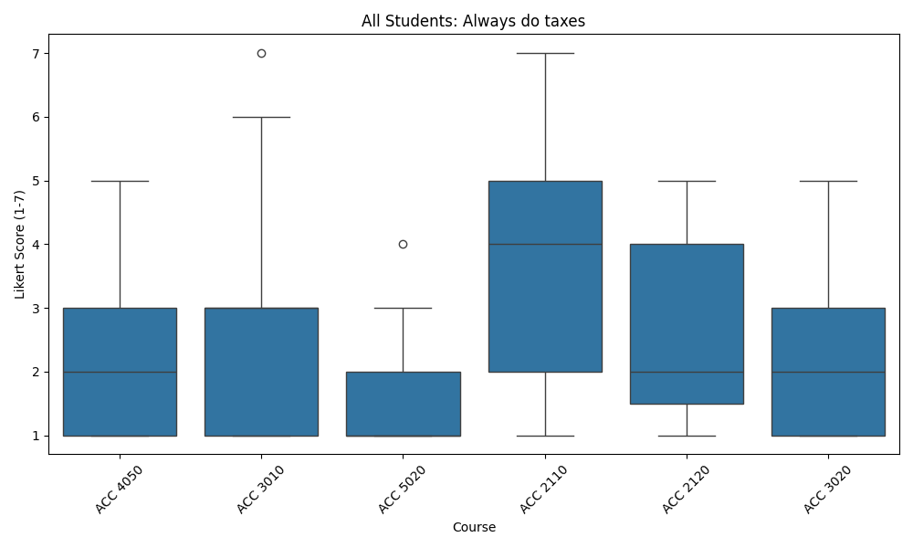
---
### Q12_7: Reliable
- **Question Text:** How strongly do you believe each of these stereotypes about accounting / accountants? - Reliable
- **ANOVA:** F=1.7410, p=0.1243

**Descriptive Statistics:**
| Q2       |   mean |   std |   count |
|:---------|-------:|------:|--------:|
| ACC 2110 |   5.27 |  1.17 |     215 |
| ACC 2120 |   5.3  |  1.1  |      43 |
| ACC 3010 |   5.86 |  0.93 |      28 |
| ACC 3020 |   5.3  |  1.1  |      33 |
| ACC 4050 |   5.59 |  1.17 |      49 |
| ACC 5020 |   5.36 |  1.22 |      22 |

No significant difference across courses.

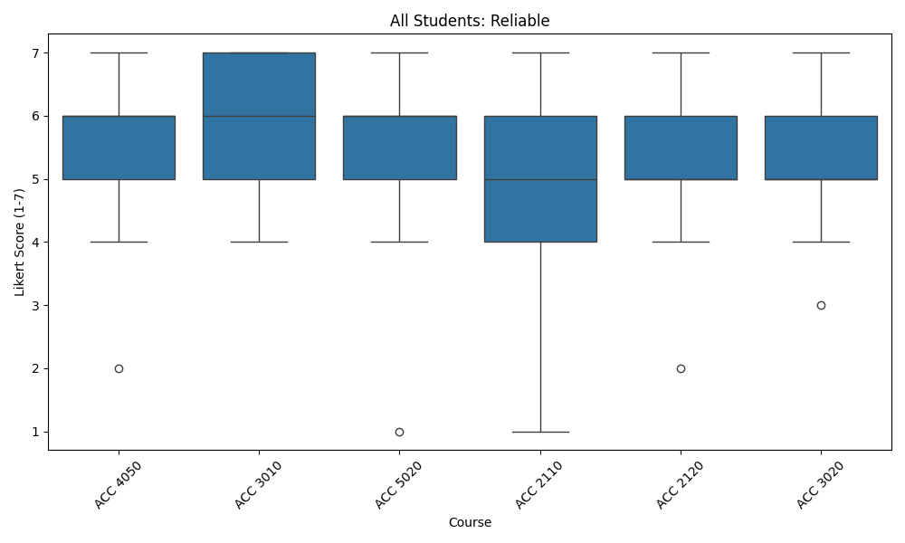
---
### Q12_8: Detail oriented
- **Question Text:** How strongly do you believe each of these stereotypes about accounting / accountants? - Detail oriented
- **ANOVA:** F=0.7531, p=0.5842

**Descriptive Statistics:**
| Q2       |   mean |   std |   count |
|:---------|-------:|------:|--------:|
| ACC 2110 |   5.65 |  1.12 |     215 |
| ACC 2120 |   5.7  |  1.01 |      43 |
| ACC 3010 |   6    |  0.94 |      28 |
| ACC 3020 |   5.58 |  1.03 |      33 |
| ACC 4050 |   5.84 |  1.07 |      49 |
| ACC 5020 |   5.68 |  1.25 |      22 |

No significant difference across courses.

---
### Q12_9: Follow rules
- **Question Text:** How strongly do you believe each of these stereotypes about accounting / accountants? - Follow rules
- **ANOVA:** F=1.7018, p=0.1332

**Descriptive Statistics:**
| Q2       |   mean |   std |   count |
|:---------|-------:|------:|--------:|
| ACC 2110 |   5.37 |  1.28 |     214 |
| ACC 2120 |   5.6  |  1.07 |      43 |
| ACC 3010 |   5.93 |  0.9  |      28 |
| ACC 3020 |   5.67 |  1.11 |      33 |
| ACC 4050 |   5.71 |  1.06 |      49 |
| ACC 5020 |   5.5  |  1.26 |      22 |

No significant difference across courses.

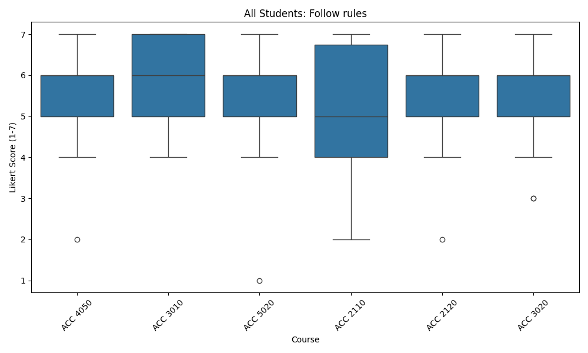
---
### Q12_10: Willing to break the law
- **Question Text:** How strongly do you believe each of these stereotypes about accounting / accountants? - Willing to break the law
- **ANOVA:** F=1.1165, p=0.3510

**Descriptive Statistics:**
| Q2       |   mean |   std |   count |
|:---------|-------:|------:|--------:|
| ACC 2110 |   2.53 |  1.42 |     214 |
| ACC 2120 |   2.26 |  1.38 |      43 |
| ACC 3010 |   2.21 |  1.2  |      28 |
| ACC 3020 |   2.39 |  1.5  |      33 |
| ACC 4050 |   2.12 |  1.09 |      49 |
| ACC 5020 |   2.18 |  1.37 |      22 |

No significant difference across courses.

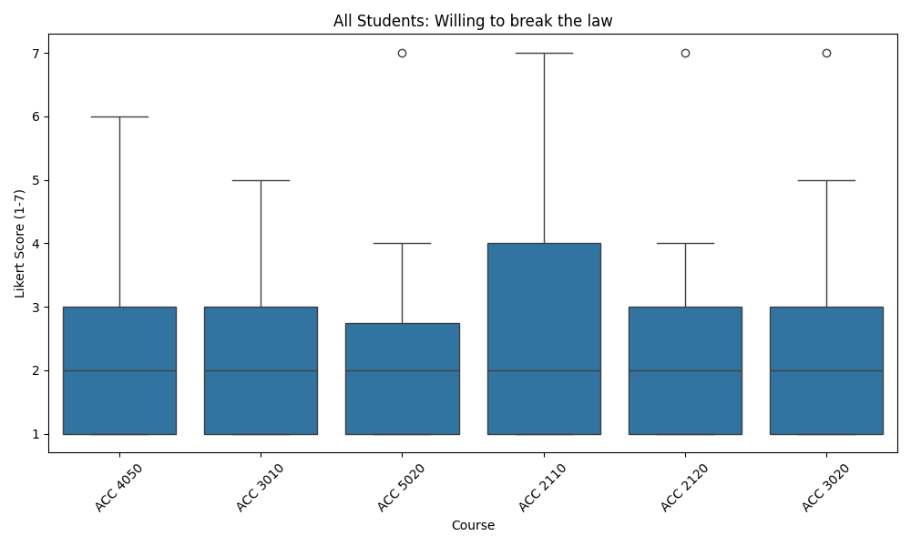
---
### Q12_11: Boring
- **Question Text:** How strongly do you believe each of these stereotypes about accounting / accountants? - Boring
- **ANOVA:** F=3.7851, p=0.0023

**Descriptive Statistics:**
| Q2       |   mean |   std |   count |
|:---------|-------:|------:|--------:|
| ACC 2110 |   4.02 |  1.51 |     214 |
| ACC 2120 |   3.44 |  1.39 |      43 |
| ACC 3010 |   3.21 |  1.45 |      28 |
| ACC 3020 |   3.79 |  1.34 |      33 |
| ACC 4050 |   3.51 |  1.54 |      49 |
| ACC 5020 |   3.05 |  1.59 |      22 |

**Significant Difference Detected (p < 0.05).**

**Tukey HSD Post-hoc Results:**
| group1   | group2   |   meandiff |   p-adj |   lower |   upper | reject   |
|:---------|:---------|-----------:|--------:|--------:|--------:|:---------|
| ACC 2110 | ACC 5020 |    -0.9779 |  0.0407 | -1.9315 | -0.0243 | True     |

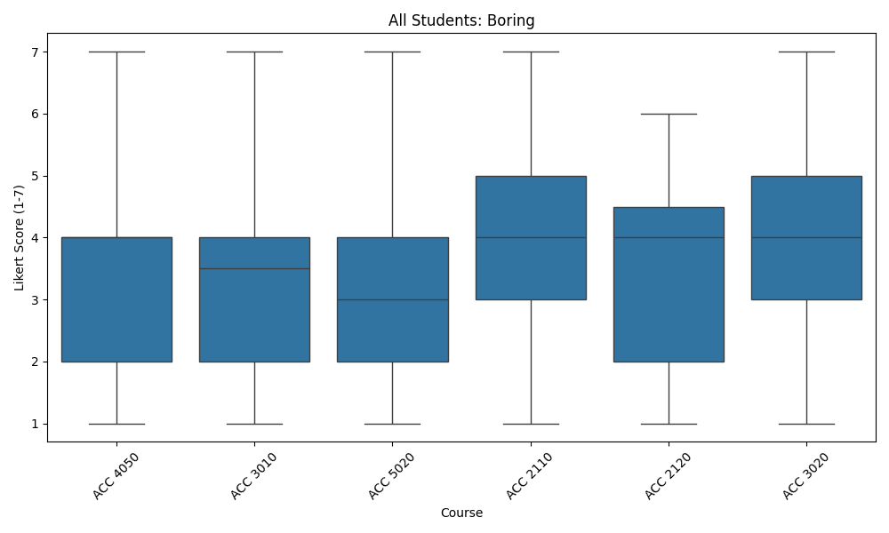
---
### Q12_12: Work alone
- **Question Text:** How strongly do you believe each of these stereotypes about accounting / accountants? - Work alone
- **ANOVA:** F=7.3509, p=0.0000

**Descriptive Statistics:**
| Q2       |   mean |   std |   count |
|:---------|-------:|------:|--------:|
| ACC 2110 |   4.05 |  1.42 |     213 |
| ACC 2120 |   3.72 |  1.35 |      43 |
| ACC 3010 |   3.21 |  1.6  |      28 |
| ACC 3020 |   3.39 |  1.34 |      33 |
| ACC 4050 |   3.35 |  1.59 |      49 |
| ACC 5020 |   2.41 |  1.65 |      22 |

**Significant Difference Detected (p < 0.05).**

**Tukey HSD Post-hoc Results:**
| group1   | group2   |   meandiff |   p-adj |   lower |   upper | reject   |
|:---------|:---------|-----------:|--------:|--------:|--------:|:---------|
| ACC 2110 | ACC 4050 |    -0.7    |  0.0309 | -1.3613 | -0.0387 | True     |
| ACC 2110 | ACC 5020 |    -1.6379 |  0      | -2.5726 | -0.7032 | True     |
| ACC 2120 | ACC 5020 |    -1.3118 |  0.0086 | -2.4059 | -0.2178 | True     |

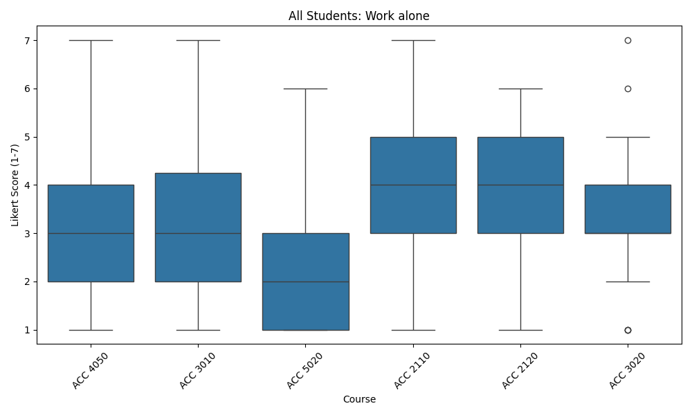
---
### Q15_1: Never talk to people
- **Question Text:** How strongly do each of these stereotypes lead you towards or away from a major / career in accounting? - Never talk to people
- **ANOVA:** F=1.3697, p=0.2348

**Descriptive Statistics:**
| Q2       |   mean |   std |   count |
|:---------|-------:|------:|--------:|
| ACC 2110 |   3.46 |  1.42 |     215 |
| ACC 2120 |   3.9  |  1.01 |      42 |
| ACC 3010 |   3.21 |  1.5  |      28 |
| ACC 3020 |   3.33 |  1.63 |      33 |
| ACC 4050 |   3.74 |  1.35 |      50 |
| ACC 5020 |   3.64 |  1.56 |      22 |

No significant difference across courses.

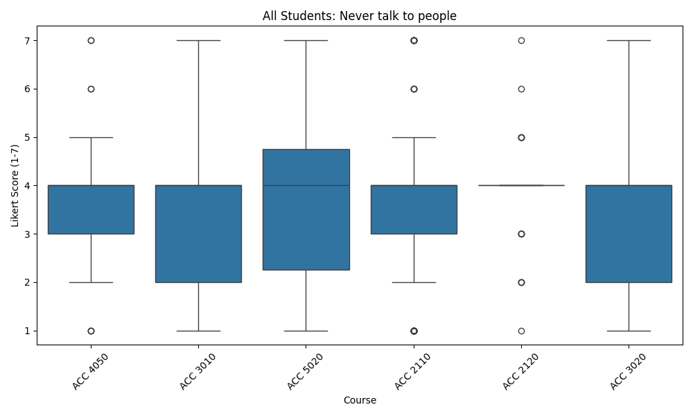
---
### Q15_2: Introverts
- **Question Text:** How strongly do each of these stereotypes lead you towards or away from a major / career in accounting? - Introverts
- **ANOVA:** F=3.1874, p=0.0078

**Descriptive Statistics:**
| Q2       |   mean |   std |   count |
|:---------|-------:|------:|--------:|
| ACC 2110 |   3.53 |  1.38 |     215 |
| ACC 2120 |   4.14 |  1.05 |      42 |
| ACC 3010 |   3.43 |  1.53 |      28 |
| ACC 3020 |   3.52 |  1.48 |      33 |
| ACC 4050 |   4.2  |  1.46 |      50 |
| ACC 5020 |   3.55 |  1.53 |      22 |

**Significant Difference Detected (p < 0.05).**

**Tukey HSD Post-hoc Results:**
| group1   | group2   |   meandiff |   p-adj |   lower |   upper | reject   |
|:---------|:---------|-----------:|--------:|--------:|--------:|:---------|
| ACC 2110 | ACC 4050 |     0.6744 |  0.0255 |  0.0504 |  1.2984 | True     |

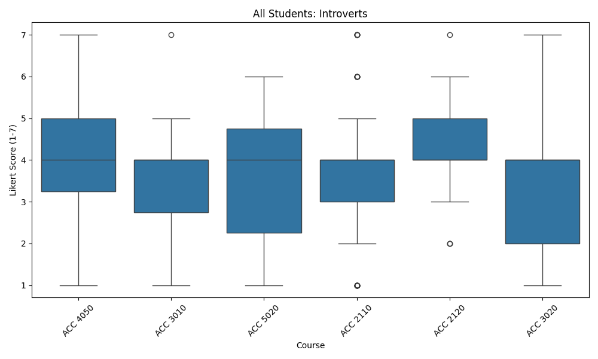
---
### Q15_3: Work in a cubicle
- **Question Text:** How strongly do each of these stereotypes lead you towards or away from a major / career in accounting? - Work in a cubicle
- **ANOVA:** F=2.8963, p=0.0140

**Descriptive Statistics:**
| Q2       |   mean |   std |   count |
|:---------|-------:|------:|--------:|
| ACC 2110 |   2.94 |  1.47 |     215 |
| ACC 2120 |   3.71 |  1.22 |      42 |
| ACC 3010 |   3    |  1.15 |      28 |
| ACC 3020 |   3.03 |  1.49 |      33 |
| ACC 4050 |   3.46 |  1.39 |      50 |
| ACC 5020 |   2.95 |  1.21 |      22 |

**Significant Difference Detected (p < 0.05).**

**Tukey HSD Post-hoc Results:**
| group1   | group2   |   meandiff |   p-adj |   lower |   upper | reject   |
|:---------|:---------|-----------:|--------:|--------:|--------:|:---------|
| ACC 2110 | ACC 2120 |     0.7701 |  0.0154 |  0.0929 |  1.4473 | True     |

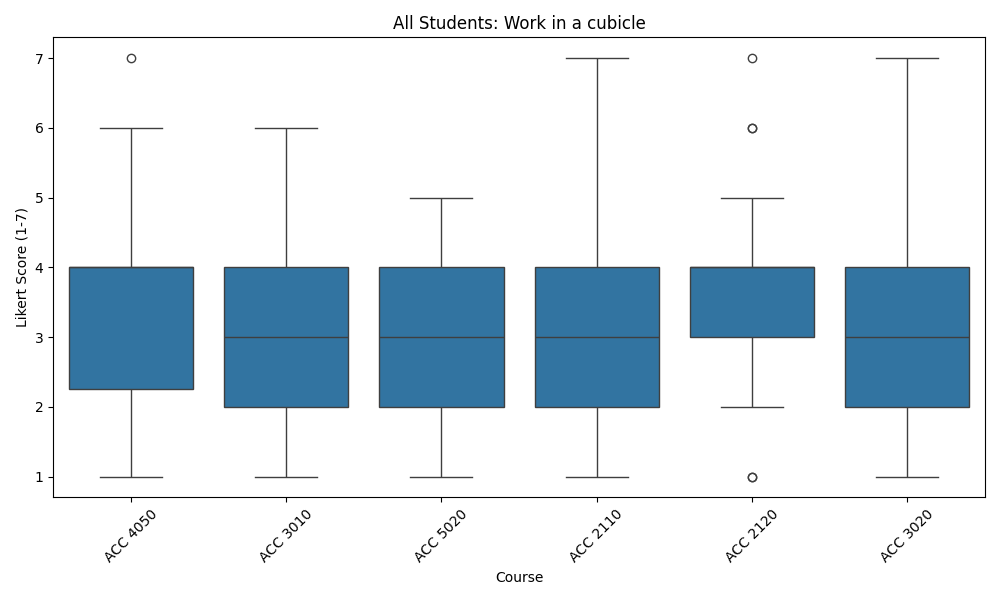
---
### Q15_4: Long work hours
- **Question Text:** How strongly do each of these stereotypes lead you towards or away from a major / career in accounting? - Long work hours
- **ANOVA:** F=1.4649, p=0.2004

**Descriptive Statistics:**
| Q2       |   mean |   std |   count |
|:---------|-------:|------:|--------:|
| ACC 2110 |   3.13 |  1.35 |     215 |
| ACC 2120 |   3.14 |  1.09 |      42 |
| ACC 3010 |   2.86 |  1.27 |      28 |
| ACC 3020 |   2.61 |  1.25 |      33 |
| ACC 4050 |   3.02 |  1.29 |      50 |
| ACC 5020 |   3.45 |  1.5  |      22 |

No significant difference across courses.

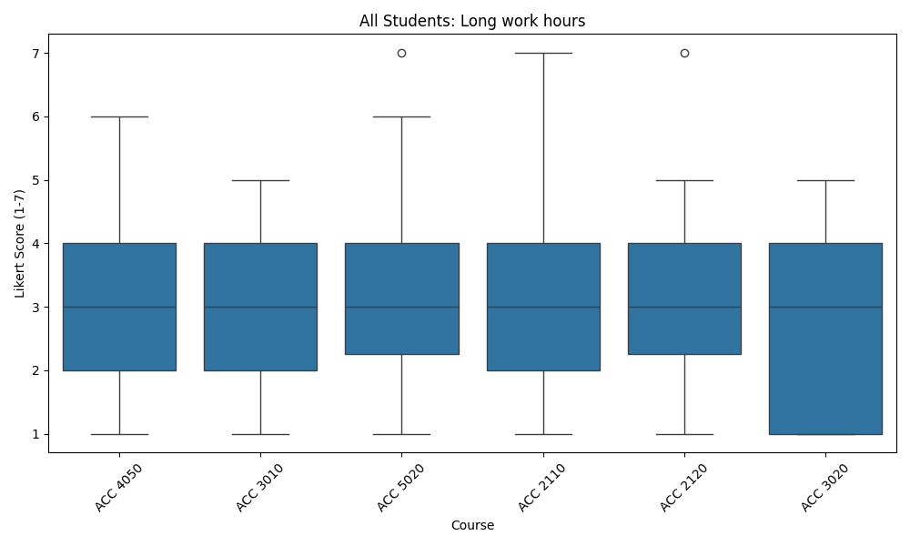
---
### Q15_5: Only tax and audit careers
- **Question Text:** How strongly do each of these stereotypes lead you towards or away from a major / career in accounting? - Only tax and audit careers
- **ANOVA:** F=2.1714, p=0.0566

**Descriptive Statistics:**
| Q2       |   mean |   std |   count |
|:---------|-------:|------:|--------:|
| ACC 2110 |   3.16 |  1.28 |     215 |
| ACC 2120 |   3.79 |  1.23 |      43 |
| ACC 3010 |   3.43 |  1.26 |      28 |
| ACC 3020 |   3.39 |  0.86 |      33 |
| ACC 4050 |   3.34 |  1.3  |      50 |
| ACC 5020 |   3.55 |  1.18 |      22 |

No significant difference across courses.

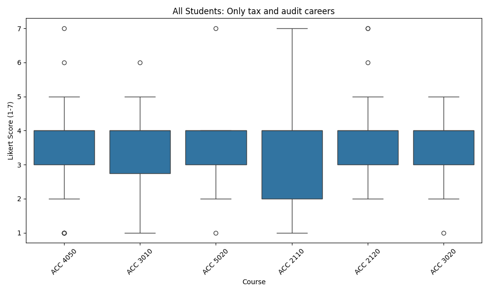
---
### Q15_6: Always do taxes
- **Question Text:** How strongly do each of these stereotypes lead you towards or away from a major / career in accounting? - Always do taxes
- **ANOVA:** F=1.6320, p=0.1505

**Descriptive Statistics:**
| Q2       |   mean |   std |   count |
|:---------|-------:|------:|--------:|
| ACC 2110 |   3.12 |  1.33 |     215 |
| ACC 2120 |   3.71 |  1.09 |      42 |
| ACC 3010 |   3.29 |  1.33 |      28 |
| ACC 3020 |   3.33 |  1.05 |      33 |
| ACC 4050 |   3.38 |  1.37 |      50 |
| ACC 5020 |   3.27 |  1.42 |      22 |

No significant difference across courses.

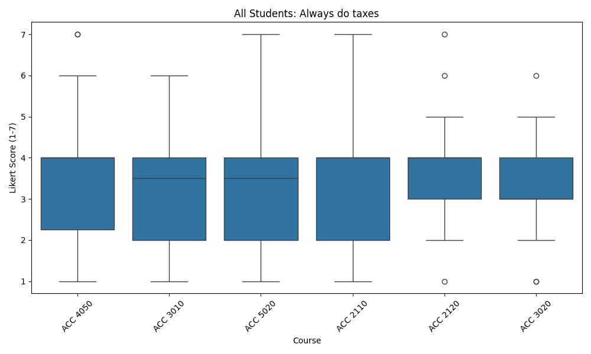
---
### Q15_7: Reliable
- **Question Text:** How strongly do each of these stereotypes lead you towards or away from a major / career in accounting? - Reliable
- **ANOVA:** F=5.9136, p=0.0000

**Descriptive Statistics:**
| Q2       |   mean |   std |   count |
|:---------|-------:|------:|--------:|
| ACC 2110 |   4.99 |  1.22 |     215 |
| ACC 2120 |   5.52 |  0.99 |      42 |
| ACC 3010 |   5.82 |  1.09 |      28 |
| ACC 3020 |   5.52 |  1.12 |      33 |
| ACC 4050 |   5.74 |  1.03 |      50 |
| ACC 5020 |   5.36 |  1.71 |      22 |

**Significant Difference Detected (p < 0.05).**

**Tukey HSD Post-hoc Results:**
| group1   | group2   |   meandiff |   p-adj |   lower |   upper | reject   |
|:---------|:---------|-----------:|--------:|--------:|--------:|:---------|
| ACC 2110 | ACC 3010 |     0.8354 |  0.0069 |  0.1514 |  1.5194 | True     |
| ACC 2110 | ACC 4050 |     0.754  |  0.0009 |  0.2195 |  1.2885 | True     |

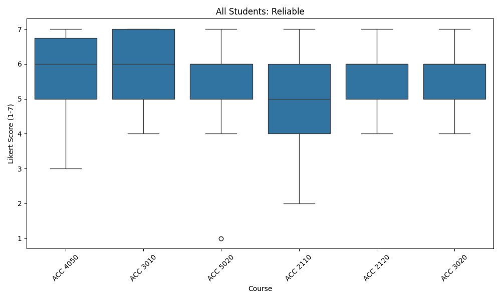
---
### Q15_8: Detail oriented
- **Question Text:** How strongly do each of these stereotypes lead you towards or away from a major / career in accounting? - Detail oriented
- **ANOVA:** F=5.4009, p=0.0001

**Descriptive Statistics:**
| Q2       |   mean |   std |   count |
|:---------|-------:|------:|--------:|
| ACC 2110 |   5.04 |  1.17 |     215 |
| ACC 2120 |   5.47 |  1.14 |      43 |
| ACC 3010 |   5.96 |  1    |      28 |
| ACC 3020 |   5.55 |  1.18 |      33 |
| ACC 4050 |   5.68 |  1.08 |      50 |
| ACC 5020 |   5.5  |  1.74 |      22 |

**Significant Difference Detected (p < 0.05).**

**Tukey HSD Post-hoc Results:**
| group1   | group2   |   meandiff |   p-adj |   lower |   upper | reject   |
|:---------|:---------|-----------:|--------:|--------:|--------:|:---------|
| ACC 2110 | ACC 3010 |     0.9224 |  0.0017 |  0.2404 |  1.6045 | True     |
| ACC 2110 | ACC 4050 |     0.6381 |  0.0087 |  0.1052 |  1.1711 | True     |

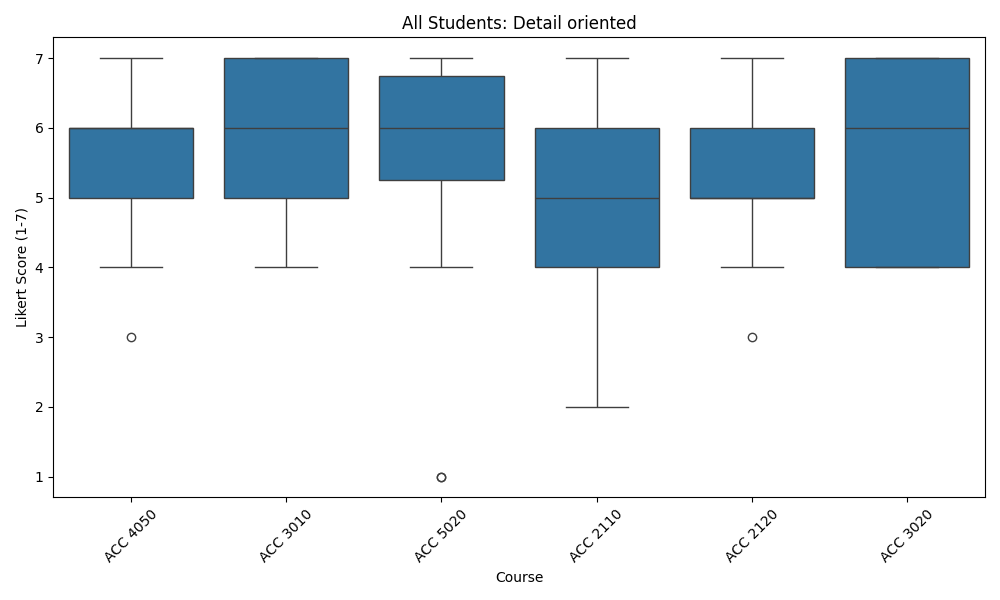
---
### Q15_9: Follow rules
- **Question Text:** How strongly do each of these stereotypes lead you towards or away from a major / career in accounting? - Follow rules
- **ANOVA:** F=3.9032, p=0.0018

**Descriptive Statistics:**
| Q2       |   mean |   std |   count |
|:---------|-------:|------:|--------:|
| ACC 2110 |   4.87 |  1.19 |     215 |
| ACC 2120 |   5.4  |  1.16 |      43 |
| ACC 3010 |   5.46 |  1.17 |      28 |
| ACC 3020 |   5.33 |  1.08 |      33 |
| ACC 4050 |   5.5  |  1.18 |      50 |
| ACC 5020 |   5.05 |  1.62 |      22 |

**Significant Difference Detected (p < 0.05).**

**Tukey HSD Post-hoc Results:**
| group1   | group2   |   meandiff |   p-adj |   lower |   upper | reject   |
|:---------|:---------|-----------:|--------:|--------:|--------:|:---------|
| ACC 2110 | ACC 4050 |     0.6256 |   0.013 |  0.0844 |  1.1668 | True     |

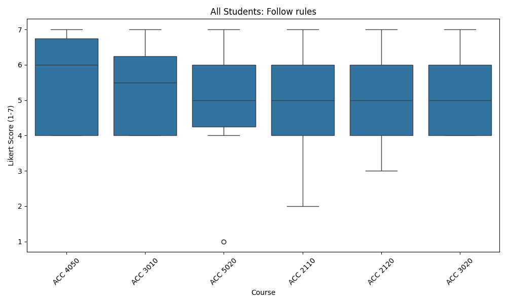
---
### Q15_10: Willing to break the law
- **Question Text:** How strongly do each of these stereotypes lead you towards or away from a major / career in accounting? - Willing to break the law
- **ANOVA:** F=0.8816, p=0.4934

**Descriptive Statistics:**
| Q2       |   mean |   std |   count |
|:---------|-------:|------:|--------:|
| ACC 2110 |   2.8  |  1.4  |     215 |
| ACC 2120 |   2.48 |  1.5  |      42 |
| ACC 3010 |   2.29 |  1.24 |      28 |
| ACC 3020 |   2.64 |  1.43 |      33 |
| ACC 4050 |   2.62 |  1.52 |      50 |
| ACC 5020 |   2.68 |  1.78 |      22 |

No significant difference across courses.

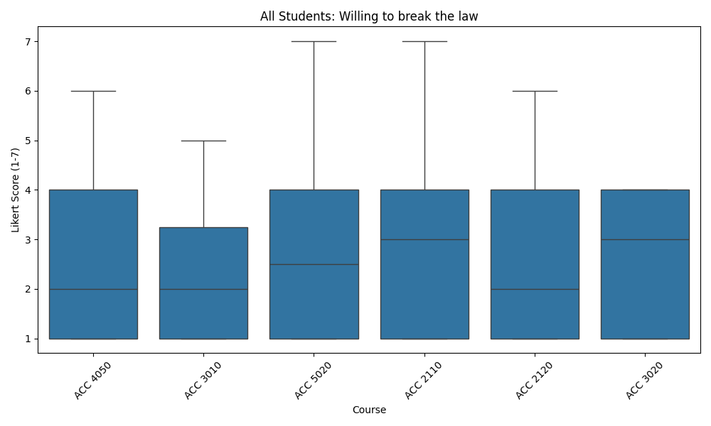
---
### Q15_11: Boring
- **Question Text:** How strongly do each of these stereotypes lead you towards or away from a major / career in accounting? - Boring
- **ANOVA:** F=1.5309, p=0.1792

**Descriptive Statistics:**
| Q2       |   mean |   std |   count |
|:---------|-------:|------:|--------:|
| ACC 2110 |   2.93 |  1.36 |     214 |
| ACC 2120 |   3.17 |  1.08 |      42 |
| ACC 3010 |   2.54 |  1.26 |      28 |
| ACC 3020 |   2.7  |  1.19 |      33 |
| ACC 4050 |   3.18 |  1.16 |      50 |
| ACC 5020 |   3.18 |  1.44 |      22 |

No significant difference across courses.

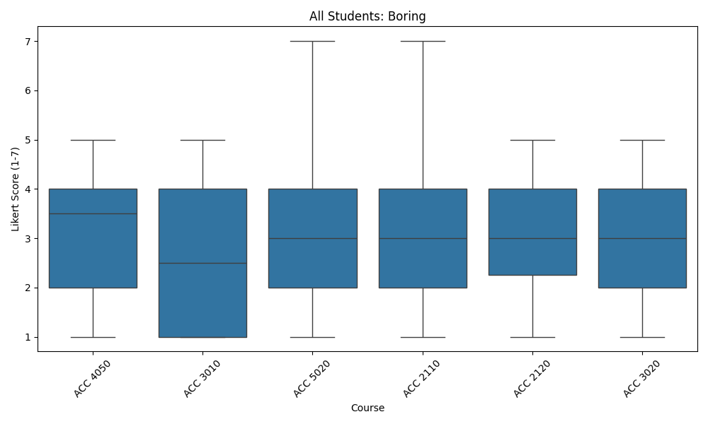
---
### Q15_12: Work alone
- **Question Text:** How strongly do each of these stereotypes lead you towards or away from a major / career in accounting? - Work alone
- **ANOVA:** F=1.9534, p=0.0848

**Descriptive Statistics:**
| Q2       |   mean |   std |   count |
|:---------|-------:|------:|--------:|
| ACC 2110 |   3.4  |  1.53 |     215 |
| ACC 2120 |   4.1  |  1.14 |      42 |
| ACC 3010 |   3.39 |  1.52 |      28 |
| ACC 3020 |   3.18 |  1.36 |      33 |
| ACC 4050 |   3.42 |  1.42 |      50 |
| ACC 5020 |   3.32 |  1.39 |      22 |

No significant difference across courses.

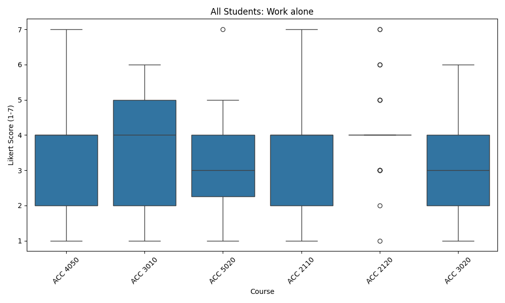
---
### Q18_1: Written communication
- **Question Text:** How useful do you think the following skills / traits are in accounting? - Written communication
- **ANOVA:** F=0.2346, p=0.9472

**Descriptive Statistics:**
| Q2       |   mean |   std |   count |
|:---------|-------:|------:|--------:|
| ACC 2110 |   5.97 |  1.2  |     214 |
| ACC 2120 |   6.05 |  0.9  |      43 |
| ACC 3010 |   6.04 |  0.92 |      28 |
| ACC 3020 |   6.09 |  0.88 |      33 |
| ACC 4050 |   6.12 |  1.41 |      50 |
| ACC 5020 |   6.14 |  1.36 |      22 |

No significant difference across courses.

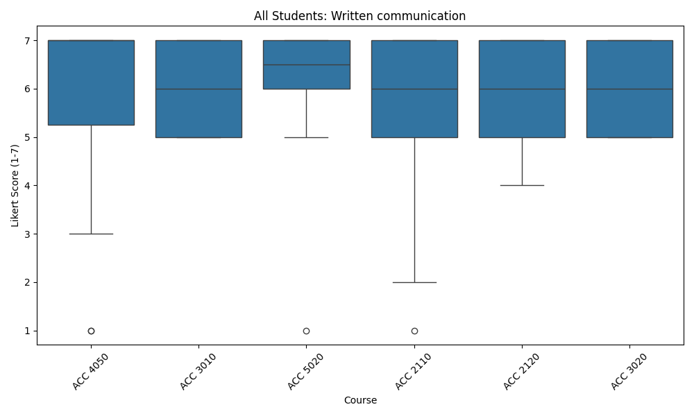
---
### Q18_2: Verbal communication
- **Question Text:** How useful do you think the following skills / traits are in accounting? - Verbal communication
- **ANOVA:** F=2.8760, p=0.0146

**Descriptive Statistics:**
| Q2       |   mean |   std |   count |
|:---------|-------:|------:|--------:|
| ACC 2110 |   5.77 |  1.35 |     214 |
| ACC 2120 |   6    |  0.83 |      42 |
| ACC 3010 |   6.36 |  0.78 |      28 |
| ACC 3020 |   6.24 |  0.9  |      33 |
| ACC 4050 |   6.26 |  1.35 |      50 |
| ACC 5020 |   6.32 |  1.36 |      22 |

**Significant Difference Detected (p < 0.05).**

**Tukey HSD Post-hoc Results:**
No pairwise differences were significant according to Tukey HSD.

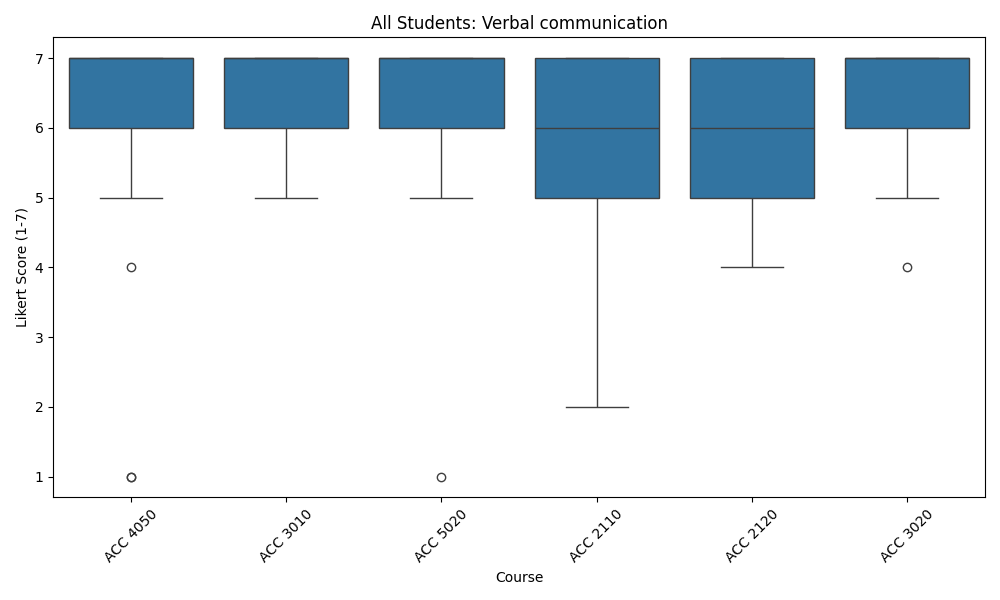
---
### Q18_3: Critical thinking
- **Question Text:** How useful do you think the following skills / traits are in accounting? - Critical thinking
- **ANOVA:** F=2.8456, p=0.0155

**Descriptive Statistics:**
| Q2       |   mean |   std |   count |
|:---------|-------:|------:|--------:|
| ACC 2110 |   6.23 |  1.15 |     214 |
| ACC 2120 |   6.28 |  0.88 |      43 |
| ACC 3010 |   6.68 |  0.61 |      28 |
| ACC 3020 |   6.58 |  0.66 |      33 |
| ACC 4050 |   6.48 |  1.28 |      50 |
| ACC 5020 |   6.91 |  0.29 |      22 |

**Significant Difference Detected (p < 0.05).**

**Tukey HSD Post-hoc Results:**
| group1   | group2   |   meandiff |   p-adj |   lower |   upper | reject   |
|:---------|:---------|-----------:|--------:|--------:|--------:|:---------|
| ACC 2110 | ACC 5020 |     0.6801 |  0.0459 |  0.0072 |  1.3531 | True     |

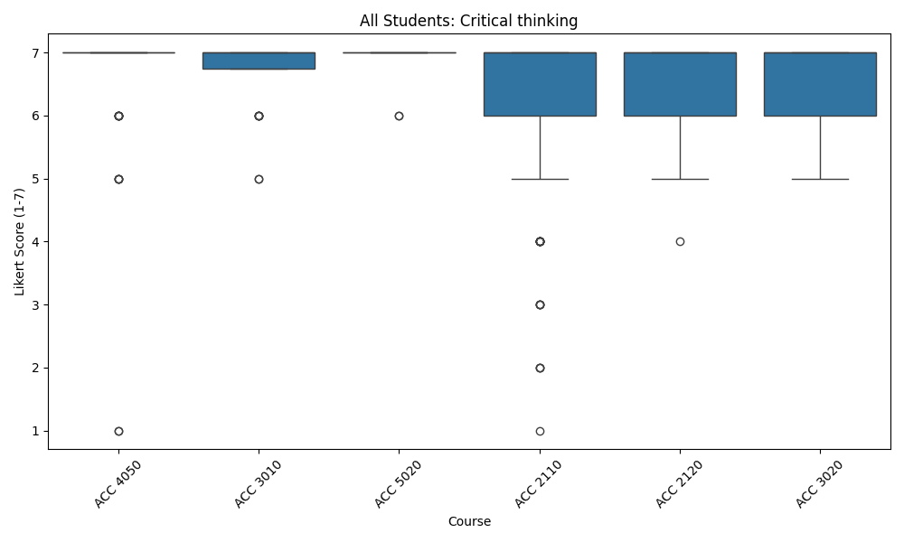
---
### Q18_4: Organization
- **Question Text:** How useful do you think the following skills / traits are in accounting? - Organization
- **ANOVA:** F=0.3217, p=0.8999

**Descriptive Statistics:**
| Q2       |   mean |   std |   count |
|:---------|-------:|------:|--------:|
| ACC 2110 |   6.45 |  0.96 |     214 |
| ACC 2120 |   6.63 |  0.66 |      43 |
| ACC 3010 |   6.57 |  0.74 |      28 |
| ACC 3020 |   6.48 |  0.71 |      33 |
| ACC 4050 |   6.42 |  1.26 |      50 |
| ACC 5020 |   6.5  |  1.34 |      22 |

No significant difference across courses.

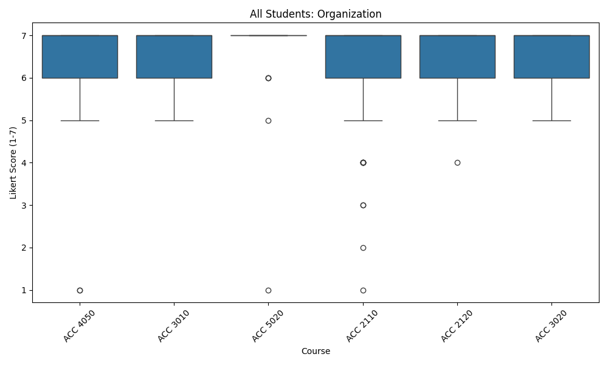
---
### Q18_5: Attention to detail
- **Question Text:** How useful do you think the following skills / traits are in accounting? - Attention to detail
- **ANOVA:** F=1.4956, p=0.1902

**Descriptive Statistics:**
| Q2       |   mean |   std |   count |
|:---------|-------:|------:|--------:|
| ACC 2110 |   6.49 |  0.93 |     214 |
| ACC 2120 |   6.72 |  0.63 |      43 |
| ACC 3010 |   6.75 |  0.59 |      28 |
| ACC 3020 |   6.48 |  0.83 |      33 |
| ACC 4050 |   6.54 |  1.23 |      50 |
| ACC 5020 |   6.91 |  0.29 |      22 |

No significant difference across courses.

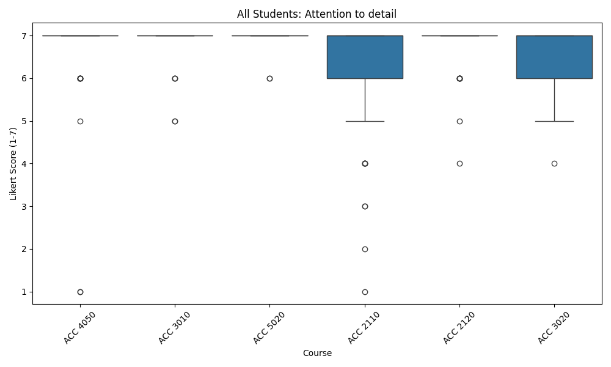
---
### Q18_6: Being good with numbers
- **Question Text:** How useful do you think the following skills / traits are in accounting? - Being good with numbers
- **ANOVA:** F=5.5897, p=0.0001

**Descriptive Statistics:**
| Q2       |   mean |   std |   count |
|:---------|-------:|------:|--------:|
| ACC 2110 |   6.28 |  1.01 |     214 |
| ACC 2120 |   5.84 |  1.15 |      43 |
| ACC 3010 |   5.93 |  0.98 |      28 |
| ACC 3020 |   5.52 |  1.18 |      33 |
| ACC 4050 |   5.62 |  1.48 |      50 |
| ACC 5020 |   5.68 |  1.04 |      22 |

**Significant Difference Detected (p < 0.05).**

**Tukey HSD Post-hoc Results:**
| group1   | group2   |   meandiff |   p-adj |   lower |   upper | reject   |
|:---------|:---------|-----------:|--------:|--------:|--------:|:---------|
| ACC 2110 | ACC 3020 |    -0.7605 |  0.0039 | -1.3565 | -0.1646 | True     |
| ACC 2110 | ACC 4050 |    -0.6557 |  0.0028 | -1.1562 | -0.1552 | True     |

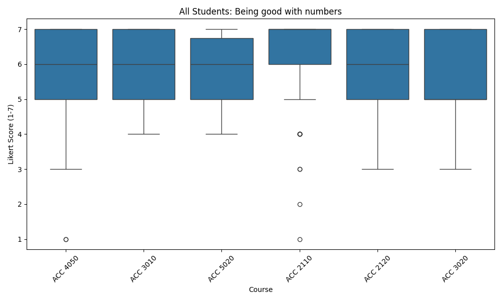
---
### Q18_7: Being a perfectionist
- **Question Text:** How useful do you think the following skills / traits are in accounting? - Being a perfectionist
- **ANOVA:** F=8.8578, p=0.0000

**Descriptive Statistics:**
| Q2       |   mean |   std |   count |
|:---------|-------:|------:|--------:|
| ACC 2110 |   5.11 |  1.34 |     214 |
| ACC 2120 |   4.74 |  1.36 |      43 |
| ACC 3010 |   4.61 |  1.47 |      28 |
| ACC 3020 |   4.18 |  1.26 |      33 |
| ACC 4050 |   4.26 |  1.23 |      50 |
| ACC 5020 |   3.68 |  0.95 |      22 |

**Significant Difference Detected (p < 0.05).**

**Tukey HSD Post-hoc Results:**
| group1   | group2   |   meandiff |   p-adj |   lower |   upper | reject   |
|:---------|:---------|-----------:|--------:|--------:|--------:|:---------|
| ACC 2110 | ACC 3020 |    -0.9303 |  0.0024 | -1.6334 | -0.2273 | True     |
| ACC 2110 | ACC 4050 |    -0.8521 |  0.0006 | -1.4426 | -0.2617 | True     |
| ACC 2110 | ACC 5020 |    -1.4303 |  0      | -2.272  | -0.5887 | True     |
| ACC 2120 | ACC 5020 |    -1.0624 |  0.0261 | -2.0477 | -0.077  | True     |

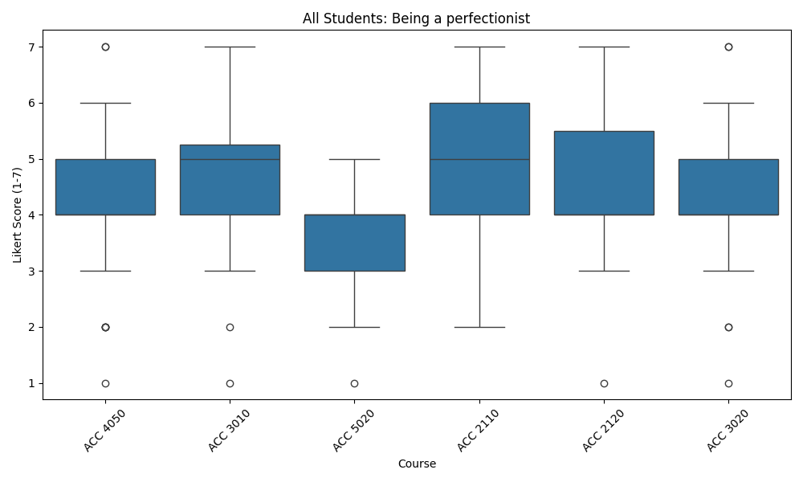
---
### Q18_8: Willing to learn new things
- **Question Text:** How useful do you think the following skills / traits are in accounting? - Willing to learn new things
- **ANOVA:** F=1.1341, p=0.3417

**Descriptive Statistics:**
| Q2       |   mean |   std |   count |
|:---------|-------:|------:|--------:|
| ACC 2110 |   5.96 |  1.15 |     214 |
| ACC 2120 |   5.98 |  1.03 |      43 |
| ACC 3010 |   6.39 |  0.99 |      28 |
| ACC 3020 |   6.15 |  1.12 |      33 |
| ACC 4050 |   6.02 |  1.35 |      50 |
| ACC 5020 |   6.36 |  1.33 |      22 |

No significant difference across courses.

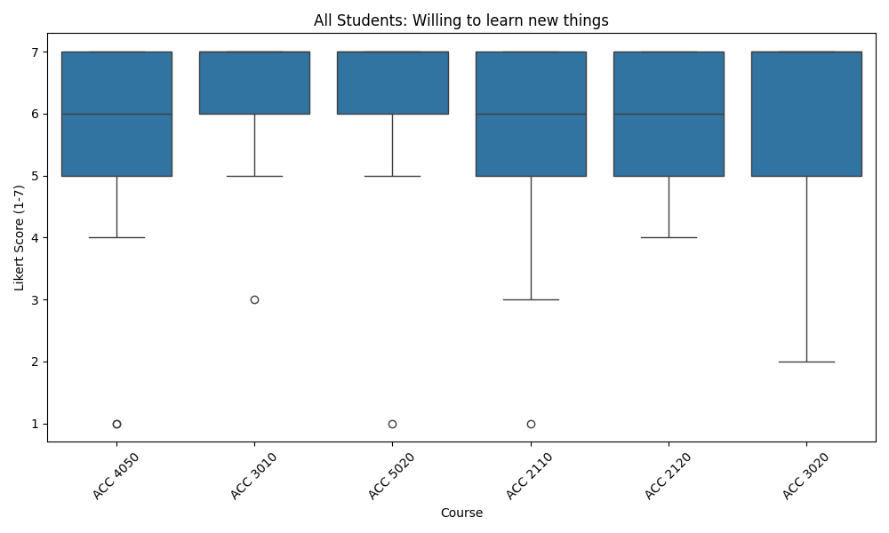
---
### Q18_9: Honest / ethical conduct
- **Question Text:** How useful do you think the following skills / traits are in accounting? - Honest / ethical conduct
- **ANOVA:** F=2.4629, p=0.0326

**Descriptive Statistics:**
| Q2       |   mean |   std |   count |
|:---------|-------:|------:|--------:|
| ACC 2110 |   6.28 |  1.11 |     214 |
| ACC 2120 |   6.47 |  0.85 |      43 |
| ACC 3010 |   6.86 |  0.45 |      28 |
| ACC 3020 |   6.36 |  1.03 |      33 |
| ACC 4050 |   6.46 |  1.25 |      50 |
| ACC 5020 |   6.82 |  0.66 |      22 |

**Significant Difference Detected (p < 0.05).**

**Tukey HSD Post-hoc Results:**
No pairwise differences were significant according to Tukey HSD.

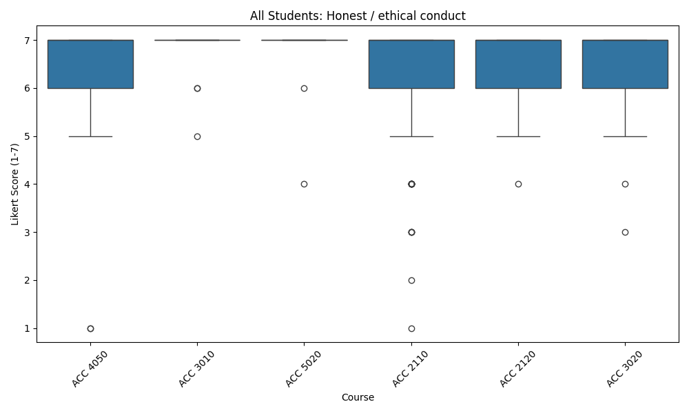
---
### Q17: How significantly do you think Artificial Intellig...
- **Question Text:** How significantly do you think Artificial Intelligence (AI) will change the type of work performed by accountants in the future?
- **ANOVA:** F=1.7309, p=0.1265

**Descriptive Statistics:**
| Q2       |   mean |   std |   count |
|:---------|-------:|------:|--------:|
| ACC 2110 |   5.51 |  1.35 |     214 |
| ACC 2120 |   5.21 |  1.21 |      43 |
| ACC 3010 |   5.57 |  1.17 |      28 |
| ACC 3020 |   5.61 |  1.3  |      33 |
| ACC 4050 |   5.28 |  1.18 |      50 |
| ACC 5020 |   4.82 |  1.3  |      22 |

No significant difference across courses.

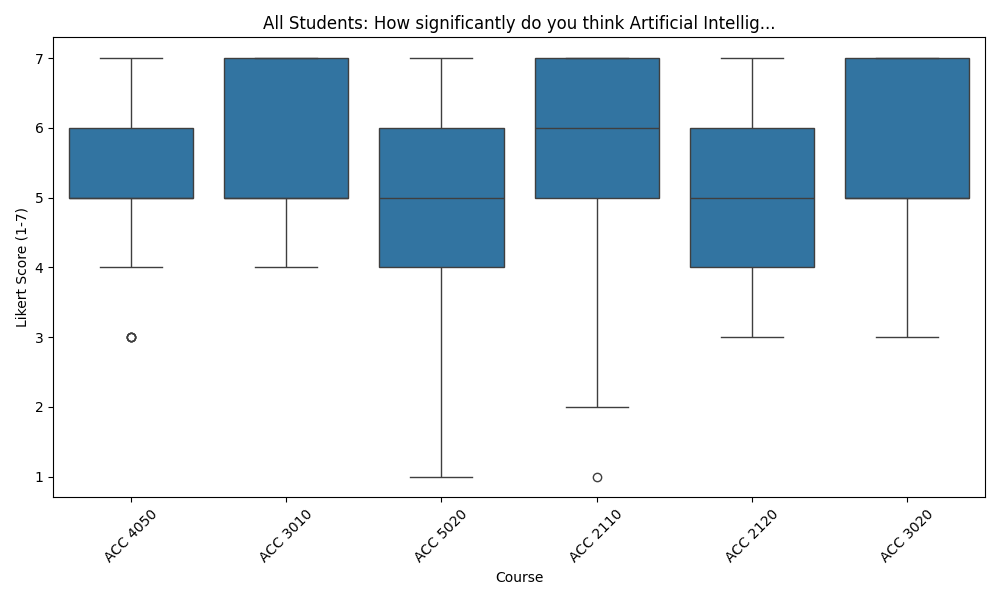
---
### Q22: To what degree do you feel that your job in accoun...
- **Question Text:** To what degree do you feel that your job in accounting has influenced how you view the accounting profession?
- **ANOVA:** F=1.7230, p=0.1374

**Descriptive Statistics:**
| Q2       |   mean |   std |   count |
|:---------|-------:|------:|--------:|
| ACC 2110 |   5.67 |  1.4  |      15 |
| ACC 2120 |   6.33 |  0.87 |       9 |
| ACC 3010 |   5    |  1.1  |      11 |
| ACC 3020 |   5.53 |  1.22 |      19 |
| ACC 4050 |   6    |  1.1  |      24 |
| ACC 5020 |   5.56 |  1.25 |      18 |

No significant difference across courses.

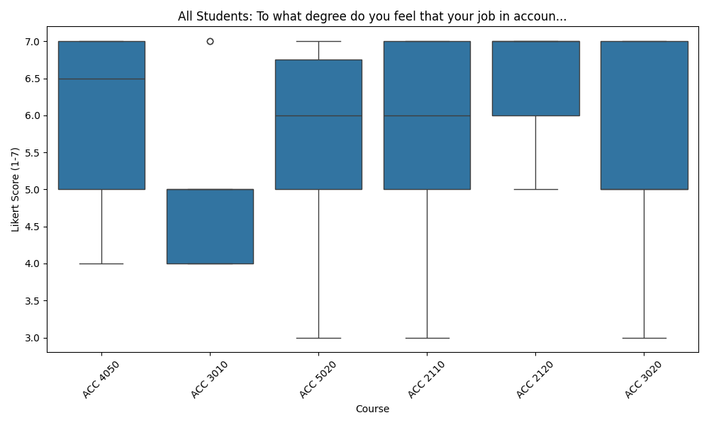
---
### Q23: How beneficial do you think having a Master of Acc...
- **Question Text:** How beneficial do you think having a Master of Accountancy degree would be on a person's ability to get a job in accounting?
- **ANOVA:** F=12.3337, p=0.0000

**Descriptive Statistics:**
| Q2       |   mean |   std |   count |
|:---------|-------:|------:|--------:|
| ACC 2110 |   5.83 |  1.32 |     214 |
| ACC 2120 |   5.63 |  1.4  |      43 |
| ACC 3010 |   5.61 |  1.17 |      28 |
| ACC 3020 |   4.79 |  1.24 |      33 |
| ACC 4050 |   4.33 |  1.61 |      49 |
| ACC 5020 |   4.91 |  1.57 |      22 |

**Significant Difference Detected (p < 0.05).**

**Tukey HSD Post-hoc Results:**
| group1   | group2   |   meandiff |   p-adj |   lower |   upper | reject   |
|:---------|:---------|-----------:|--------:|--------:|--------:|:---------|
| ACC 2110 | ACC 3020 |    -1.0392 |  0.0008 | -1.7713 | -0.3071 | True     |
| ACC 2110 | ACC 4050 |    -1.5006 |  0      | -2.1205 | -0.8806 | True     |
| ACC 2110 | ACC 5020 |    -0.918  |  0.034  | -1.7945 | -0.0416 | True     |
| ACC 2120 | ACC 4050 |    -1.3014 |  0.0001 | -2.1194 | -0.4834 | True     |
| ACC 3010 | ACC 4050 |    -1.2806 |  0.0013 | -2.208  | -0.3532 | True     |

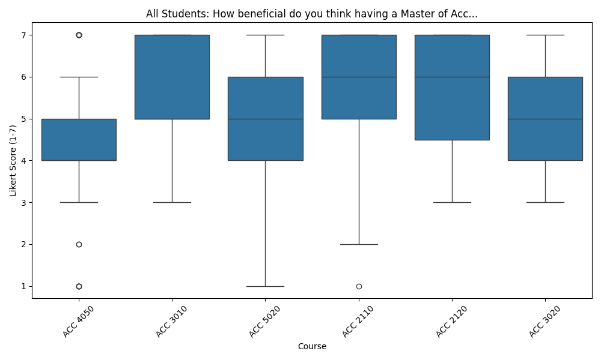
---
### Q24: How beneficial do you think having an accounting c...
- **Question Text:** How beneficial do you think having an accounting certification or license (Certified Public Accountant, Enrolled Agent, etc.) would be on a person's ability to get a job in accounting?
- **ANOVA:** F=2.2412, p=0.0497

**Descriptive Statistics:**
| Q2       |   mean |   std |   count |
|:---------|-------:|------:|--------:|
| ACC 2110 |   5.93 |  1.3  |     214 |
| ACC 2120 |   5.95 |  1.13 |      43 |
| ACC 3010 |   6.46 |  0.84 |      28 |
| ACC 3020 |   6.06 |  1.09 |      33 |
| ACC 4050 |   6.45 |  0.82 |      49 |
| ACC 5020 |   5.95 |  1.46 |      22 |

**Significant Difference Detected (p < 0.05).**

**Tukey HSD Post-hoc Results:**
No pairwise differences were significant according to Tukey HSD.

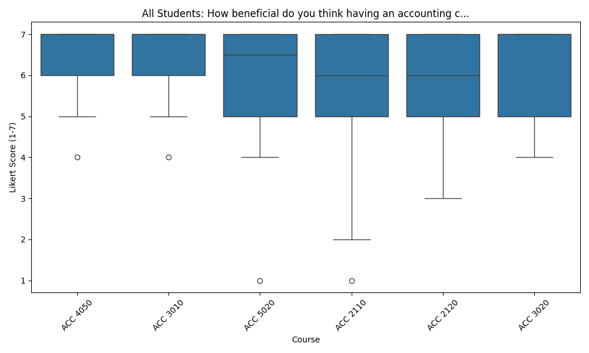
---
### Q32: How strongly do you believe that you want to pursu...
- **Question Text:** How strongly do you believe that you want to pursue that area of accounting?
- **ANOVA:** F=3.1305, p=0.0110

**Descriptive Statistics:**
| Q2       |   mean |   std |   count |
|:---------|-------:|------:|--------:|
| ACC 2110 |   4.75 |  0.71 |       8 |
| ACC 2120 |   5.27 |  0.8  |      15 |
| ACC 3010 |   5.16 |  1.46 |      19 |
| ACC 3020 |   6    |  0.77 |      21 |
| ACC 4050 |   5.79 |  1.07 |      38 |
| ACC 5020 |   5.84 |  1.01 |      19 |

**Significant Difference Detected (p < 0.05).**

**Tukey HSD Post-hoc Results:**
No pairwise differences were significant according to Tukey HSD.

---
### Q31: To what degree do you like accounting principles a...
- **Question Text:** To what degree do you like accounting principles and rules?
- **ANOVA:** F=9.2583, p=0.0000

**Descriptive Statistics:**
| Q2       |   mean |   std |   count |
|:---------|-------:|------:|--------:|
| ACC 2110 |   4.85 |  1.21 |     214 |
| ACC 2120 |   5.63 |  1.23 |      43 |
| ACC 3010 |   5.68 |  1.06 |      28 |
| ACC 3020 |   5.42 |  1.12 |      33 |
| ACC 4050 |   5.63 |  1.01 |      49 |
| ACC 5020 |   5.86 |  0.77 |      22 |

**Significant Difference Detected (p < 0.05).**

**Tukey HSD Post-hoc Results:**
| group1   | group2   |   meandiff |   p-adj |   lower |   upper | reject   |
|:---------|:---------|-----------:|--------:|--------:|--------:|:---------|
| ACC 2110 | ACC 2120 |     0.7821 |  0.0009 |  0.2297 |  1.3345 | True     |
| ACC 2110 | ACC 3010 |     0.8328 |  0.005  |  0.1685 |  1.4971 | True     |
| ACC 2110 | ACC 4050 |     0.7869 |  0.0003 |  0.2634 |  1.3103 | True     |
| ACC 2110 | ACC 5020 |     1.0178 |  0.0014 |  0.2778 |  1.7579 | True     |

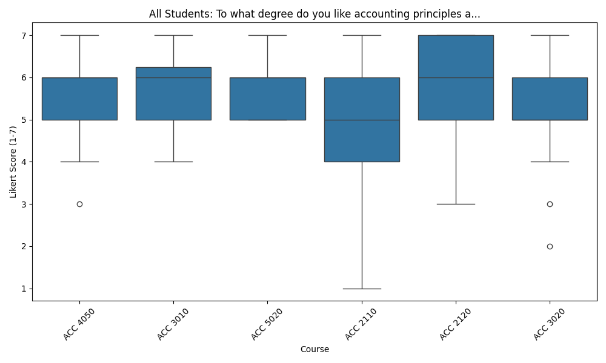
---
## Analysis Segment: Accounting Majors
**Number of observations:** 181
**Courses included:** ACC 4050, ACC 3010, ACC 5020, ACC 2110, ACC 2120, ACC 3020
### Q12_1: Never talk to people
- **Question Text:** How strongly do you believe each of these stereotypes about accounting / accountants? - Never talk to people
- **ANOVA:** F=0.7594, p=0.5803

**Descriptive Statistics:**
| Q2       |   mean |   std |   count |
|:---------|-------:|------:|--------:|
| ACC 2110 |   2.41 |  1.71 |      22 |
| ACC 2120 |   2.53 |  1.22 |      32 |
| ACC 3010 |   2.2  |  1.38 |      25 |
| ACC 3020 |   2.3  |  1.38 |      33 |
| ACC 4050 |   2.49 |  1.54 |      49 |
| ACC 5020 |   1.84 |  1.07 |      19 |

No significant difference across courses.

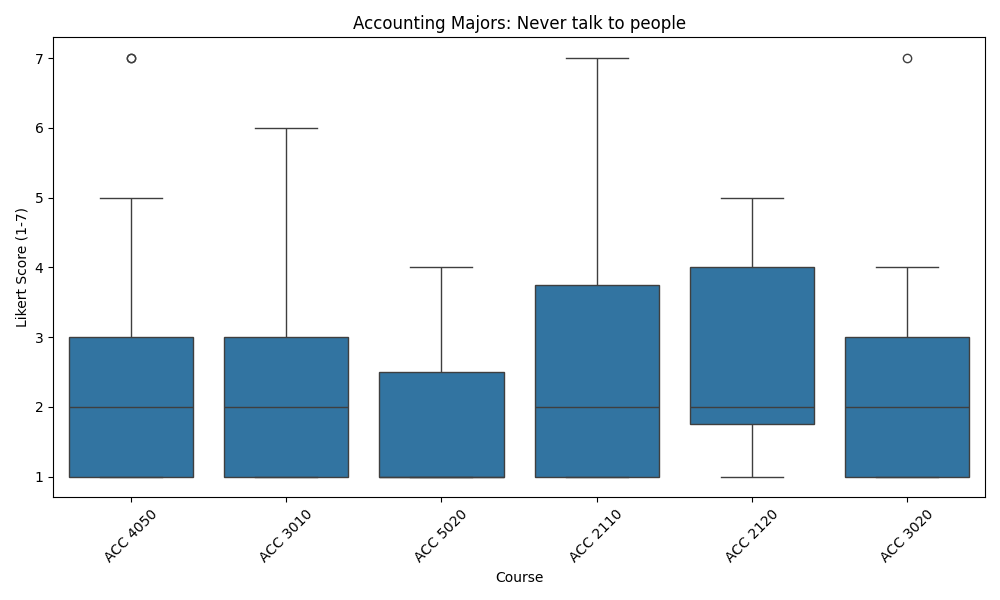
---
### Q12_2: Introverts
- **Question Text:** How strongly do you believe each of these stereotypes about accounting / accountants? - Introverts
- **ANOVA:** F=1.5808, p=0.1678

**Descriptive Statistics:**
| Q2       |   mean |   std |   count |
|:---------|-------:|------:|--------:|
| ACC 2110 |   3.36 |  1.43 |      22 |
| ACC 2120 |   3.31 |  1.35 |      32 |
| ACC 3010 |   3.52 |  1.5  |      25 |
| ACC 3020 |   3.55 |  1.48 |      33 |
| ACC 4050 |   4.14 |  1.73 |      49 |
| ACC 5020 |   3.53 |  1.43 |      19 |

No significant difference across courses.

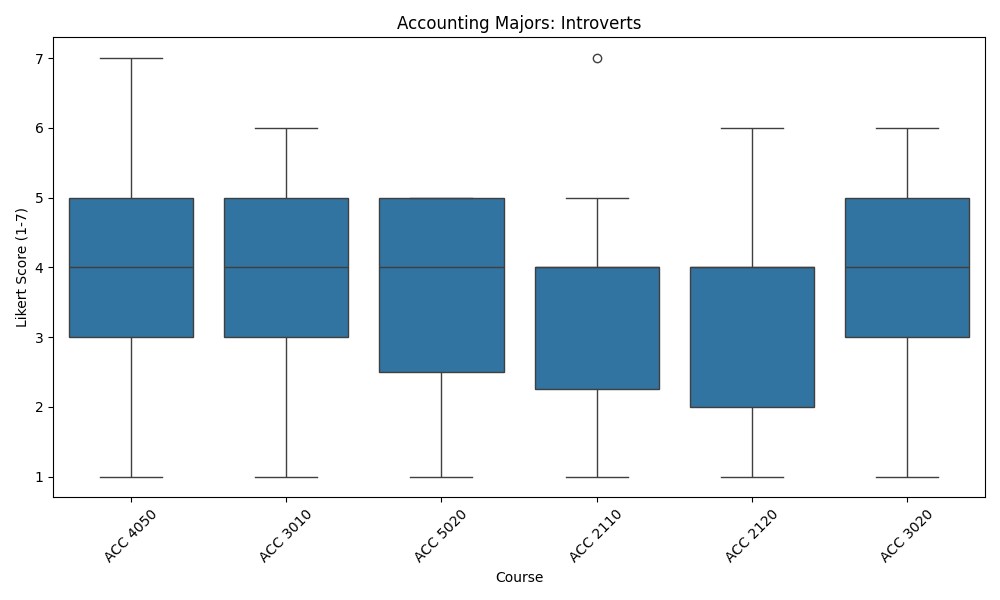
---
### Q12_3: Work in a cubicle
- **Question Text:** How strongly do you believe each of these stereotypes about accounting / accountants? - Work in a cubicle
- **ANOVA:** F=1.8548, p=0.1047

**Descriptive Statistics:**
| Q2       |   mean |   std |   count |
|:---------|-------:|------:|--------:|
| ACC 2110 |   4.64 |  1    |      22 |
| ACC 2120 |   4.59 |  1.16 |      32 |
| ACC 3010 |   4.24 |  1.39 |      25 |
| ACC 3020 |   4.24 |  1.39 |      33 |
| ACC 4050 |   3.9  |  1.54 |      49 |
| ACC 5020 |   3.79 |  1.32 |      19 |

No significant difference across courses.

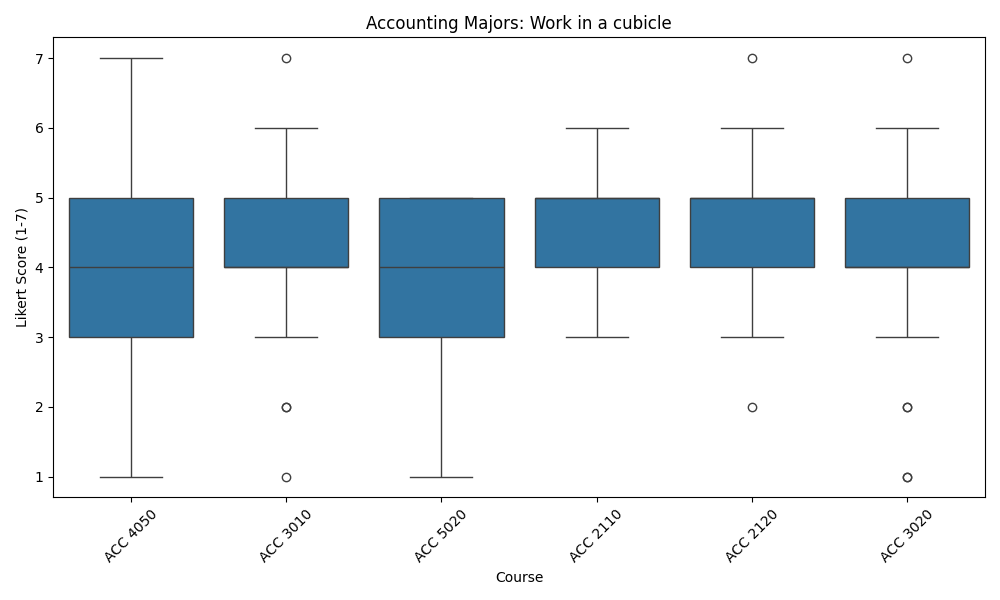
---
### Q12_4: Long work hours
- **Question Text:** How strongly do you believe each of these stereotypes about accounting / accountants? - Long work hours
- **ANOVA:** F=3.0238, p=0.0121

**Descriptive Statistics:**
| Q2       |   mean |   std |   count |
|:---------|-------:|------:|--------:|
| ACC 2110 |   5    |  0.98 |      22 |
| ACC 2120 |   4.84 |  1.39 |      32 |
| ACC 3010 |   5.76 |  1.27 |      25 |
| ACC 3020 |   5.76 |  0.9  |      33 |
| ACC 4050 |   5.45 |  1.31 |      49 |
| ACC 5020 |   5.68 |  1.34 |      19 |

**Significant Difference Detected (p < 0.05).**

**Tukey HSD Post-hoc Results:**
| group1   | group2   |   meandiff |   p-adj |   lower |   upper | reject   |
|:---------|:---------|-----------:|--------:|--------:|--------:|:---------|
| ACC 2120 | ACC 3020 |     0.9138 |  0.0341 |  0.0414 |  1.7862 | True     |

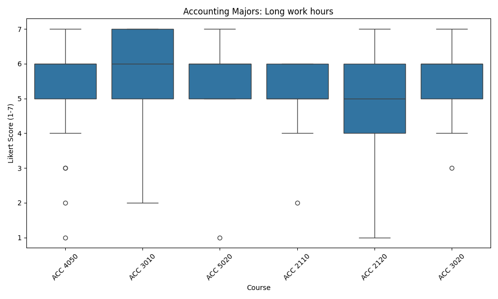
---
### Q12_5: Only tax and audit careers
- **Question Text:** How strongly do you believe each of these stereotypes about accounting / accountants? - Only tax and audit careers
- **ANOVA:** F=0.2188, p=0.9541

**Descriptive Statistics:**
| Q2       |   mean |   std |   count |
|:---------|-------:|------:|--------:|
| ACC 2110 |   2.86 |  1.08 |      22 |
| ACC 2120 |   2.81 |  1.55 |      32 |
| ACC 3010 |   2.92 |  1.53 |      25 |
| ACC 3020 |   3.03 |  1.88 |      33 |
| ACC 4050 |   2.69 |  1.7  |      49 |
| ACC 5020 |   2.68 |  1.67 |      19 |

No significant difference across courses.

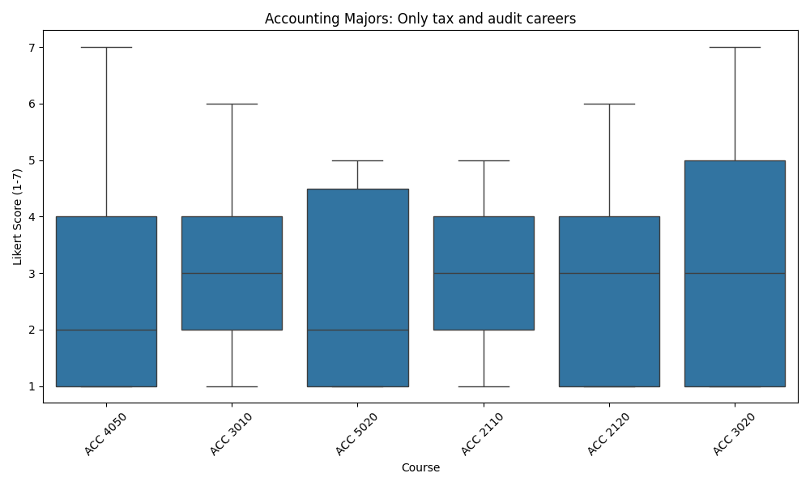
---
### Q12_6: Always do taxes
- **Question Text:** How strongly do you believe each of these stereotypes about accounting / accountants? - Always do taxes
- **ANOVA:** F=2.2619, p=0.0504

**Descriptive Statistics:**
| Q2       |   mean |   std |   count |
|:---------|-------:|------:|--------:|
| ACC 2110 |   2.59 |  1.37 |      22 |
| ACC 2120 |   2.56 |  1.39 |      32 |
| ACC 3010 |   2.6  |  1.58 |      25 |
| ACC 3020 |   2.24 |  1.32 |      33 |
| ACC 4050 |   2.08 |  1.29 |      49 |
| ACC 5020 |   1.53 |  0.84 |      19 |

No significant difference across courses.

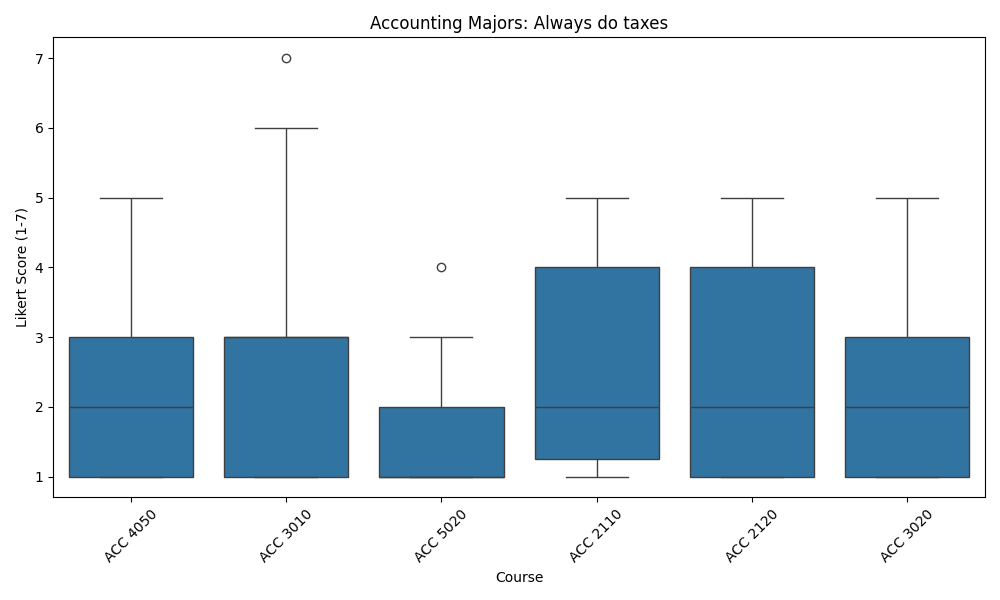
---
### Q12_7: Reliable
- **Question Text:** How strongly do you believe each of these stereotypes about accounting / accountants? - Reliable
- **ANOVA:** F=1.1058, p=0.3591

**Descriptive Statistics:**
| Q2       |   mean |   std |   count |
|:---------|-------:|------:|--------:|
| ACC 2110 |   5.36 |  1.14 |      22 |
| ACC 2120 |   5.34 |  1.12 |      32 |
| ACC 3010 |   5.88 |  0.93 |      25 |
| ACC 3020 |   5.3  |  1.1  |      33 |
| ACC 4050 |   5.59 |  1.17 |      49 |
| ACC 5020 |   5.32 |  1.29 |      19 |

No significant difference across courses.

---
### Q12_8: Detail oriented
- **Question Text:** How strongly do you believe each of these stereotypes about accounting / accountants? - Detail oriented
- **ANOVA:** F=0.4692, p=0.7989

**Descriptive Statistics:**
| Q2       |   mean |   std |   count |
|:---------|-------:|------:|--------:|
| ACC 2110 |   5.73 |  0.98 |      22 |
| ACC 2120 |   5.81 |  0.97 |      32 |
| ACC 3010 |   5.96 |  0.98 |      25 |
| ACC 3020 |   5.58 |  1.03 |      33 |
| ACC 4050 |   5.84 |  1.07 |      49 |
| ACC 5020 |   5.68 |  1.34 |      19 |

No significant difference across courses.

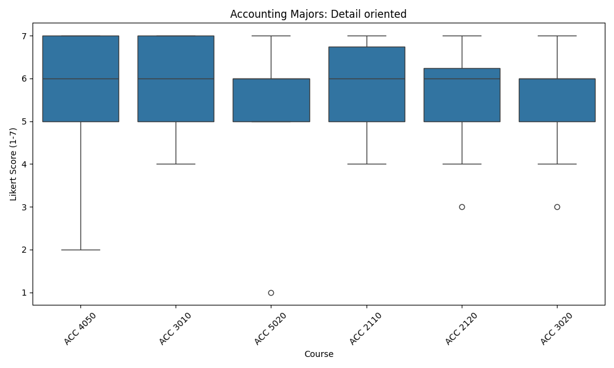
---
### Q12_9: Follow rules
- **Question Text:** How strongly do you believe each of these stereotypes about accounting / accountants? - Follow rules
- **ANOVA:** F=0.5126, p=0.7665

**Descriptive Statistics:**
| Q2       |   mean |   std |   count |
|:---------|-------:|------:|--------:|
| ACC 2110 |   5.5  |  1.19 |      22 |
| ACC 2120 |   5.69 |  1.15 |      32 |
| ACC 3010 |   5.96 |  0.89 |      25 |
| ACC 3020 |   5.67 |  1.11 |      33 |
| ACC 4050 |   5.71 |  1.06 |      49 |
| ACC 5020 |   5.53 |  1.35 |      19 |

No significant difference across courses.

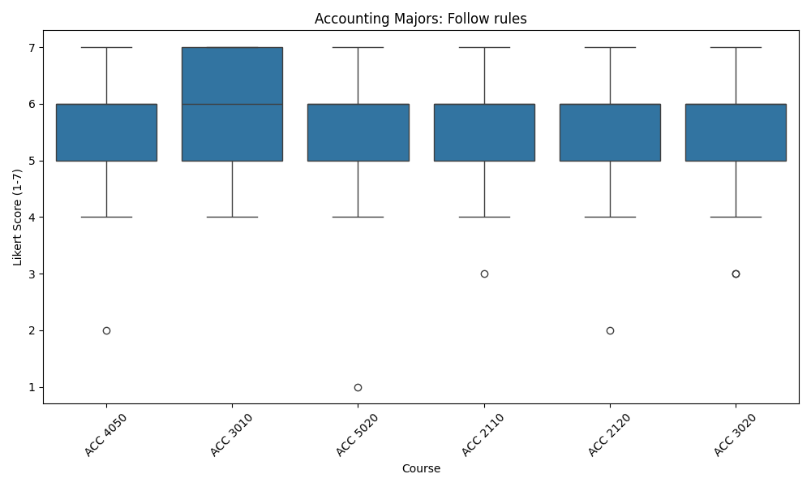
---
### Q12_10: Willing to break the law
- **Question Text:** How strongly do you believe each of these stereotypes about accounting / accountants? - Willing to break the law
- **ANOVA:** F=0.2503, p=0.9392

**Descriptive Statistics:**
| Q2       |   mean |   std |   count |
|:---------|-------:|------:|--------:|
| ACC 2110 |   2.32 |  1.25 |      22 |
| ACC 2120 |   2.12 |  1.41 |      32 |
| ACC 3010 |   2.16 |  1.11 |      25 |
| ACC 3020 |   2.39 |  1.5  |      33 |
| ACC 4050 |   2.12 |  1.09 |      49 |
| ACC 5020 |   2.26 |  1.45 |      19 |

No significant difference across courses.

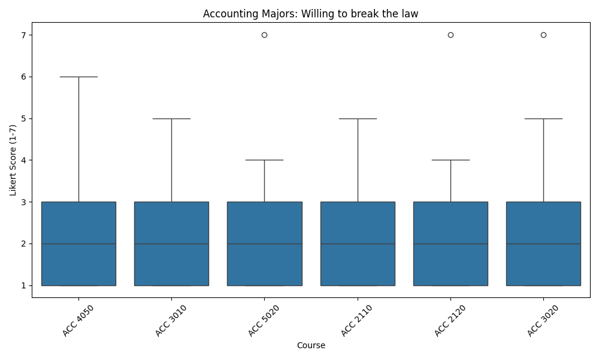
---
### Q12_11: Boring
- **Question Text:** How strongly do you believe each of these stereotypes about accounting / accountants? - Boring
- **ANOVA:** F=0.6689, p=0.6476

**Descriptive Statistics:**
| Q2       |   mean |   std |   count |
|:---------|-------:|------:|--------:|
| ACC 2110 |   3.41 |  1.37 |      22 |
| ACC 2120 |   3.34 |  1.33 |      32 |
| ACC 3010 |   3.24 |  1.51 |      25 |
| ACC 3020 |   3.79 |  1.34 |      33 |
| ACC 4050 |   3.51 |  1.54 |      49 |
| ACC 5020 |   3.16 |  1.61 |      19 |

No significant difference across courses.

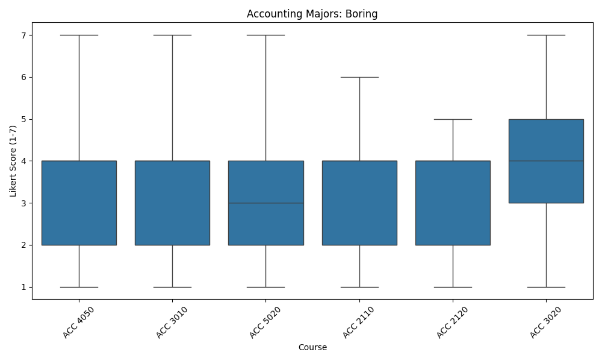
---
### Q12_12: Work alone
- **Question Text:** How strongly do you believe each of these stereotypes about accounting / accountants? - Work alone
- **ANOVA:** F=2.1809, p=0.0584

**Descriptive Statistics:**
| Q2       |   mean |   std |   count |
|:---------|-------:|------:|--------:|
| ACC 2110 |   3.77 |  1.38 |      22 |
| ACC 2120 |   3.81 |  1.26 |      32 |
| ACC 3010 |   3.2  |  1.63 |      25 |
| ACC 3020 |   3.39 |  1.34 |      33 |
| ACC 4050 |   3.35 |  1.59 |      49 |
| ACC 5020 |   2.53 |  1.71 |      19 |

No significant difference across courses.

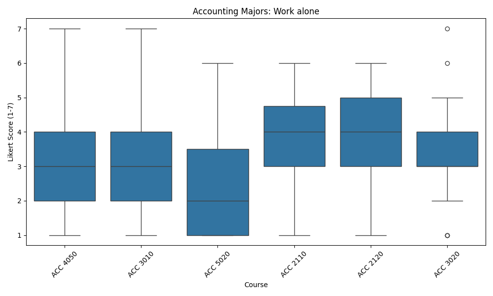
---
### Q15_1: Never talk to people
- **Question Text:** How strongly do each of these stereotypes lead you towards or away from a major / career in accounting? - Never talk to people
- **ANOVA:** F=1.7214, p=0.1320

**Descriptive Statistics:**
| Q2       |   mean |   std |   count |
|:---------|-------:|------:|--------:|
| ACC 2110 |   3.91 |  1.51 |      22 |
| ACC 2120 |   4.16 |  0.85 |      32 |
| ACC 3010 |   3.24 |  1.59 |      25 |
| ACC 3020 |   3.33 |  1.63 |      33 |
| ACC 4050 |   3.74 |  1.35 |      50 |
| ACC 5020 |   3.68 |  1.63 |      19 |

No significant difference across courses.

---
### Q15_2: Introverts
- **Question Text:** How strongly do each of these stereotypes lead you towards or away from a major / career in accounting? - Introverts
- **ANOVA:** F=2.2024, p=0.0561

**Descriptive Statistics:**
| Q2       |   mean |   std |   count |
|:---------|-------:|------:|--------:|
| ACC 2110 |   3.86 |  1.28 |      22 |
| ACC 2120 |   4.34 |  1.04 |      32 |
| ACC 3010 |   3.48 |  1.61 |      25 |
| ACC 3020 |   3.52 |  1.48 |      33 |
| ACC 4050 |   4.2  |  1.46 |      50 |
| ACC 5020 |   3.58 |  1.61 |      19 |

No significant difference across courses.

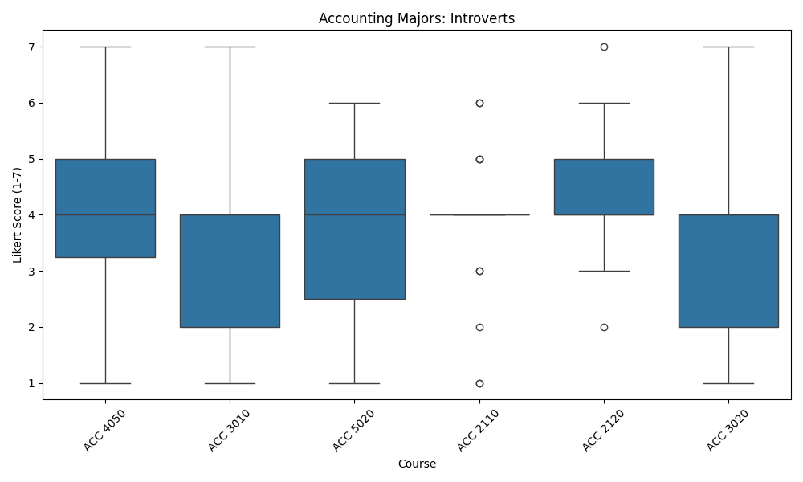
---
### Q15_3: Work in a cubicle
- **Question Text:** How strongly do each of these stereotypes lead you towards or away from a major / career in accounting? - Work in a cubicle
- **ANOVA:** F=2.2992, p=0.0470

**Descriptive Statistics:**
| Q2       |   mean |   std |   count |
|:---------|-------:|------:|--------:|
| ACC 2110 |   3.59 |  1.47 |      22 |
| ACC 2120 |   3.88 |  1.18 |      32 |
| ACC 3010 |   3.08 |  1.19 |      25 |
| ACC 3020 |   3.03 |  1.49 |      33 |
| ACC 4050 |   3.46 |  1.39 |      50 |
| ACC 5020 |   2.84 |  1.26 |      19 |

**Significant Difference Detected (p < 0.05).**

**Tukey HSD Post-hoc Results:**
No pairwise differences were significant according to Tukey HSD.

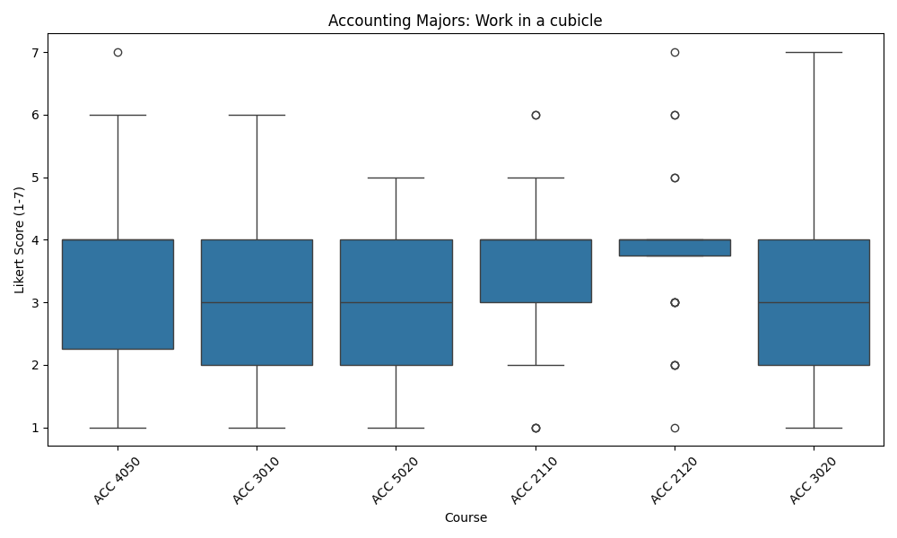
---
### Q15_4: Long work hours
- **Question Text:** How strongly do each of these stereotypes lead you towards or away from a major / career in accounting? - Long work hours
- **ANOVA:** F=1.6127, p=0.1590

**Descriptive Statistics:**
| Q2       |   mean |   std |   count |
|:---------|-------:|------:|--------:|
| ACC 2110 |   3.27 |  0.83 |      22 |
| ACC 2120 |   3.09 |  1.17 |      32 |
| ACC 3010 |   2.88 |  1.3  |      25 |
| ACC 3020 |   2.61 |  1.25 |      33 |
| ACC 4050 |   3.02 |  1.29 |      50 |
| ACC 5020 |   3.53 |  1.58 |      19 |

No significant difference across courses.

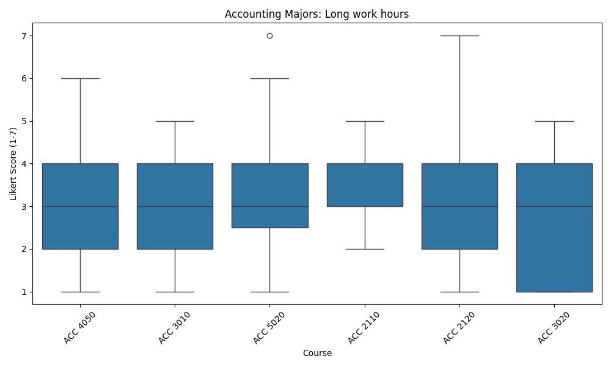
---
### Q15_5: Only tax and audit careers
- **Question Text:** How strongly do each of these stereotypes lead you towards or away from a major / career in accounting? - Only tax and audit careers
- **ANOVA:** F=0.4781, p=0.7923

**Descriptive Statistics:**
| Q2       |   mean |   std |   count |
|:---------|-------:|------:|--------:|
| ACC 2110 |   3.55 |  0.91 |      22 |
| ACC 2120 |   3.69 |  1.2  |      32 |
| ACC 3010 |   3.32 |  1.28 |      25 |
| ACC 3020 |   3.39 |  0.86 |      33 |
| ACC 4050 |   3.34 |  1.3  |      50 |
| ACC 5020 |   3.53 |  1.26 |      19 |

No significant difference across courses.

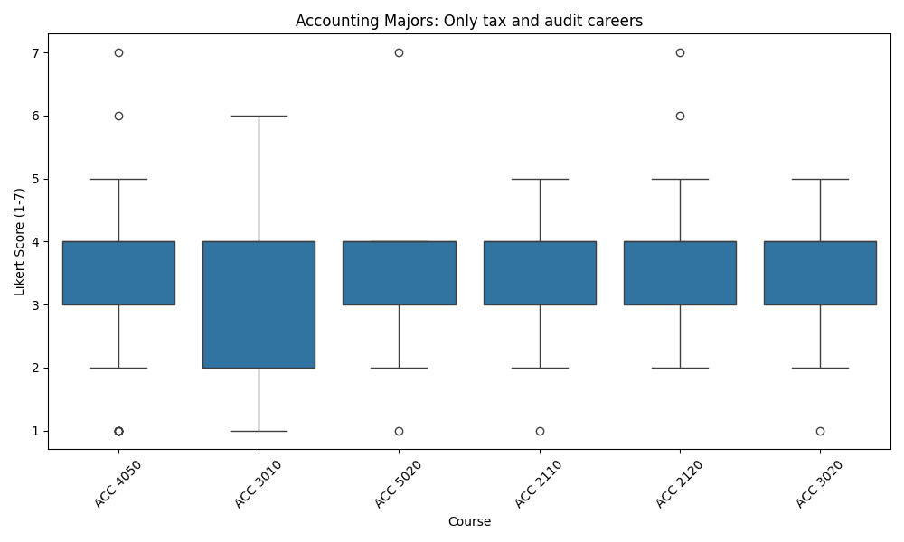
---
### Q15_6: Always do taxes
- **Question Text:** How strongly do each of these stereotypes lead you towards or away from a major / career in accounting? - Always do taxes
- **ANOVA:** F=0.5443, p=0.7425

**Descriptive Statistics:**
| Q2       |   mean |   std |   count |
|:---------|-------:|------:|--------:|
| ACC 2110 |   3.27 |  1.2  |      22 |
| ACC 2120 |   3.69 |  1.18 |      32 |
| ACC 3010 |   3.2  |  1.35 |      25 |
| ACC 3020 |   3.33 |  1.05 |      33 |
| ACC 4050 |   3.38 |  1.37 |      50 |
| ACC 5020 |   3.26 |  1.48 |      19 |

No significant difference across courses.

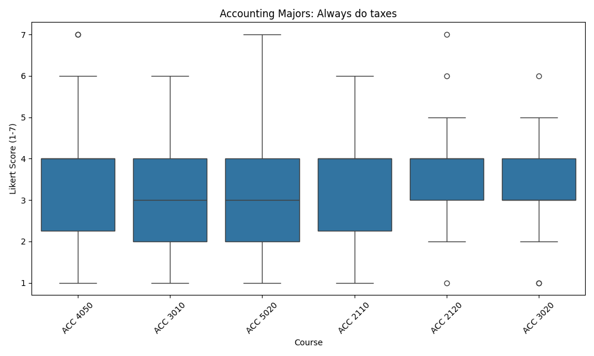
---
### Q15_7: Reliable
- **Question Text:** How strongly do each of these stereotypes lead you towards or away from a major / career in accounting? - Reliable
- **ANOVA:** F=0.5699, p=0.7230

**Descriptive Statistics:**
| Q2       |   mean |   std |   count |
|:---------|-------:|------:|--------:|
| ACC 2110 |   5.77 |  0.92 |      22 |
| ACC 2120 |   5.62 |  0.94 |      32 |
| ACC 3010 |   5.92 |  1.08 |      25 |
| ACC 3020 |   5.52 |  1.12 |      33 |
| ACC 4050 |   5.74 |  1.03 |      50 |
| ACC 5020 |   5.47 |  1.78 |      19 |

No significant difference across courses.

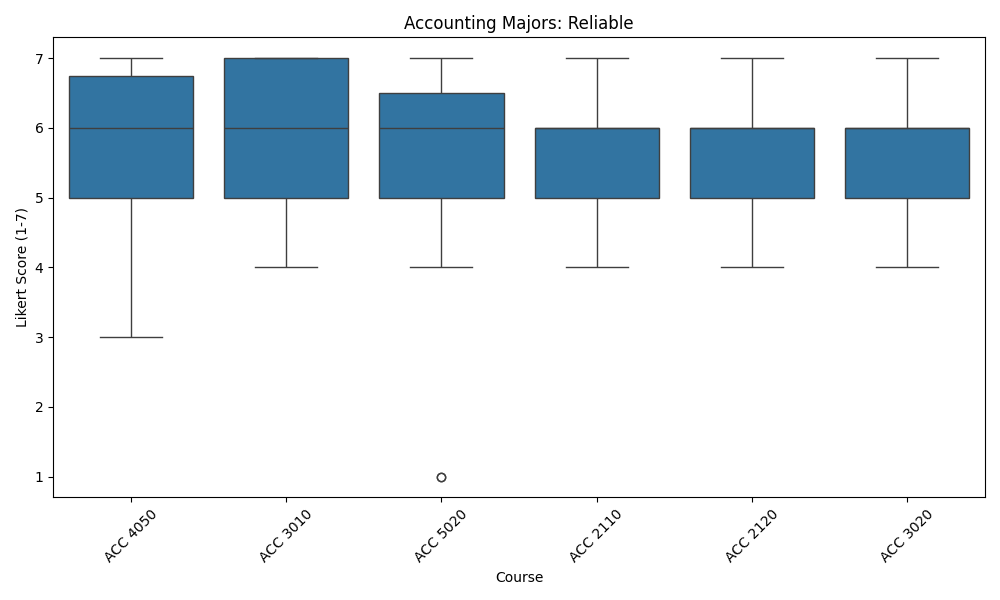
---
### Q15_8: Detail oriented
- **Question Text:** How strongly do each of these stereotypes lead you towards or away from a major / career in accounting? - Detail oriented
- **ANOVA:** F=0.9967, p=0.4213

**Descriptive Statistics:**
| Q2       |   mean |   std |   count |
|:---------|-------:|------:|--------:|
| ACC 2110 |   6    |  0.87 |      22 |
| ACC 2120 |   5.59 |  1.1  |      32 |
| ACC 3010 |   6.08 |  0.95 |      25 |
| ACC 3020 |   5.55 |  1.18 |      33 |
| ACC 4050 |   5.68 |  1.08 |      50 |
| ACC 5020 |   5.63 |  1.8  |      19 |

No significant difference across courses.

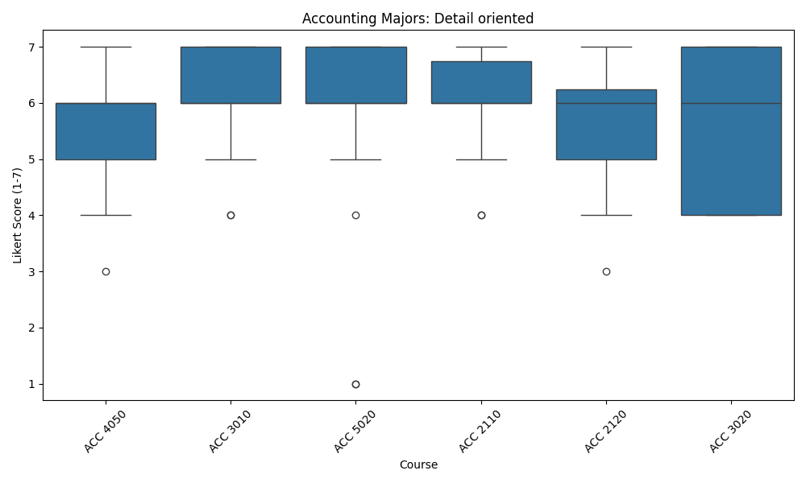
---
### Q15_9: Follow rules
- **Question Text:** How strongly do each of these stereotypes lead you towards or away from a major / career in accounting? - Follow rules
- **ANOVA:** F=0.6523, p=0.6601

**Descriptive Statistics:**
| Q2       |   mean |   std |   count |
|:---------|-------:|------:|--------:|
| ACC 2110 |   5.82 |  1.05 |      22 |
| ACC 2120 |   5.53 |  1.14 |      32 |
| ACC 3010 |   5.52 |  1.19 |      25 |
| ACC 3020 |   5.33 |  1.08 |      33 |
| ACC 4050 |   5.5  |  1.18 |      50 |
| ACC 5020 |   5.21 |  1.69 |      19 |

No significant difference across courses.

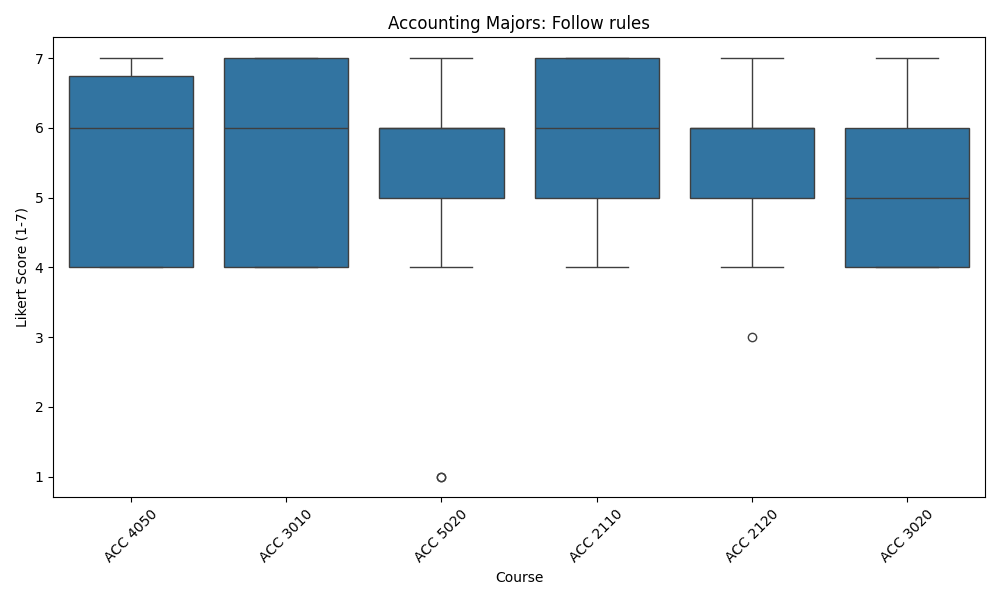
---
### Q15_10: Willing to break the law
- **Question Text:** How strongly do each of these stereotypes lead you towards or away from a major / career in accounting? - Willing to break the law
- **ANOVA:** F=0.4948, p=0.7799

**Descriptive Statistics:**
| Q2       |   mean |   std |   count |
|:---------|-------:|------:|--------:|
| ACC 2110 |   2.64 |  1.4  |      22 |
| ACC 2120 |   2.34 |  1.49 |      32 |
| ACC 3010 |   2.16 |  1.18 |      25 |
| ACC 3020 |   2.64 |  1.43 |      33 |
| ACC 4050 |   2.62 |  1.52 |      50 |
| ACC 5020 |   2.47 |  1.84 |      19 |

No significant difference across courses.

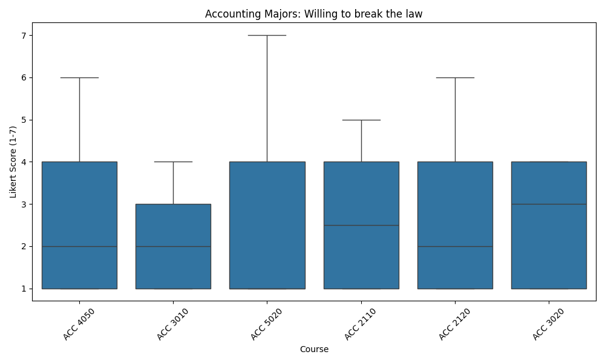
---
### Q15_11: Boring
- **Question Text:** How strongly do each of these stereotypes lead you towards or away from a major / career in accounting? - Boring
- **ANOVA:** F=2.0700, p=0.0713

**Descriptive Statistics:**
| Q2       |   mean |   std |   count |
|:---------|-------:|------:|--------:|
| ACC 2110 |   3.23 |  1.02 |      22 |
| ACC 2120 |   3.06 |  1.11 |      32 |
| ACC 3010 |   2.4  |  1.22 |      25 |
| ACC 3020 |   2.7  |  1.19 |      33 |
| ACC 4050 |   3.18 |  1.16 |      50 |
| ACC 5020 |   3.05 |  1.51 |      19 |

No significant difference across courses.

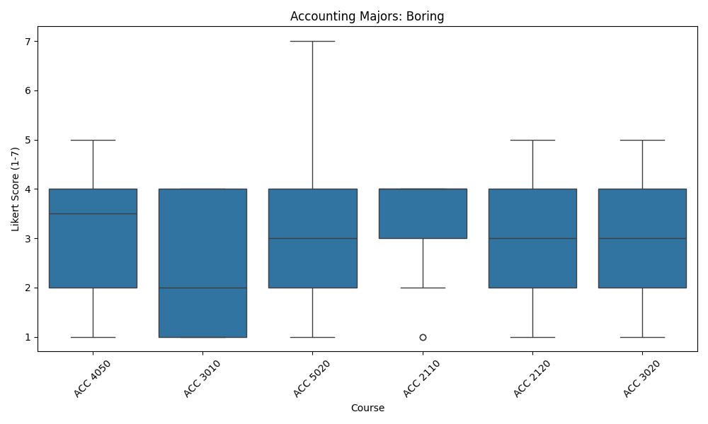
---
### Q15_12: Work alone
- **Question Text:** How strongly do each of these stereotypes lead you towards or away from a major / career in accounting? - Work alone
- **ANOVA:** F=2.2579, p=0.0507

**Descriptive Statistics:**
| Q2       |   mean |   std |   count |
|:---------|-------:|------:|--------:|
| ACC 2110 |   3.95 |  1.5  |      22 |
| ACC 2120 |   4.12 |  1.18 |      32 |
| ACC 3010 |   3.44 |  1.5  |      25 |
| ACC 3020 |   3.18 |  1.36 |      33 |
| ACC 4050 |   3.42 |  1.42 |      50 |
| ACC 5020 |   3.21 |  1.47 |      19 |

No significant difference across courses.

---
### Q18_1: Written communication
- **Question Text:** How useful do you think the following skills / traits are in accounting? - Written communication
- **ANOVA:** F=0.0235, p=0.9998

**Descriptive Statistics:**
| Q2       |   mean |   std |   count |
|:---------|-------:|------:|--------:|
| ACC 2110 |   6.18 |  0.91 |      22 |
| ACC 2120 |   6.16 |  0.88 |      32 |
| ACC 3010 |   6.12 |  0.93 |      25 |
| ACC 3020 |   6.09 |  0.88 |      33 |
| ACC 4050 |   6.12 |  1.41 |      50 |
| ACC 5020 |   6.11 |  1.45 |      19 |

No significant difference across courses.

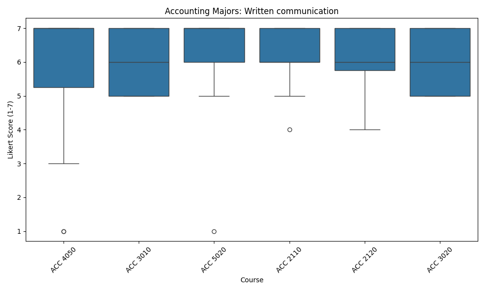
---
### Q18_2: Verbal communication
- **Question Text:** How useful do you think the following skills / traits are in accounting? - Verbal communication
- **ANOVA:** F=0.3658, p=0.8715

**Descriptive Statistics:**
| Q2       |   mean |   std |   count |
|:---------|-------:|------:|--------:|
| ACC 2110 |   6.05 |  0.9  |      22 |
| ACC 2120 |   6.09 |  0.78 |      32 |
| ACC 3010 |   6.4  |  0.76 |      25 |
| ACC 3020 |   6.24 |  0.9  |      33 |
| ACC 4050 |   6.26 |  1.35 |      50 |
| ACC 5020 |   6.26 |  1.45 |      19 |

No significant difference across courses.

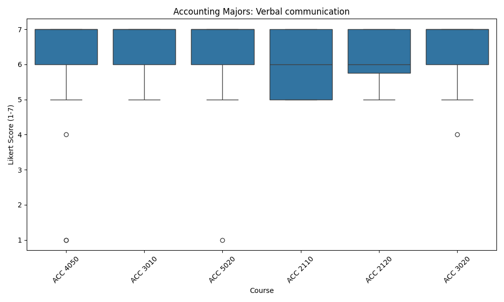
---
### Q18_3: Critical thinking
- **Question Text:** How useful do you think the following skills / traits are in accounting? - Critical thinking
- **ANOVA:** F=0.9542, p=0.4475

**Descriptive Statistics:**
| Q2       |   mean |   std |   count |
|:---------|-------:|------:|--------:|
| ACC 2110 |   6.59 |  0.67 |      22 |
| ACC 2120 |   6.38 |  0.83 |      32 |
| ACC 3010 |   6.64 |  0.64 |      25 |
| ACC 3020 |   6.58 |  0.66 |      33 |
| ACC 4050 |   6.48 |  1.28 |      50 |
| ACC 5020 |   6.89 |  0.32 |      19 |

No significant difference across courses.

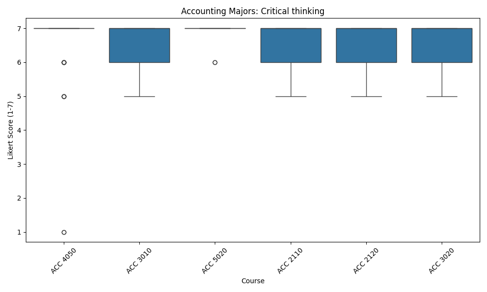
---
### Q18_4: Organization
- **Question Text:** How useful do you think the following skills / traits are in accounting? - Organization
- **ANOVA:** F=0.5593, p=0.7311

**Descriptive Statistics:**
| Q2       |   mean |   std |   count |
|:---------|-------:|------:|--------:|
| ACC 2110 |   6.73 |  0.55 |      22 |
| ACC 2120 |   6.69 |  0.54 |      32 |
| ACC 3010 |   6.56 |  0.77 |      25 |
| ACC 3020 |   6.48 |  0.71 |      33 |
| ACC 4050 |   6.42 |  1.26 |      50 |
| ACC 5020 |   6.42 |  1.43 |      19 |

No significant difference across courses.

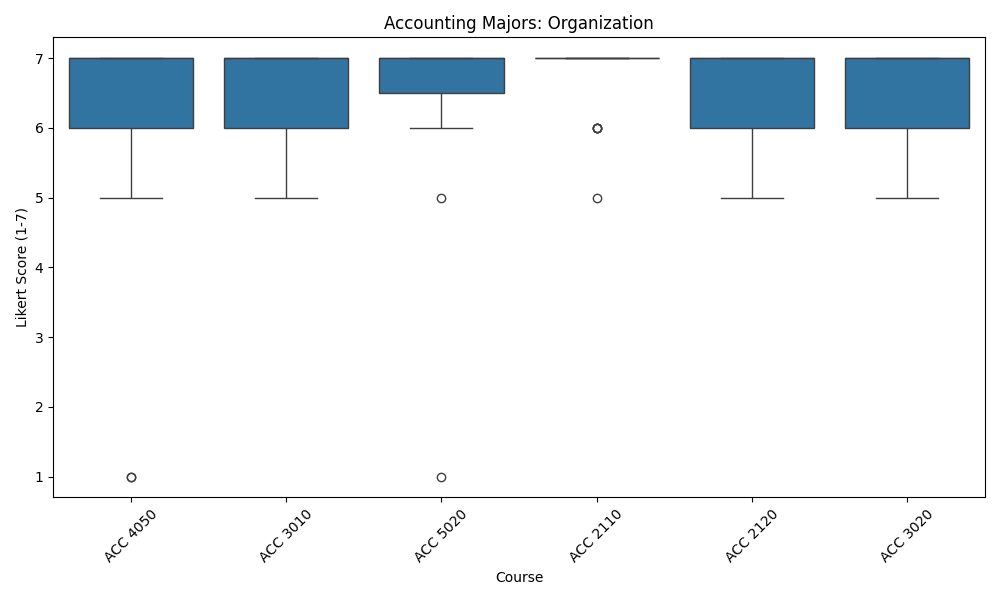
---
### Q18_5: Attention to detail
- **Question Text:** How useful do you think the following skills / traits are in accounting? - Attention to detail
- **ANOVA:** F=1.0837, p=0.3711

**Descriptive Statistics:**
| Q2       |   mean |   std |   count |
|:---------|-------:|------:|--------:|
| ACC 2110 |   6.82 |  0.39 |      22 |
| ACC 2120 |   6.75 |  0.51 |      32 |
| ACC 3010 |   6.72 |  0.61 |      25 |
| ACC 3020 |   6.48 |  0.83 |      33 |
| ACC 4050 |   6.54 |  1.23 |      50 |
| ACC 5020 |   6.89 |  0.32 |      19 |

No significant difference across courses.

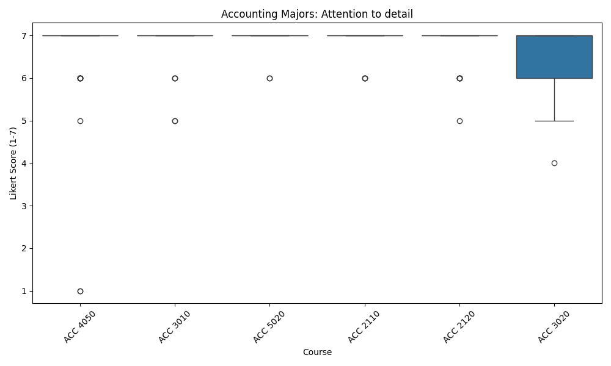
---
### Q18_6: Being good with numbers
- **Question Text:** How useful do you think the following skills / traits are in accounting? - Being good with numbers
- **ANOVA:** F=1.2492, p=0.2882

**Descriptive Statistics:**
| Q2       |   mean |   std |   count |
|:---------|-------:|------:|--------:|
| ACC 2110 |   6.18 |  0.8  |      22 |
| ACC 2120 |   5.88 |  1.18 |      32 |
| ACC 3010 |   6    |  1    |      25 |
| ACC 3020 |   5.52 |  1.18 |      33 |
| ACC 4050 |   5.62 |  1.48 |      50 |
| ACC 5020 |   5.63 |  1.07 |      19 |

No significant difference across courses.

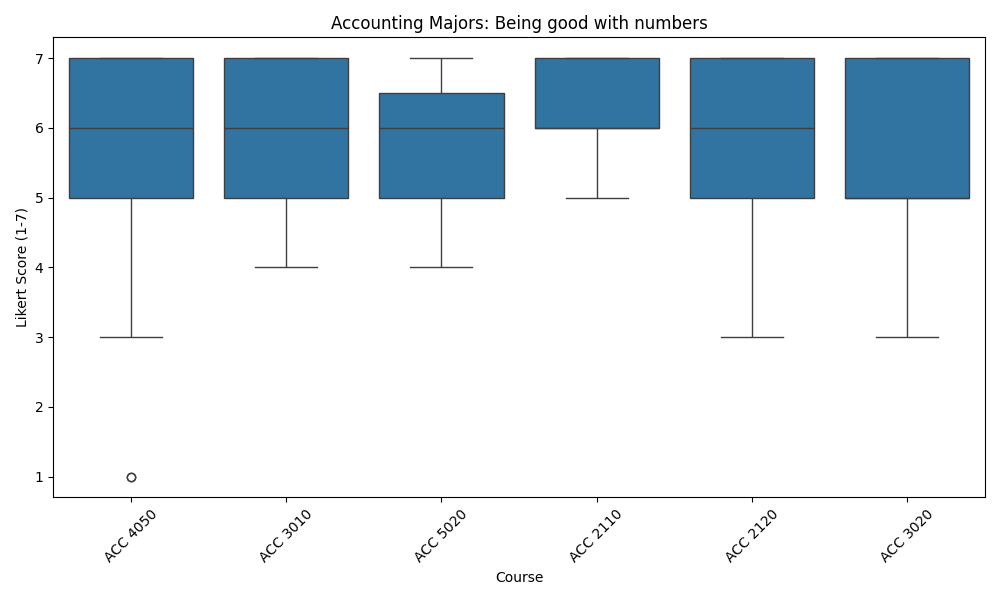
---
### Q18_7: Being a perfectionist
- **Question Text:** How useful do you think the following skills / traits are in accounting? - Being a perfectionist
- **ANOVA:** F=4.8726, p=0.0003

**Descriptive Statistics:**
| Q2       |   mean |   std |   count |
|:---------|-------:|------:|--------:|
| ACC 2110 |   5.32 |  1.04 |      22 |
| ACC 2120 |   4.81 |  1.45 |      32 |
| ACC 3010 |   4.56 |  1.53 |      25 |
| ACC 3020 |   4.18 |  1.26 |      33 |
| ACC 4050 |   4.26 |  1.23 |      50 |
| ACC 5020 |   3.58 |  0.96 |      19 |

**Significant Difference Detected (p < 0.05).**

**Tukey HSD Post-hoc Results:**
| group1   | group2   |   meandiff |   p-adj |   lower |   upper | reject   |
|:---------|:---------|-----------:|--------:|--------:|--------:|:---------|
| ACC 2110 | ACC 3020 |    -1.1364 |  0.0179 | -2.1485 | -0.1243 | True     |
| ACC 2110 | ACC 4050 |    -1.0582 |  0.0176 | -1.9989 | -0.1174 | True     |
| ACC 2110 | ACC 5020 |    -1.7392 |  0.0003 | -2.8909 | -0.5876 | True     |
| ACC 2120 | ACC 5020 |    -1.2336 |  0.013  | -2.2985 | -0.1686 | True     |

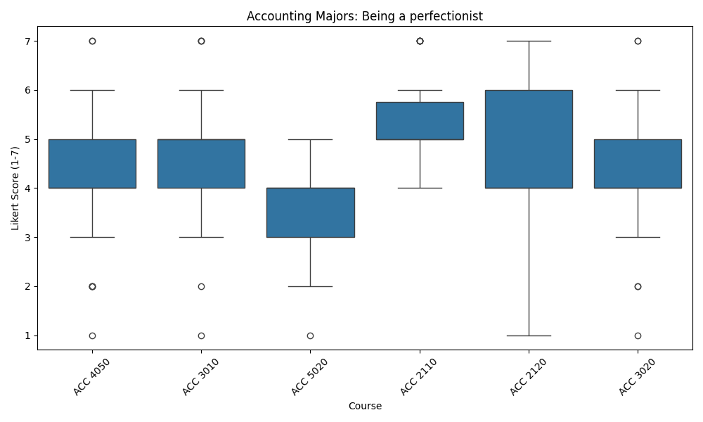
---
### Q18_8: Willing to learn new things
- **Question Text:** How useful do you think the following skills / traits are in accounting? - Willing to learn new things
- **ANOVA:** F=0.6871, p=0.6338

**Descriptive Statistics:**
| Q2       |   mean |   std |   count |
|:---------|-------:|------:|--------:|
| ACC 2110 |   6.45 |  0.74 |      22 |
| ACC 2120 |   6.03 |  0.93 |      32 |
| ACC 3010 |   6.32 |  1.03 |      25 |
| ACC 3020 |   6.15 |  1.12 |      33 |
| ACC 4050 |   6.02 |  1.35 |      50 |
| ACC 5020 |   6.32 |  1.42 |      19 |

No significant difference across courses.

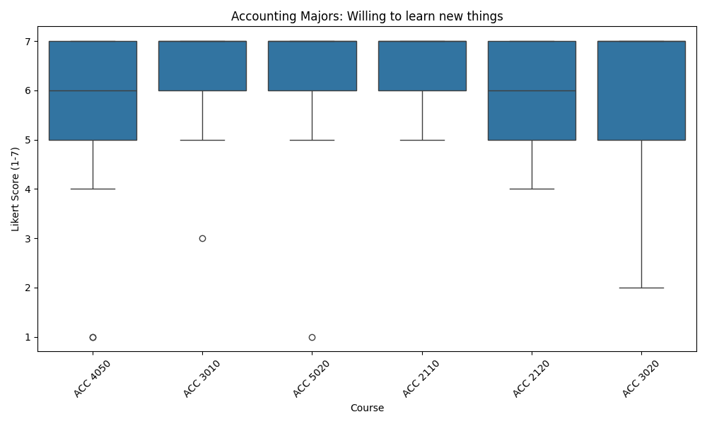
---
### Q18_9: Honest / ethical conduct
- **Question Text:** How useful do you think the following skills / traits are in accounting? - Honest / ethical conduct
- **ANOVA:** F=1.3939, p=0.2287

**Descriptive Statistics:**
| Q2       |   mean |   std |   count |
|:---------|-------:|------:|--------:|
| ACC 2110 |   6.73 |  0.55 |      22 |
| ACC 2120 |   6.53 |  0.76 |      32 |
| ACC 3010 |   6.88 |  0.44 |      25 |
| ACC 3020 |   6.36 |  1.03 |      33 |
| ACC 4050 |   6.46 |  1.25 |      50 |
| ACC 5020 |   6.79 |  0.71 |      19 |

No significant difference across courses.

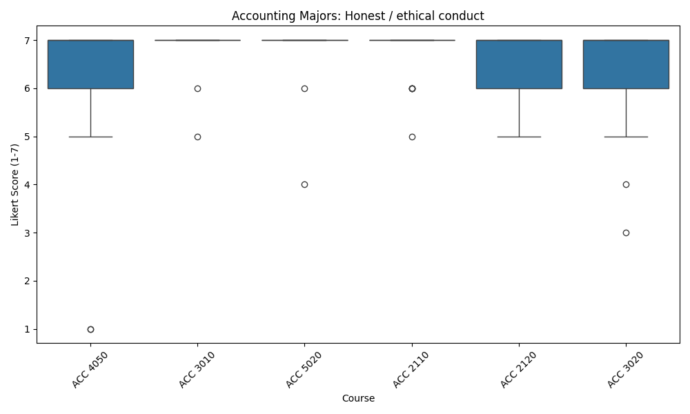
---
### Q17: How significantly do you think Artificial Intellig...
- **Question Text:** How significantly do you think Artificial Intelligence (AI) will change the type of work performed by accountants in the future?
- **ANOVA:** F=1.3986, p=0.2270

**Descriptive Statistics:**
| Q2       |   mean |   std |   count |
|:---------|-------:|------:|--------:|
| ACC 2110 |   5.18 |  1.47 |      22 |
| ACC 2120 |   5.19 |  1.23 |      32 |
| ACC 3010 |   5.52 |  1.12 |      25 |
| ACC 3020 |   5.61 |  1.3  |      33 |
| ACC 4050 |   5.28 |  1.18 |      50 |
| ACC 5020 |   4.74 |  1.33 |      19 |

No significant difference across courses.

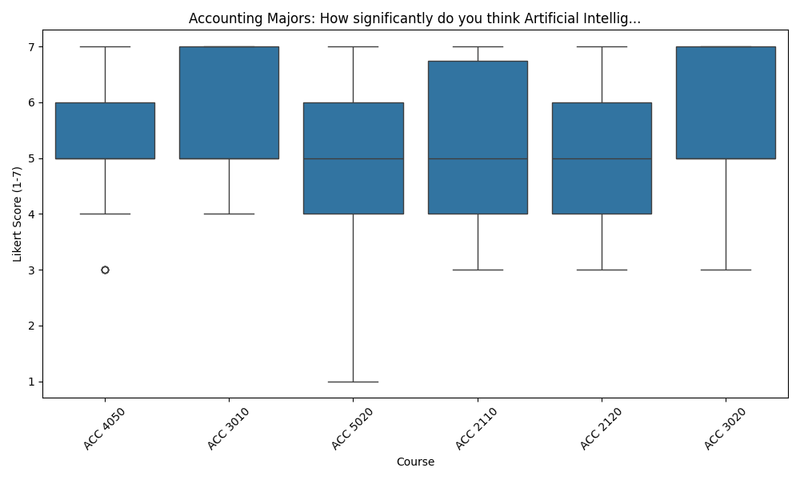
---
### Q22: To what degree do you feel that your job in accoun...
- **Question Text:** To what degree do you feel that your job in accounting has influenced how you view the accounting profession?
- **ANOVA:** F=1.3643, p=0.2477

**Descriptive Statistics:**
| Q2       |   mean |   std |   count |
|:---------|-------:|------:|--------:|
| ACC 2110 |   5.5  |  1.73 |       4 |
| ACC 2120 |   6.14 |  0.9  |       7 |
| ACC 3010 |   5    |  1.15 |      10 |
| ACC 3020 |   5.53 |  1.22 |      19 |
| ACC 4050 |   6    |  1.1  |      24 |
| ACC 5020 |   5.47 |  1.3  |      15 |

No significant difference across courses.

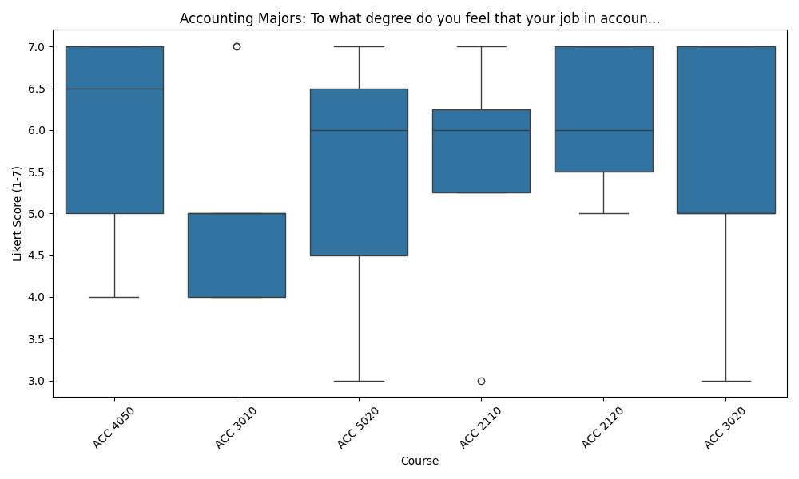
---
### Q23: How beneficial do you think having a Master of Acc...
- **Question Text:** How beneficial do you think having a Master of Accountancy degree would be on a person's ability to get a job in accounting?
- **ANOVA:** F=5.3990, p=0.0001

**Descriptive Statistics:**
| Q2       |   mean |   std |   count |
|:---------|-------:|------:|--------:|
| ACC 2110 |   5.5  |  1.34 |      22 |
| ACC 2120 |   5.62 |  1.43 |      32 |
| ACC 3010 |   5.64 |  1.22 |      25 |
| ACC 3020 |   4.79 |  1.24 |      33 |
| ACC 4050 |   4.33 |  1.61 |      49 |
| ACC 5020 |   4.63 |  1.5  |      19 |

**Significant Difference Detected (p < 0.05).**

**Tukey HSD Post-hoc Results:**
| group1   | group2   |   meandiff |   p-adj |   lower |   upper | reject   |
|:---------|:---------|-----------:|--------:|--------:|--------:|:---------|
| ACC 2110 | ACC 4050 |    -1.1735 |  0.019  | -2.2246 | -0.1224 | True     |
| ACC 2120 | ACC 4050 |    -1.2985 |  0.0012 | -2.2294 | -0.3676 | True     |
| ACC 3010 | ACC 4050 |    -1.3135 |  0.0031 | -2.3201 | -0.3068 | True     |

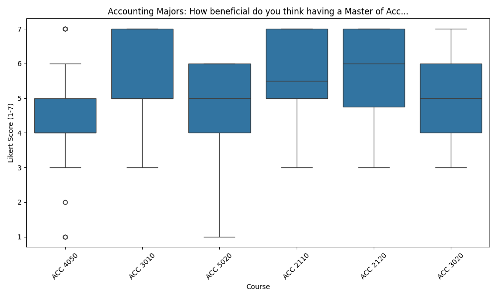
---
### Q24: How beneficial do you think having an accounting c...
- **Question Text:** How beneficial do you think having an accounting certification or license (Certified Public Accountant, Enrolled Agent, etc.) would be on a person's ability to get a job in accounting?
- **ANOVA:** F=1.9062, p=0.0956

**Descriptive Statistics:**
| Q2       |   mean |   std |   count |
|:---------|-------:|------:|--------:|
| ACC 2110 |   6.05 |  0.95 |      22 |
| ACC 2120 |   5.94 |  1.22 |      32 |
| ACC 3010 |   6.48 |  0.87 |      25 |
| ACC 3020 |   6.06 |  1.09 |      33 |
| ACC 4050 |   6.45 |  0.82 |      49 |
| ACC 5020 |   5.84 |  1.54 |      19 |

No significant difference across courses.

---
### Q32: How strongly do you believe that you want to pursu...
- **Question Text:** How strongly do you believe that you want to pursue that area of accounting?
- **ANOVA:** F=3.1305, p=0.0110

**Descriptive Statistics:**
| Q2       |   mean |   std |   count |
|:---------|-------:|------:|--------:|
| ACC 2110 |   4.75 |  0.71 |       8 |
| ACC 2120 |   5.27 |  0.8  |      15 |
| ACC 3010 |   5.16 |  1.46 |      19 |
| ACC 3020 |   6    |  0.77 |      21 |
| ACC 4050 |   5.79 |  1.07 |      38 |
| ACC 5020 |   5.84 |  1.01 |      19 |

**Significant Difference Detected (p < 0.05).**

**Tukey HSD Post-hoc Results:**
No pairwise differences were significant according to Tukey HSD.

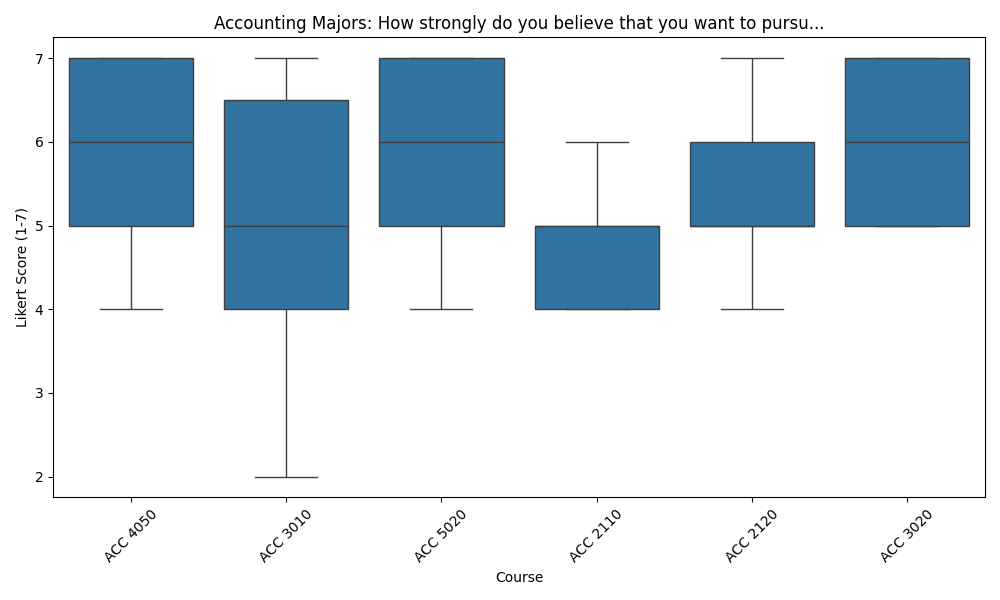
---
### Q31: To what degree do you like accounting principles a...
- **Question Text:** To what degree do you like accounting principles and rules?
- **ANOVA:** F=0.8549, p=0.5128

**Descriptive Statistics:**
| Q2       |   mean |   std |   count |
|:---------|-------:|------:|--------:|
| ACC 2110 |   5.36 |  1.26 |      22 |
| ACC 2120 |   5.84 |  1.08 |      32 |
| ACC 3010 |   5.6  |  1.08 |      25 |
| ACC 3020 |   5.42 |  1.12 |      33 |
| ACC 4050 |   5.63 |  1.01 |      49 |
| ACC 5020 |   5.79 |  0.79 |      19 |

No significant difference across courses.

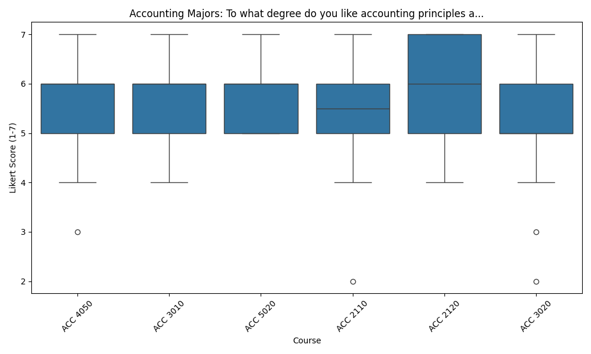
---
